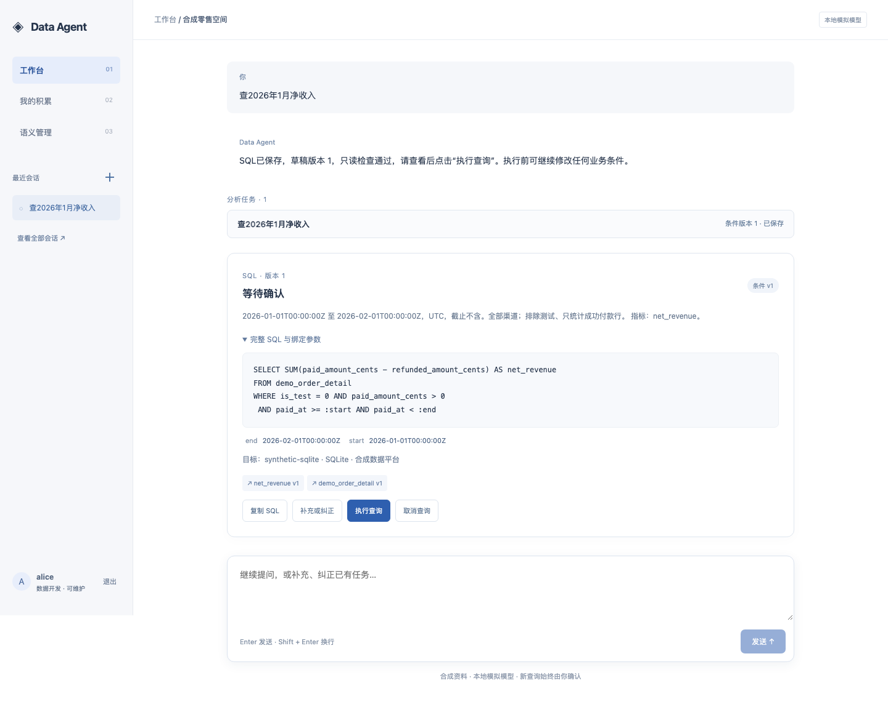
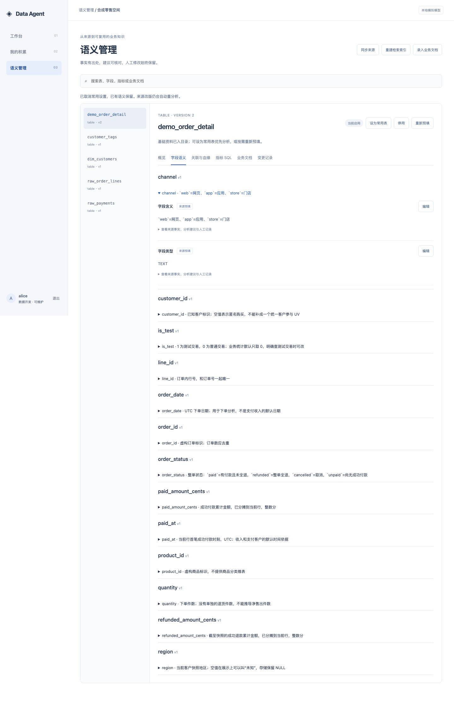
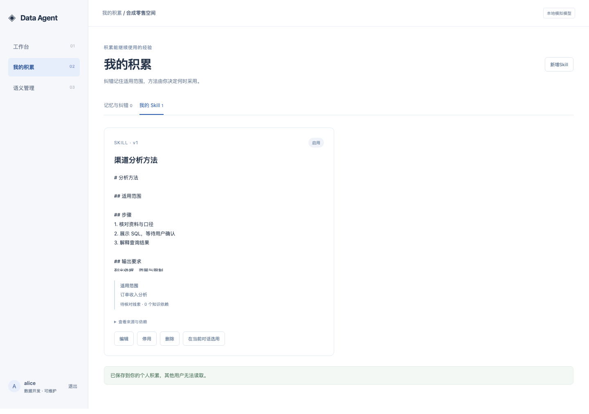
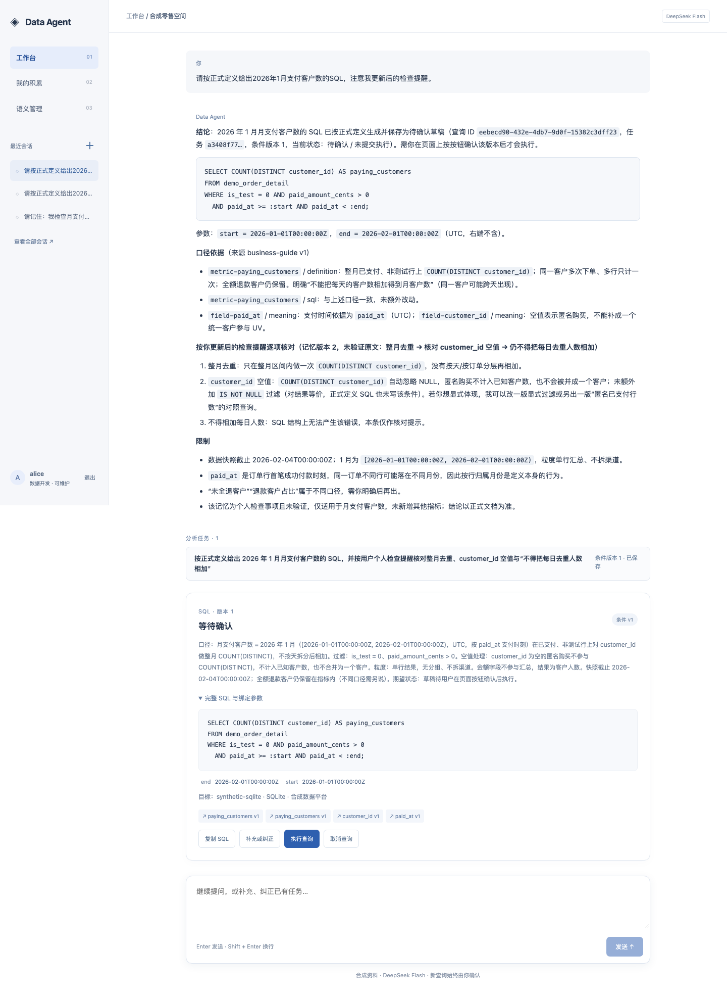
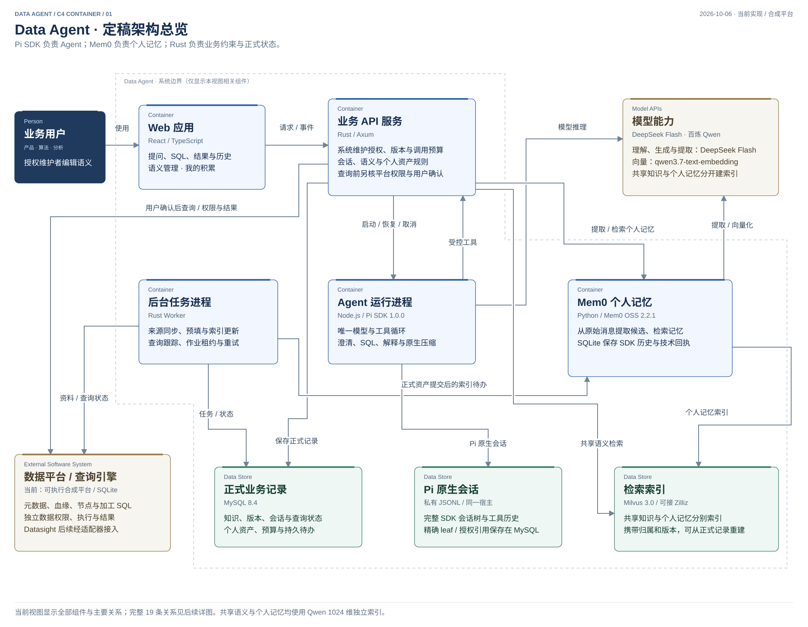

# Data Agent

**围绕语义、SQL 和可复用经验的数据分析工作台。**

面向产品、算法、数据分析和数据开发：用自然语言找表、理解指标口径、生成 SQL、确认取数，再继续追问。数据开发维护共享语义；每位用户积累自己的纠错记忆和 Skill。

[快速开始](#快速开始) · [功能预览](#功能预览) · [软件架构](#软件架构) · [验证与边界](#验证与边界) · [文档导航](#文档导航)

> **当前状态：合成平台 MVP 已完成。** 已实现 React 工作台、Rust 业务服务、Pi SDK、Mem0 个人记忆及可执行合成数据平台，完成本地验收和真实 DeepSeek Flash 针对性试用。真实数据平台、正式认证和同事实际使用验收属于后续接入。最新进度和证据见 [CURRENT](docs/CURRENT.md)。

> **向量方案已统一为百炼 Qwen 1024 维。** 共享语义由 Rust 接入，个人记忆由 Mem0 接入；分别保存到独立 Milvus 集合。正式内容与版本继续保存在 MySQL，模型调用沿用持久预算。



*正式 React 工作台截图。这里使用本地模拟模型与合成订单资料；SQL 展示后由用户确认执行。*

## 功能预览

### 从问题到结果，始终可以补充和纠正

1. **提问与澄清**：Agent 检索表、字段、指标和业务文档；缺少必要信息时主动询问。
2. **查看 SQL**：展示草稿、参数、执行目标、口径依据与版本。执行前可以继续补充条件。
3. **确认取数**：服务端校验权限、只读约束及确认版本，再提交查询；修改后的 SQL 需要重新确认。
4. **继续分析**：查看表格、基础图表、CSV 与解释。同一对话可持续多轮，包含多个分析任务；历史在工作台侧栏。

### 共享语义由数据开发维护

利用平台元数据、DDL、血缘、调度节点与加工 SQL 建立基础目录，再通过模型分析补充语义。页面维护表与字段含义、指标及计算 SQL、关联关系和长篇业务文档。

- 来源事实、模型建议、人工修改分别记录，保留出处和版本。
- 重新预填保留人工值；来源变化会触发受影响内容的重新分析。
- 常用表优先分析，普通表按需深入。检索结合名称、关键词与向量，命中后回源核对权限和有效版本。

<details>
<summary>查看语义管理界面</summary>



*正式页面的合成资料示例，展示字段语义、指标 SQL、血缘、业务文档与变更记录入口。*

</details>

### 个人记忆与 Skill

记住用户确认过的偏好和纠错，后续对话可以复用；用户可以修订、停用或删除。Mem0 从原始消息提取候选，Rust 校验并保存正式版本。个人经验按用户和空间隔离，公共口径仍由共享语义管理。

Skill 保存可复用的分析方法，用户明确选用后在当前对话采用。Pi 负责会话延续和原生上下文压缩，个人记忆负责跨会话的长期积累。

<details>
<summary>查看个人积累与真实模型回答</summary>



*正式页面的合成 Skill 示例；可编辑、停用、删除或在当前对话选用。*



*真实 DeepSeek Flash + Mem0 的合成数据回归截图：已修订的个人检查提醒被新会话采用，SQL 保持待确认。*

</details>

## 软件架构

React 负责交互，Rust 负责业务约束，Pi SDK 负责唯一的 Agent 循环，Mem0 负责个人记忆提取与检索。API 和 Worker 复用同一个 Rust 业务库，按职责分进程、统一交付。



*上图展示全部组件，Mem0 是明确采用的个人记忆组件。[完整架构说明](docs/architecture/README.md)包含三张详图及存储职责，完整保留 11 个组件、19 条调用关系。*

| 部分 | 技术 | 负责什么 |
| --- | --- | --- |
| 工作台与维护页面 | React / TypeScript | 提问、SQL 确认、结果、历史、共享语义与个人积累 |
| 业务 API / Worker | Rust / Axum / SQLx | 权限、版本、任务、查询、预算、同步、预填与索引作业 |
| Agent 运行进程 | Node.js / Pi SDK 1.0.0 | 模型与工具循环、澄清、流式输出、取消、续接与原生压缩 |
| 个人记忆适配进程 | Python / Mem0 OSS 2.2.1 | 原始消息提取、个人记忆候选检索、派生索引 |
| 正式业务记录 | MySQL 8.4 | 语义、文档、资产、会话引用、SQL、状态、预算与版本 |
| 会话与技术回执 | Pi JSONL / Mem0 SQLite | 原生 SDK 会话历史；记忆组件的幂等回执与 SDK 历史 |
| 检索索引 | Milvus 3.0 | 可重建的共享知识和个人记忆索引，保留 Zilliz 适配方向 |
| 模型 | DeepSeek Flash / 百炼 Qwen | Flash 理解与生成；共享语义与个人记忆使用 Qwen 1024 维向量 |
| 数据平台适配器 | 当前为合成 SQLite 平台 | 元数据、血缘、节点 SQL、权限、只读查询及结果 |

**语义层连接业务含义和数据结构。** Agent 取得的是有出处、有版本的表、字段、指标、SQL 与文档。共享知识和个人记忆的向量索引都能重建；正式内容以 MySQL 为准，采用前重新核对权限和状态。

图源和导出：[SVG 合集](docs/architecture/data-agent-c4-container.svg) · [PNG 合集](docs/architecture/data-agent-c4-container.png) · [可编辑 draw.io](docs/architecture/data-agent-c4-container.drawio) · [模块与流程图册](docs/architecture/implementation-atlas.html)。

## 快速开始

当前验证环境是 **macOS ARM64**。需要 Node 26.8.1 / npm 11.19.0、Rust 1.99.0、Python 3.10+、Make、Colima 和 Docker CLI / Compose。依赖与镜像按锁文件固定，首次安装需要联网下载。其他系统尚未按同一启动流程验收。

```sh
git clone https://github.com/yaoziyaoguai/data_agent.git
cd data_agent
make setup-node setup-rust
make infra-up
make dev
```

打开 **http://127.0.0.1:5173/**，用启动器生成的 `.local/development/identities.json` 中 `alice` 或 `bob` 的值登录。该文件只保存在本机。Ctrl+C 关闭应用进程，数据库与会话保留；结束后可用 `make infra-down` 停止基础服务，或用 `make vm-stop` 停止项目虚拟机。

默认使用**本地模拟模型和词法检索**，无需模型密钥，不调用付费向量接口。可以先问“查 2026 年 1 月净收入”，查看 SQL 后点击执行，再补充“改成 2 月，只看 app”。模拟模式只支持合成场景演示；自由提问需要切换真实模型。

| 运行方式 | 入口与说明 |
| --- | --- |
| 正式工作台，本地模拟 | `make dev`；运行 React、Rust、Pi 与可执行合成平台 |
| 真实 Flash + Mem0 | 先 `make setup-memory`，再按[模型配置](docs/development.md#6-真实模型小样与取消)和[记忆配置](docs/development.md#7-mem0个人记忆)启动；需要模型及 embedding 凭据、生成模型 profile 和共享向量维护 profile |
| 纯交互原型 | `make prototype`，打开 `http://127.0.0.1:8765/`；使用浏览器本地存储，不执行 SQL、不调用模型 |

本地服务只监听回环地址。`.env.example` 和 `apps/memory/config.example.json` 提供配置格式；凭据、运行数据库、会话和日志保存在被 Git 忽略的本地目录。启动方式、端口、恢复及索引重建见[开发指南](docs/development.md)。

## 验证与边界

### 已有证据

| 验证 | 结果与适用范围 |
| --- | --- |
| MVP 收尾 | 四组增量验收及独立审查通过；记忆范围一致性、Markdown 安全渲染、契约、代码、Pi 续接与压缩、工作台回归均有记录 |
| 真实 Flash 质量基线 | 固定 16 个合成场景各测一次，独立内容判分 **12/16（75%）**；这是历史版本基线，保留 4 个错例 |
| 记忆方案对比 | 完整场景均为 **16/18**；Mem0 的记忆管理 **17/18**、SQL **24/24**，原方案为 **16/18**、**22/24**；据分项选择 Mem0，小样未证明稳定统计优势 |
| 接入后试用与修复 | 原始试用 **5/6**、SQL **7/7**；自动记忆范围扩写和 Markdown 显示两项问题已修复。新针对性回归 **4/4 条消息**通过，旧评分不改写 |
| 真实共享向量小样 | 百炼 Qwen 1024维，原4个中文问题均在前6候选命中；56次调用、6,317输入token；小样不代表千表召回率 |
| 合成目录规模与恢复 | 1204 张合成表、2408 个新增对象，首次建索引和两次丢库重建通过；协议向量用于工程验证，中文语义质量由上方真实小样单列，不代表千表真实模型召回率或低延迟 |

证据入口：[共享向量真实小样](docs/sources/evaluation/qwen-shared-trial.json) · [共享向量审查](docs/reviews/shared-embedding-review.json) · [最终验收记录](docs/CURRENT.md#完成与验证) · [收尾审查](docs/reviews/mvp-closeout-review.json) · [质量基线](docs/reviews/mvp-accuracy-20261005.md) · [记忆 A/B 对比](docs/research/mem0-extraction-comparison-results.md) · [接入与修复报告](docs/research/memory-adoption-trial.md)。这些测量的题目、版本和分母不同，分别保留。

### 在本机检查

```sh
# 无模型调用的静态与离线检查
make verify-materials verify-fixture
make verify-code verify-contracts

# 需要本项目 MySQL；各项串行运行
make verify-query-workflow verify-knowledge-workflow
make verify-mvp-browser verify-mvp-regression
make verify-business-acceptance verify-hybrid-retrieval
make verify-shared-embedding verify-memory
```

检查使用合成资料和隔离测试环境。完整命令及依赖见[开发指南](docs/development.md#4-正式工作台与增量检查)。`make verify-increment`、官方试用审计等命令还需要本机冻结的私有运行证据；新克隆仓库只有公开报告和测试源码，不能直接重放未发布的收据。源码检查、本地模拟、真实模型和真实平台证据分别报告。

### 后续接入

- 真实数据平台的元数据、权限、执行与状态接口，以及正式身份认证。
- 同事实际使用、真实业务正确率、长期运行与容量验证。
- 更大个人记忆库下的效果、延迟与费用测量。

这些事项保留在后续范围；本次 MVP 在已约定的合成平台范围收尾。

## 文档导航

| 想了解 | 从这里开始 |
| --- | --- |
| 当前状态、有效决定、剩余事项 | [CURRENT](docs/CURRENT.md) |
| 系统方案和需求边界 | [系统设计](docs/semantic-retrieval-design.md) |
| 软件架构与调用关系 | [架构说明](docs/architecture/README.md) |
| 模块接口、存储归属与流程 | [实现设计](docs/architecture/implementation-design.md)、[知识模块](docs/architecture/knowledge-modules.md)、[运行模块](docs/architecture/runtime-modules.md) |
| HTTP、工具和事件契约 | [OpenAPI 3.1](packages/contracts/openapi.json)、[共用 JSON Schema](packages/contracts/schema.json) |
| 安装、配置、检查与恢复 | [开发指南](docs/development.md)、[基础设施](infra/README.md) |
| 合成业务及独立参考答案 | [样例资料](docs/sources/README.md) |
| 个人记忆接入与选型依据 | [Mem0 接入报告](docs/research/memory-adoption-trial.md)、[比较实验](experiments/mem0-comparison/README.md) |
| 工程规则和防漂移约定 | [AGENTS.md](AGENTS.md) |

```text
apps/                React 页面、Rust 入口、Pi 桥、Mem0 侧车、合成平台
crates/data-agent/   按业务能力组织的 Rust 模块与具名 use_cases
packages/contracts/ 跨语言契约及生成类型
migrations/         MySQL 迁移
tests/              契约、业务、恢复、浏览器与真实模型试用程序
infra/ · scripts/   本地环境、启动和检查工具
docs/               设计、架构图、合成资料与公开验证报告
prototype/          前期交互原型
experiments/        独立记忆对比实验
```

## 资料、联网与许可

表、SQL、数据、业务文档和案例均为从零构造的**合成材料**。独立验收答案与 Agent 知识输入分开；密钥、私有会话及原始试用日志不进入 Git。

首次准备会下载依赖和镜像；不再下载本地 embedding 权重。真实模型模式会向配置的 DeepSeek / 百炼端点发送允许的模型输入；Mem0 遥测在本项目适配器中关闭。默认模拟模式不发起付费模型调用。

本仓库尚未指定开源许可证；公开可见与授予开源使用许可是两件事。各依赖的许可证以其自身声明为准。
