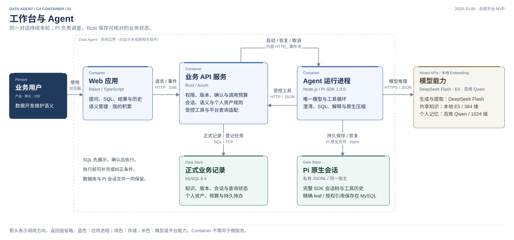
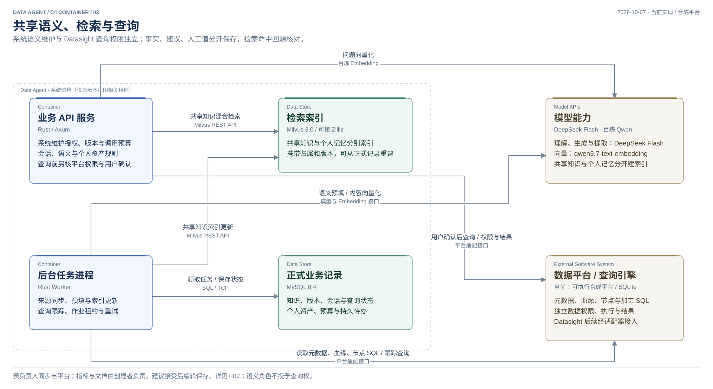
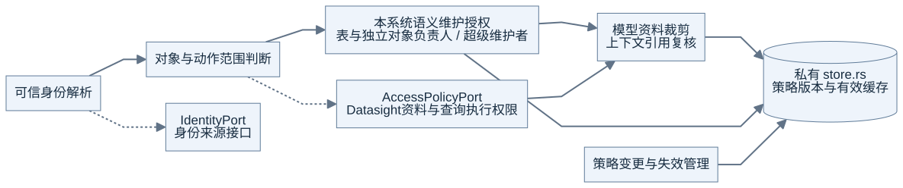
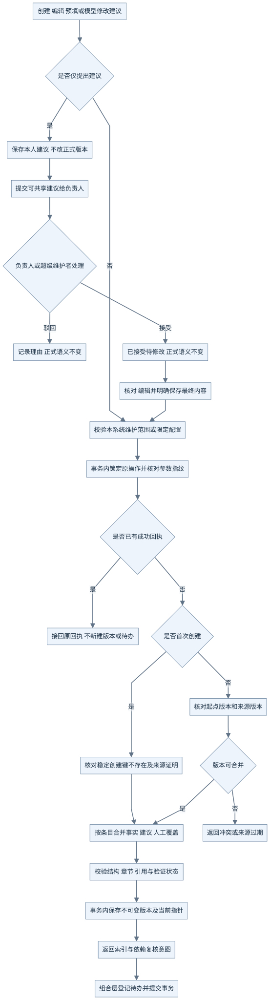
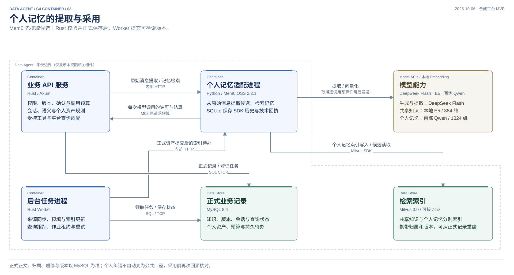

# Data Agent 软件架构

本页展示定稿方案：**React 做交互，Rust 管业务约束，Pi 运行 Agent，Mem0 处理个人记忆；生成模型用 DeepSeek Flash，向量模型用百炼 Qwen**。API 与 Worker 复用 Rust 业务库，按职责分进程、统一交付。

原有 11 个组件、19 条调用关系保留，先看总览，再看三个 C4 详图。同名组件在不同视图中代表同一个组件；图中的容器表示运行职责，不要求每个模块成为独立微服务。

[工作台与 Agent](#工作台与-agent) · [共享语义与查询](#共享语义与查询) · [语义权限与纠错协作](#语义权限与纠错协作) · [个人记忆](#个人记忆) · [组件与存储责任](#组件与存储责任)

## 当前实现

以下实现状态于 2026-10-07 对照源码核查：

| 部分 | 定稿 | 当前实现 |
| --- | --- | --- |
| Agent 与生成模型 | Pi SDK + DeepSeek Flash | 已接入 |
| 个人记忆 | Mem0 OSS + 百炼 `qwen3.7-text-embedding`，1024 维 | 已接入，正式正文仍由 Rust 存入 MySQL |
| 共享语义向量 | 百炼 `qwen3.7-text-embedding` | 已接入：Rust 受控 HTTP 适配，1024 维独立集合 |
| 正式存储与索引 | MySQL + Milvus；共享知识和个人记忆分别索引 | 已接入；新共享集合从 MySQL 当前版本重建 |
| 系统内语义维护授权 | 逐表负责人，超级维护者可维护全部表的共享语义 | 已接入；平台维护人同步、独立对象创建者自动负责、可信配置超级维护者 |
| 跨用户语义纠错 | 提交给负责人；驳回，或接受后编辑保存 | 已接入；共享提交独立保存，私人草稿继续隔离 |

代码依据：[共享语义向量实现](../../crates/data-agent/src/modules/retrieval/vector.rs)、[启动器](../../scripts/development.py)、[Mem0 接入](../../apps/memory/service.py)。共享向量调用由 Rust 逐次许可和结算；成功响应持久保存供重建复用。当前验证与旧版本证据分别保存在 [CURRENT](../CURRENT.md)。

## 定稿总览


总览呈现主要调用，模型调用预算、后台索引等完整关系在后续详图中展开。

## 工作台与 Agent



- 用户在同一对话内持续提问、补充、纠正，也可以开展多个分析任务。
- Pi SDK 负责模型与工具循环、澄清、流式事件、取消、续接和原生上下文压缩。通过受控工具调用 Rust 业务规则。
- Rust 校验身份、权限、预算、版本和操作身份，保存任务与 SQL 草稿。SQL 先展示，用户确认具体版本后才能执行。
- MySQL 保存业务记录及精确的 Pi 会话引用；私有 JSONL 保存完整 SDK 会话树。恢复和备份需要同时保留两者。

图中的 API 是业务接入边界；实际的任务领取、后台交付和查询跟踪由 Worker 调用同一 Rust 业务库完成。具体时序见 [V03](implementation-views.md#v03-提问到纠错调用时序)。

## 共享语义与查询



**语义层保存业务含义及其依据。** 元数据、DDL、血缘、调度节点和加工 SQL 提供基础事实，模型分析提出补充建议，数据开发维护人工值。表、字段、指标、计算 SQL 和长篇业务文档共同组成可检索的知识。

Worker 负责来源同步、语义预填与复核、索引更新及查询状态跟踪。定稿的共享检索结合精确名称、关键词和百炼 Qwen 向量；候选返回后，再从 MySQL 核对权限、状态、版本和正式内容。同一知识版本保持原维护预算，集合更换不重新授权调用。

查询通过平台适配器提交和查证。当前适配器使用可实际执行只读 SQL 的合成 SQLite 平台；真实平台的接口、权限和终态语义仍需接入验证。

## 语义权限与纠错协作

**系统维护权和 Datasight 数据权独立。** M01 分别校验对应动作，M02 保存语义与建议；SQL 查询继续经原平台适配器。没有新增服务，也不改变 Pi、Mem0 或数据库的职责。

| 边界 | 管理内容 | 不会因此获得的权限 |
| --- | --- | --- |
| Data Agent | 普通用户提出建议；表负责人编辑该表语义；超级维护者维护全部表的共享语义 | Datasight 取数、执行 SQL，以及他人的聊天、记忆和 Skill |
| Datasight | 平台资料、查询执行、结果与行列范围 | Data Agent 的正式语义编辑权 |

维护者为核验语义而查询数据时，依然需要具体 SQL 的用户确认与平台授权。表负责人沿用平台维护关系；独立人工对象的首次录入者自动成为负责人，最近修改人另行记录。当前空间 Datasight 表维护人均可创建指标和文档，其他用户可提出纠错建议。



### A 提出纠错，B 作为表负责人处理

1. A 本次的 SQL 先核对和修订，再由 A 确认；不等待共享建议审核。
2. A 提交可共享的对象、原值、建议值、理由和依据。本人聊天与 Mem0 个人记忆保持私有。
3. B 或超级维护者驳回并说明原因，或接受为“待修改”。接受不改变正式语义。
4. B 核对并编辑最终内容，明确保存后产生新版本，同事务登记索引与依赖复核待办。
5. 后续共享检索使用正式版本。待处理建议不参与共享召回，索引滞后时仍回源核对。



这两张图展开当前语义协作边界。代码、OpenAPI、迁移和页面按本轮增量实现，验收见 CURRENT；真实身份和 Datasight ACL 仍待接入。数据归属见[知识模块](knowledge-modules.md#34-数据与接口边界)，实际路径见[接口说明](implementation-design.md#421-语义协作接口)。

## 个人记忆



1. Pi 根据对话调用保存或修订记忆的受控工具；Rust 核对原话引用、身份与版本。
2. Mem0 从原始消息提取候选，候选在正式提交前不能被采用。
3. Rust 校验并将正式正文、来源、范围、版本和索引待办原子保存到 MySQL。
4. Worker 提交对应版本的索引待办；Mem0 使用 Milvus 写入或检索个人记忆向量。
5. 检索命中后回源核对有效版本与归属，才交给 Pi 使用。停用、删除和修订受正式状态约束。

自动保存的正文和适用范围取自同一份最终正文，名称只作原文前缀标签。页面人工编辑保留用户明确填写的名称和范围；人工正文建索引时不再经模型改写。

Mem0 的 SQLite 保存 SDK 历史和技术回执；MySQL 保存正式资产与调用预算。每次提取和 embedding 调用均经 Rust 的逐调用许可和结算。Pi 的上下文管理和个人长期记忆承担不同职责。

## 组件与存储责任

| 组件 | 技术 | 主要责任 |
| --- | --- | --- |
| 业务用户 | 浏览器 | 产品、算法、分析、数据开发；共享语义编辑须有本系统维护授权 |
| Web 应用 | React / TypeScript | 工作台、语义管理、个人积累与输入展示 |
| 业务 API | Rust / Axum | 身份、权限、正式状态、版本、确认、受控工具和预算 |
| Agent 运行进程 | Node.js / Pi SDK 1.0.0 | 唯一 Agent 循环、会话续接与原生压缩 |
| 后台任务进程 | Rust Worker | 同步、预填、索引、查询跟踪与持久任务 |
| 个人记忆适配进程 | Python / Mem0 OSS 2.2.1 | 原始消息提取、个人记忆检索；SQLite 保存技术状态 |
| 正式业务记录 | MySQL 8.4 | 正式知识、个人资产、应用状态、预算及版本 |
| Pi 原生会话 | 私有 JSONL | SDK 原始历史与压缩摘要；MySQL 引用精确 leaf |
| 检索索引 | Milvus 3.0 | 可重建的知识与个人记忆向量，分别配置归属和版本 |
| 模型能力 | Flash / 百炼 Qwen | Flash 生成与提取；共享语义和个人记忆的 Qwen 1024 维向量 |
| 数据平台 / 查询引擎 | 合成平台，真实平台预留 | 元数据、血缘、节点 SQL、权限、执行及结果 |

图中的“模型能力”展示定稿的 DeepSeek 和百炼端点。共享语义与个人记忆继续分开建索引，保留各自的权限和版本核对。Milvus 与 Zilliz 的接口方向保留，当前验证使用本地 Milvus。

## 接口与更细的设计

- [实现设计](implementation-design.md)：模块接口、事务、代码布局与依赖方向。
- [模块框架与流程](implementation-views.md)、[离线图册](implementation-atlas.html)：进一步展开各模块内部职责。
- [知识与个人资产](knowledge-modules.md)、[运行与查询](runtime-modules.md)：数据归属与状态规则。
- [OpenAPI](../../packages/contracts/openapi.json)、[共用 JSON Schema](../../packages/contracts/schema.json)：HTTP、Pi 工具及 SSE 契约真源。
- [开发指南](../development.md)：启动、配置、备份边界及索引重建。
- [CURRENT](../CURRENT.md)：当前交付状态和验收证据。

## 图源与导出

[SVG 合集](data-agent-c4-container.svg) · [PNG 合集](data-agent-c4-container.png) · [四页 draw.io 源图](data-agent-c4-container.drawio)

总览与三张详图由 [render-c4.cjs](render-c4.cjs) 的同一份节点和关系定义生成。已安装项目 Node / Playwright 依赖后，在仓库根目录运行：

```sh
node docs/architecture/render-c4.cjs
```

脚本生成 SVG、PNG 和可编辑 draw.io，核对关系覆盖、画布和节点文字溢出、标签与节点及标签之间的遮挡，结果写入 [diagram-checks.json](diagram-checks.json)。这些检查只验证图形产物；业务行为沿用相应集成验收。
