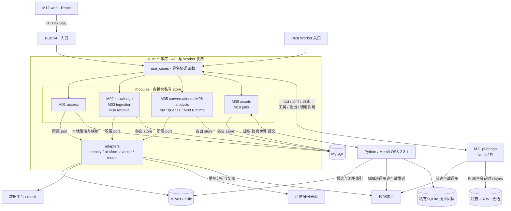
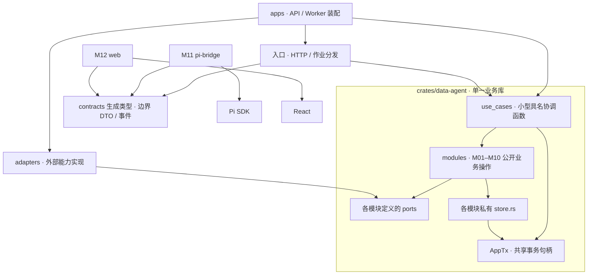
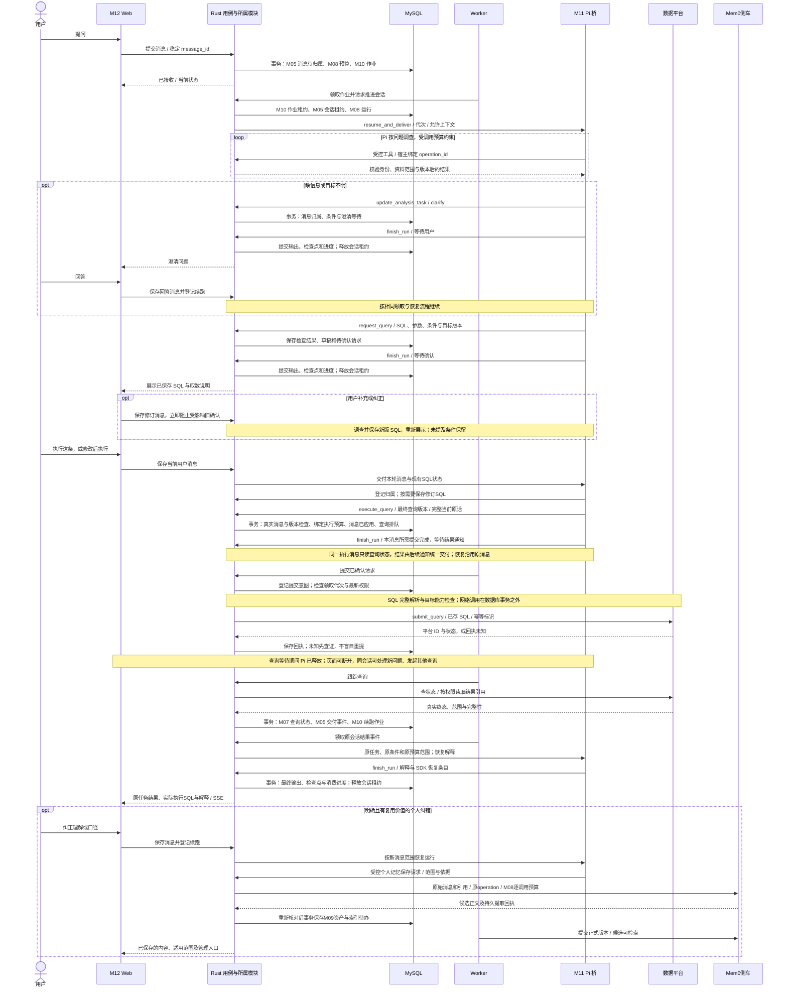
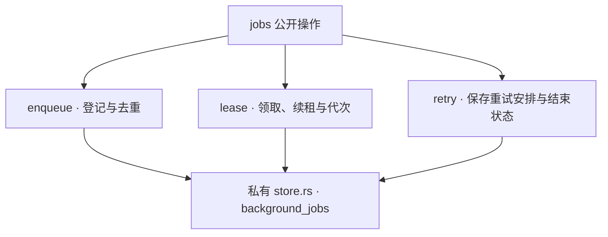
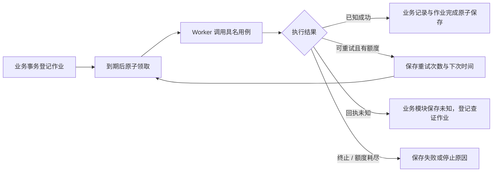
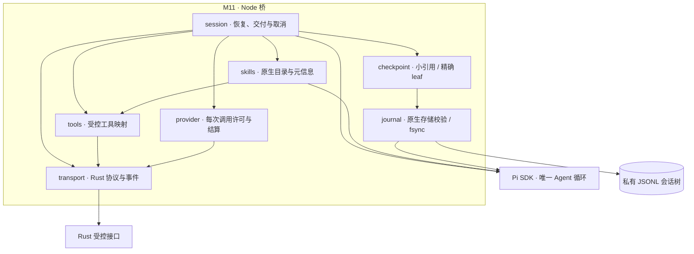
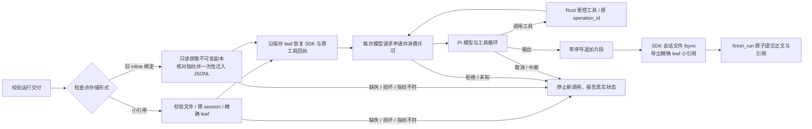
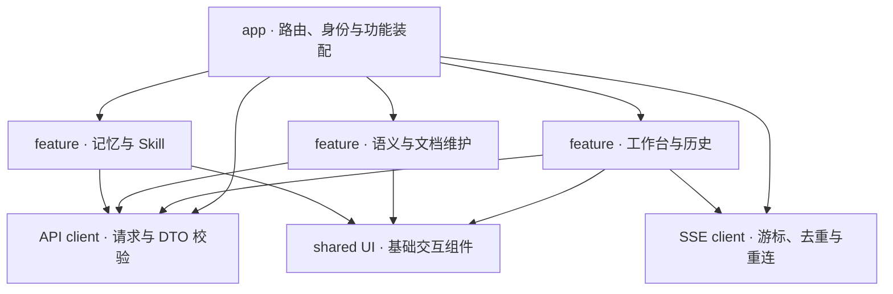
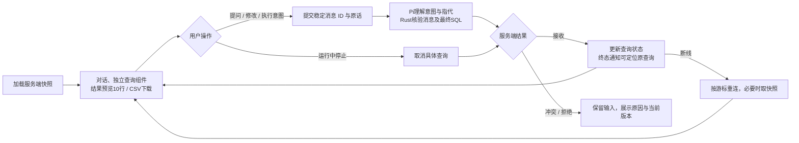
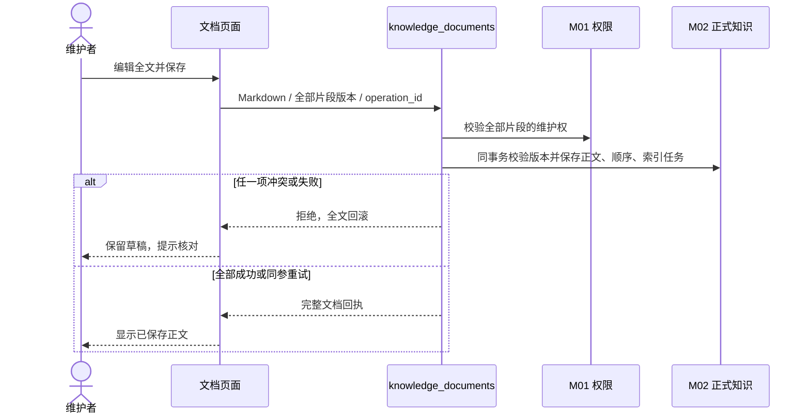

# 实施架构与模块流程

本文件把[系统设计](../semantic-retrieval-design.md)第 17–20 节展开为组件、依赖和调用视图；包含实现约束和当前接入边界。当前进度只见 [CURRENT](../CURRENT.md)。模块是代码职责边界，统一交付；Rust 业务代码位于一个 `crates/data-agent` 库内。

2026-10-06 补充：语义维护属于 Data Agent 内部权限，Datasight 资料读取与 SQL 查询执行独立校验。逐表负责人、超级维护者及跨用户建议处理待实现，目标流程见 [S01 / F01、S02 / F02](knowledge-modules.md)。其余会话、Pi、Mem0 与查询运行职责保持原设计。

## V01 组件框架：运行时交互

图例：箭头表示运行时请求或存储访问，分组表示职责。Pi 的双向连接经过 Rust 内部 API 入口，省略该重复入口以便阅读。M01 定义可信身份；M05 管会话串行租约；M08 管运行、恢复和付费调用预算；M10 管后台作业租约。Rust API 和 Worker 使用同一业务用例。Pi 保持唯一 Agent 循环，预填的两次有界结构化调用不增加规划器。

MySQL 保存应用事实及 Pi 会话的精确 session/leaf/authority 引用；私有 JSONL 保存 SDK 历史，两者一同保留和备份。恢复仅采用数据库已保存的 leaf，文件中的未确认尾部不进入模型上下文。Milvus 是可重建索引，命中后回源检查。平台查询的实际终态由平台查证。组件分组不要求独立部署，也不对应十二个微服务。

## V02 代码依赖：编译与导入方向

图例：`A → B` 表示 A 导入或编译依赖 B。M01–M10 同级不互导；需要组合时由 `use_cases` 调用多个模块公开操作。ports 归所属模块，adapters 实现，apps 注入装配；只为真实外部边界定义接口。

跨模块事务由具名用例开启，调用各模块公开 `*_in_tx(AppTx, …)`；各模块只写自己负责的表，协调层不写 SQL。Rust 私有模块隐藏 store 实现，`pub(crate)` 本身不能阻止兄弟模块访问；禁互导、SQL 位置和表 owner 由工程检查与评审约束。`AppTx` 不实现通用 `Executor` / `Deref`，底层连接仅允许私有 store 访问，并检查 `use_cases` 不持有通用 SQL 入口。共享事务不承诺表级隔离，真实数据库权限由账号及授权配置保证。

`packages/contracts` 是唯一契约真源：HTTP 使用 OpenAPI 3.1 并引用共用 JSON Schema；内部 Pi、工具和 SSE payload 使用 JSON Schema。Rust / TypeScript 边界类型从同源生成，在入口做运行时校验后映射为业务输入，不进入业务核心；具体生成器在 I0 用代表样本验证，不维护三份手抄定义。Pi SDK 格式留在 Node 桥内；Node 回调 Rust 是 V01 的运行时交互，不产生循环导入。

## V03 提问到纠错：调用时序

图例：实线为请求，虚线为返回；事务行只包本地状态变更。会话串行租约和作业租约独立，旧代次拒绝写入。图示取数分支；纯解释可直接结束，调查和澄清由 Pi 按需决定。取消、失败、预算耗尽及未知回执保留各自状态；解释失败不重跑查询。

该时序末尾表示个人记忆保存。共享语义纠错另走待实现的 F02：A 提交可共享建议，B 作为表负责人接受或驳回；接受后核对、编辑并保存才产生正式版本。个人记忆不因建议提交而对 B 开放，语义角色也不扩大图中数据平台的查询授权。

## M10 jobs：后台作业

只负责 `background_jobs` 的登记、领取、续租和结束；业务执行由 Worker 分发到具名用例。作业载荷使用类型、对象 ID、目标版本及预算范围引用，不保存可任意执行的命令。

| 操作 | 输入 | 输出 | 错误 | 副作用 |
| --- | --- | --- | --- | --- |
| `enqueue_in_tx` | AppTx、稳定 job_key、类型、对象/版本、到期时间、预算引用 | 作业 ID / 原记录 | 参数冲突、非法类型 | 同业务变更原子登记；同键同载荷去重 |
| `claim_due` | Worker ID、可处理类型、领取上限、当前时间 | 到期作业、租约代次 | 存储失败 | 原子领取；过期可接管，代次递增 |
| `renew_lease` | 作业 ID、领取者、代次、续租时间 | 新到期时间 | 旧代次、租约失效 | 只延长当前持有者租约 |
| `settle_in_tx` | AppTx、作业/代次、完成或有限重试决定、错误 | 作业状态 / 原回执 | 旧代次、状态冲突 | 完成、待重试或失败；不修改业务表 |

### S10 模块内部结构

箭头表示内部调用依赖。作业执行与是否重试由具名业务用例决定；M10 只校验并保存作业状态，不包含查询、预填或 Agent 业务逻辑。

### F10 作业内部流程

业务用例决定是否可重试，M10 不把超时直接改成重做。`user_request` 作业继承原请求预算；`maintenance` 作业继承明确维护配置创建的范围。自动重试、接管和事件唤醒均不增加额度。领取作业不等于获得 M05 会话推进权。

## M11 pi-bridge：Node 与 Pi

本轮展示调整沿用既有 Pi 提示与模拟提供者：工具继续使用完整ID和版本，用户回答以业务目标、名称与当前状态说明。SQL、表名和影响答案的条件仍准确展示；没有新增Agent循环或改写模型输出的清洗器。

模型切换沿用M08冻结的 `RunEnvelope.model_profile`，从Pi模型目录选择模型并传原生 `thinkingLevel`；共享原session与检查点。跨模型历史转换和同模型工具续调的思考字段由SDK处理，不在桥层复制一套转换规则。

桥接固定 SDK 的注册、恢复、事件和取消；业务身份由 M01 产生并由 Rust 绑定。首次工具登记由宿主分配稳定 `operation_id`，持久映射到 `origin_run_id / sdk_tool_call_id`；恢复包携带该映射以接回原调用与结果。新的 `run_id / lease_epoch` 校验当前运行权，恢复不改变原副作用身份。M11 复用 Pi 原生 JSONL 会话存储，恢复包只保存版本、文件名、原 session 与精确 leaf/authority；业务授权仍由 Rust 判断。

| 操作 | 输入 | 输出 | 错误 | 副作用 |
| --- | --- | --- | --- | --- |
| `resume_and_deliver` | 运行/代次、事件、任务条件、允许上下文、工具清单、恢复包 | 接收状态 / 运行标识 | 版本不支持、运行冲突、恢复失败 | 恢复 Pi；不自行创建业务任务 |
| `invoke_tool` → Rust | 当前运行/代次、宿主绑定 operation_id、origin_run_id / sdk_tool_call_id、工具及参数指纹 | 原操作结果 / 处理中 / 未知 | 权限、旧版本、映射不符、同 ID 异参 | Rust 按原 operation_id 接回或执行；新运行不能重置副作用身份 |
| `send_model_attempt` | 原预算引用、调用指纹、输入/输出上界 | 响应 / 用量 / 未知 | 额度不足、许可过期、超时 | 向 M08 申请并消费许可后发一次请求；SDK 重试也受控 |
| `append_output` → Rust | output_id、attempt_id、chunk_seq、代次、片段 | 接收进度 / 缺口 | 旧代次、片段冲突 | 保存可重连片段；不代表最终提交 |
| `finish_run` → Rust | 最终输出、恢复包、消费进度、代次 | 原提交 / 已提交 | 旧代次、缺片、持久化失败 | Rust 原子提交并释放 M05 租约；不伪造查询终态 |
| `cancel_run` | 运行 ID、代次 | 已接收 / 当前模型状态 | 运行不存在、旧代次 | 停止模型；平台取消由 M07 单独处理 |

### S11 模块内部结构

箭头表示桥内依赖及外部边界。session 装配工具和 provider；skills 调用 SDK loadSkills 解析已授权元信息，read 工具复用 SDK 分页并由 Rust 获取当前版本正文/附件。关闭直接 /skill 命令展开，不启用 bash 或主机文件工具；journal 复用 SDK 的 create/open/branch/resetLeaf，不另造会话或压缩器。目录 0700、文件 0600；引用提交前校验原 session/leaf 并 fsync。transport 只发送契约 DTO；旧 inline 仅从宿主绑定的不可变副本读取，核对原始响应指纹后一次性迁入原生文件。provider 为每次实际请求取许可，tools 不持有通用数据库写入能力。

### F11 Pi 桥内部流程

调用许可与网络发送无法跨进程原子完成，已发出但未知的调用保留预留。SDK 若无法在隐式重试前检查额度，必须关闭其隐式重试；恢复保证仍需固定版本故障试验证明。

## M12 web：交互与展示

工作台是一条对话流，草稿随保存事件展示，查询按已加载的确认事件固定位置；若该事件尚在未加载的历史页，暂置顶部，补页后恢复真实位置；完成、失败或停止由终态事件追加可定位通知，已替代的未执行SQL折叠保留。用户直接续聊，由Pi理解补充、修改和执行意图，必要时澄清；不展示内部问题列表、任务引用或补充/执行/取消按钮排。代码框右上复制SQL及参数，完成后自动展示结果与实际执行SQL，运行中保留“停止”。`ConversationFeed`管理独立消息滚动区，输入区保持可用；查阅历史时不跳转到末尾，原本位于最新消息处才跟随更新。表格和图表只预览前10行，CSV下载同一查询已保存的全部页（合成平台最多1000行，超出明确提示）。`MarkdownContent`和查询组件身份保持稳定，轮询不重建正在横向滚动的表格。

输入框底部工具栏由`ModelSelector`显示模型与思考档位；`useModelSelection`读取M08目录和M05本人设置，保存中暂停发送与再次选择，输入草稿和后台查询继续保留。请求代次阻止旧会话结果覆盖新会话；保存失败回读当前值并提示，无法回读时暂停发送并提供重试。既有对话即时保存，新对话随首条消息保存；每条消息发送时显式携带当前选择。切换到不支持当前档位的模型时显示关闭。页面不持有价格、预算或密钥。

语义管理先显示当前业务内容，DDL、来源事实、模型建议和人工记录按需展开。目录切换、筛选与请求代次共同约束详情选择，空负责目录不能保留其他人的对象。指标/文档关联和纠错依据按资料名称选择，内部ID、数字版本仍由契约和服务端校验。

对话中的SQL依据由App在`Modal`内打开只读`KnowledgeEvidence`，先展示本次采用的共享口径，单独列出查询条件。引用文档可展开当前整篇正文，明确区分当前全文和查询采用的历史依据；“去维护此内容”进入语义管理。工作台在阅读依据时持续挂载，查询与消息更新继续。正文独立滚动，底部“返回对话”固定；按钮或Escape关闭后恢复原入口焦点与阅读位置，保留输入草稿、结果视图和表格位置。

`UnsavedChangesProvider`统一保护语义条目、整篇文档、个人资产和纠错表单。关闭、切换对象/目录/主区、浏览器后退时可继续编辑或明确放弃；保存开始不撤销保护，成功回执才清除。保存失败保留输入，已发出的保存请求不会因为关窗而自动取消。弹窗正文独立滚动，编辑操作栏固定。`useWorkspaceLocation`把主区、语义对象/标签/目录范围、资产分类放进地址；自动目录选择替换当前地址，用户导航加入浏览记录。刷新和后退按同一状态恢复；URL仍不能绕过服务端权限。

工作台输入随内容适度增高，历史列表独立滚动，账户留在侧栏底部；手机使用导航抽屉。历史接口可选返回真实`created_at` UTC字符串，用创建时间区分同名对话，不假称最后更新时间。查询完成后先显示数据，最终SQL仍可查看、复制。图表明确选择分类与指标：仅已声明的文本/日期列用作分类，有限且可安全表示的数值列用作指标，排除标识字段；缺少合适列时不提供图表，不猜金额单位。NULL保留缺失含义，负数按零线绘制，原始表格保持数值精度。

语义目录保留不同身份的同名表并显示来源；刷新需核对所选对象仍符合目录条件，不因空负责目录保留他人的对象。字段用紧凑行展开，文档整篇阅读、目录跳转及编辑预览。个人资产提供搜索、状态筛选和紧凑列表，完整原文及次要操作按需展开；公共Skill入口明确先从我的Skill发布独立副本。

`KnowledgeDocument` 使用 `GET/PATCH /knowledge/{id}/document` 读写整篇Markdown。具名用例 `knowledge_documents` 组合M01授权与M02保存；请求包含正文和完整片段版本集合，任何权限/版本失败回滚全文。历史分段保留ID，新增可选 `document_order` 和正文同版本写入，空片段也保留人工覆盖；来源再分析仍走原有保护逻辑。页面独立保存编辑草稿，全文刷新失败不卸载编辑器，非首片段改动也会刷新。

“选用分析方法”和已选方法的“管理与选用”直接进入我的Skill，可切换空间公共Skill；普通“我的积累”入口仍默认个人记忆。入口分类由App传给AssetsPage，选用后返回原对话并恢复草稿。Skill新增入口提供收入概览、退款分析、结果汇报三个可修改示例；附件与引用按需维护。正文、范围、附件或引用变动仍撤销旧核对标记，选择固定版本及发布独立副本的规则保持。

只保存输入草稿、页面选择等界面状态；服务端状态经 HTTP 与可重连 SSE 更新。主入口沿用工作台、我的积累、语义管理；身份、确认可执行性和资源归属以 Rust 返回为准。

资产维护由 `AssetsPage` 保存编辑种类、窗口身份和列表请求代次，`PublishSkill` 负责发布预览，`AssetDependenciesEditor` 负责读取并核对已有知识引用。依赖更新或移除只改变草稿；名称、正文、范围、附件及依赖改动撤销旧核对标记。保存继续使用 `POST /assets`，知识读取使用 `GET /knowledge/{id}`，M09/M02 保留版本与权限规则。

写入回执与列表读取分别反馈：原窗口已关闭时，当前有效页面仍可刷新已提交记录，错误则具名提示并提供只读核对；旧页面回执不能越过身份变化。初始读取不会因一次失败提交被作废，较早的列表成功或失败不能覆盖后来的读取。服务端回执是成功依据，关窗和网络失败不能证明未写入。维护流程见[执行包第 11 节](../dogfood-repair-execution.md#11-资产维护补充修复)。

| 操作 | 输入 | 输出 | 错误 | 副作用 |
| --- | --- | --- | --- | --- |
| `load_workspace` | 登录会话、会话/任务或资源 ID | 有权查看的快照与版本 | 无权限、不存在、结果过期 | 更新视图；不自报用户身份 |
| `submit_message` | 会话、稳定 message_id、正文/澄清引用 | 已接收消息 / 当前阻塞状态 | ID 异参、无权限、服务失败 | 服务端持久化成功后标记已发送 |
| 聊天执行 | 用户正文 → Pi `execute_query` / 当前查询版本 | 同一查询状态与实际SQL | 来源无效、message_pending、版本冲突、无权限 | Rust绑定真实消息；修改后执行新稿，普通修改不执行 |
| `cancel_query` | 查询 ID、命令 ID | 该查询的取消接收结果与真实状态 | 无权限、已终止、不支持、服务失败 | 只取消指定查询，不取消整个分析任务；不先宣布成功 |
| `save_resource` / `select_skill` | 资源 ID、base_version、补丁；或 Skill 版本/任务 | 新版本与索引状态 / 选择记录 | 冲突、停用、范围不符 | 通过服务端保存；Skill 推荐不自动采用 |
| `consume_events` | 会话、上次 event_seq | 追加/替换输出与新游标 | 缺片、需快照、连接中断 | 去重；缺历史时取快照，不拼接两次半段回答 |
| `show_result` / `export_csv` | 查询引用、已获数据范围 | 表格、图表、CSV | 过期、无权限、数据未齐 | 预览10行，下载已保存的结果；明确截断和来源，不扩大权限 |

### S12 模块内部结构

箭头表示装配或依赖。三个 feature 之间不互导；跨页面跳转由 app 协调，API/SSE 客户端传递服务端事实，shared UI 不持有跨业务状态。

### F12 Web 内部流程

页面关闭不取消后台任务；草稿按会话保存，未发送内容不暂停 SQL 确认。验证至少覆盖重复事件、重连、两个页面确认竞争、旧版本、移动端和键盘操作；文档图与 mock 界面不能替代服务端行为证据。

## V04 整篇业务文档编辑与保存

