# 知识、权限与个人资产模块设计

本文展开 M01、M02、M03、M04、M09 的模块职责、公开操作和内部流程。以[系统设计](../semantic-retrieval-design.md)第 6、10–12、17–20 节为依据，当前实施状态见 [CURRENT](../CURRENT.md)。**以下为模块契约和设计边界；当前源码、测试与未验证的真实接入以CURRENT为准。**

2026-10-06 已确认补充：本系统按表负责人或超级维护者授权共享语义编辑，跨用户纠错可提交负责人处理，接受后仍需编辑保存。本轮已接入，现有私人提案继续隔离，共享建议独立保存。Datasight 的资料读取、查询和 SQL 执行权限独立校验。

## 1. 共同边界

- 模块是一个 Rust 业务库内的代码与数据责任边界，首版仍在现有 API / Worker 进程内统一交付。M11 `pi-bridge` 承载唯一 Agent 循环，M12 `web` 负责展示和输入。
- Rust 业务模块之间不直接导入或调用。`use_cases/` 中按业务动作命名的小函数组合模块公开操作，不建立万能 service、事件总线或额外微服务。
- `store.rs` 留在各模块内部私有；组合函数共享同一个 `AppTx`，只调用各模块的 `*_in_tx`，不直接写 SQL。模块返回待办意图，由组合函数调用 M10 `jobs` 登记，任何一步失败整体回滚。
- 平台、Embedding、模型和索引网络调用均在数据库事务外；回写时重新核对版本、租约代次和权限依据。事务不是网络调用只发生一次的保证。
- 表中操作是 Rust 内部公开接口；HTTP、Pi 工具和 Worker 只能进入对应组合函数。模块返回的内部对象未经组合层授权与裁剪，不得直接序列化给浏览器、模型或可见日志。

### 1.1 通用输入与结果

| 类型 | 最小字段与含义 |
| --- | --- |
| `AccessContext` | 使用[实现设计](implementation-design.md)第 4.1 节的 `{principal: user(user_id) 或 service(service_id, maintenance_config_version), space_id, authn_source, request_id}`；个人资产/会话操作要求用户主体；服务主体仅有配置明确的维护范围，不能冒用用户 |
| `RunContext` / `MaintenanceContext` | 运行身份与维护身份分别使用总设计的共用类型，携带对应运行/工作项、领取代次、固定预算范围和模型配置；不混入 `AccessContext` |
| `ResourceRef` | 使用总设计的 `{kind, id, version}`；条目路径/章节位置另随依据字段保存，来源版本、知识版本和索引版本分别记录 |
| `WriteContext` | 知识/资产专用写入参数，承接 `Command.operation_id/expected_version` 为稳定操作 ID 与 `base_version`，另记录规范化参数指纹；首次创建不传 `base_version`，用稳定创建键与不存在条件；领取代次来自运行/维护上下文，同 ID/同参数返回原回执，不同参数冲突 |
| `MutationReceipt` | 使用总设计的 `{operation_id, resource_ref, state, index_state?}`；模块内部写入结果另返回待办意图/受影响引用，先保存成功、后索引更新 |
| `ReadResult<T>` | 已核对版本的内容、可展示来源、缺口、完整性与降级状态；无资料与服务不可用分别表达 |

跨语言契约真源固定为 `packages/contracts` 中的 OpenAPI 3.1 与内部工具/事件 JSON Schema；生成 Rust/TypeScript 边界类型并执行运行时校验。内部领域类型不强制生成或暴露为 HTTP 接口。下表省略重复的身份/运行/维护与写入上下文参数，但写入均遵守上述约定。

### 1.2 读取、版本与删除

- M04 只交付候选 ID、版本与内部评分。组合层经 M02 / M09 回源，经 M01 核对访问和模型资料范围，再返回内容；不能直接返回索引摘要。
- 对模型与用户不可见的对象，不返回名称、被过滤数量、命中理由、引用链接或存在性提示。指定对象查询对“不存在”和“无权读取”统一返回 `not_available`；分页与计数仅基于可见结果。
- 内部可以区分权限拒绝、对象缺失与依赖失败，诊断只记录必要标识和关联号。向调用方说明能力降级时不附受限对象细节。
- 停用/删除先使正式记录不可用于新读取，并原子登记索引清理与上下文失效待办；清理失败不恢复可见性。旧版本只供仍有权限的历史追溯，不参与当前推荐。
- 新一轮、工具返回、恢复和模型发送前均重新核对所用引用。包含失效资料的历史工具结果或压缩摘要由 M08 / M11 重建上下文；只过滤当前检索不足以完成撤权。

## 2. M01 `access`：身份、权限与模型资料范围

**职责：**验证可信身份，分别校验本系统语义维护权限、平台数据权限和个人资源归属，再核对具体模型端点可接收的资料范围。目录读取、来源 SQL、文档、字段样例和结果分别判断；目录可见不等于查询可执行。平台权限适配器表达实际授权与未知能力，M01 不自建数仓权限平台。

**私有数据：**身份映射、空间与平台授权映射、端点资料策略及版本、必要的权限缓存/失效标识；只保存凭据引用。`semantic_ownership` 保存对象归属与授权版本，`semantic_owner_operations` 保存独立指派回执；超级维护者来自可信启动配置，不能用平台执行权限推导。会话/资产归属和对象分类由各所属模块通过组合层提供，M01 不读取其私有表。

| 公开操作 | 输入 | 输出 | 错误、副作用与幂等 |
| --- | --- | --- | --- |
| `resolve_principal` | 已验证登录凭证或受信服务调用、维护配置版本 | 区分用户/服务主体的可信 `AccessContext` | `unauthenticated` / `identity_unavailable`；服务范围受配置限制；处理用户请求的后台作业仍引用原用户授权，作业执行身份另存；模拟身份只在开发模式启用 |
| `authorize_action` | 可信上下文、动作、对象描述/归属、目标 | 限定动作与版本的授权决定 | 对外 `not_available` / `policy_unavailable`，内部细分拒绝与缺失；只读；缓存不能越过有效期或撤权代次 |
| `derive_search_scope` | 空间、资源类型、任务范围 | 可下推的过滤条件、权限版本 | 服务未知则明确失败；过滤条件只是候选范围，不替代逐项回源检查 |
| `filter_for_delivery` | 当前资料描述与引用、接收方 `user/model`、端点策略 | 允许字段/片段及可见来源 | 不输出被拒条目；端点限制不能退化为用户可读即允许外发；只读 |
| `check_context_refs` | 恢复/输出将用到的引用与权限版本 | `valid` 或内部失效引用集合 | 查证失败不得继续发送相关内容；无状态修改，组合层决定重建或暂停 |
| `record_policy_change_in_tx` | 经宿主验证的策略变更、起点版本 | 新策略版本、上下文失效意图 | 版本冲突或权限不足拒绝；原子更新本模块策略；相同操作幂等 |

M01 的授权决定只在受信 Rust 内部流转；携带主体、动作、范围、资源/策略版本和有效期。组合层在事务内核对本地版本，在事务外按平台能力查证；平台不能提供稳定快照时保守重查，不能承诺跨系统原子撤权。

### 2.1 两类权限分别校验

| 动作 | 权限依据 | 限制 |
| --- | --- | --- |
| 编辑正式语义、接受/驳回已提交建议 | 本系统的对象负责人关系，或超级维护者角色 | 逐对象在事务内核验；表权来自平台，独立对象首次创建自动归属，后续编辑不转移归属 |
| 读取平台资料、查询数据、执行 SQL、读取结果 | Datasight 当前用户及动作授权 | 系统语义角色不能放大权限；SQL 仍绑定用户确认版本 |
| 读取聊天、个人记忆或 Skill | 本人、空间与资产状态 | 超级维护者角色不提供他人私有内容访问权 |

表和字段按所属表授权。跨表共用指标/文档的维护归属须明确，引用关系不传播编辑权。维护时如需查询数据，分别通过两类动作的检查。表/字段负责人通过平台目录同步；独立人工对象由有创建资格的首次录入者负责，超级维护者可调整；超级角色按空间在启动配置中提供，不增加权限服务。

`authorize_maintainer` 现在校验可信配置的空间超级维护者，用于平台表/字段创建、同步和全局索引维护；`can_create_in_tx` 从本空间平台表维护关系或超级角色判定独立对象创建资格；`register_creator_in_tx` 与知识创建同事务登记归属，重试不覆盖已有关系。`authorize_semantic_in_tx` 对对象负责人或超级维护者授权。M01 只读取自己的授权表，平台表身份按 namespace + id 匹配，引用关系不传播权限。未配置负责人只允许超级维护者维护。

### S01 模块内部结构

图中是 M01 内部职责。两条授权分支处理不同动作，不互相授予权限。

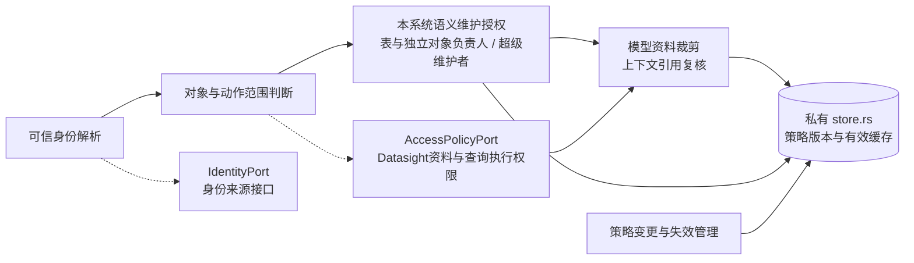

### F01 身份与资料范围校验

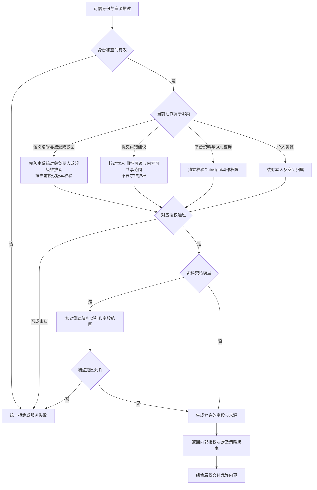

## 3. M02 `knowledge`：正式语义、文档与依据

**职责：**维护表、字段/取值、指标、查询关联、业务术语/规则、经验证案例、文档/章节和主题；管理立即生效的版本、条目来源、人工覆盖、待复核项与依赖。生产血缘事实和可用查询关联保留不同类型，不能由前者自动推出可 JOIN。

**私有数据：**`knowledge_objects`、不可变 `knowledge_versions`、`knowledge_references`、条目编辑/验证记录、文档章节与关联，以及独立的 `semantic_change_proposals`。原始平台快照归 M03；本模块按稳定来源 ID、版本和 SQL/章节位置引用。建议记录不参与正式正文或检索索引。物理表随增量落地，不按对象类型复制业务服务。

### 3.1 条目级语义

每个可编辑字段、规则、指标子项、文档条目有稳定 `entry_id/path`，独立保存以下内容；不能只给整张表打“人工修改”标记。

| 内容 | 保存与更新规则 |
| --- | --- |
| `source_facts` | 来源事实值、来源版本/原文位置、解析器版本、获取完整性；未解析 SQL 留缺口，不捏造事实 |
| `model_suggestion` | 建议值、模型/输入版本、来源、生成时间与不确定项；不得标记为人工确认 |
| `human_override` | 人工值、操作者、时间、起点版本与修改路径；重新预填必须保留，清除覆盖需显式编辑操作 |
| `effective_value` | 有人工覆盖时采用人工值，否则按条目类型采用可用事实/建议；同时返回出处和冲突，事实与业务定义冲突不自动裁决 |
| `review_state` / `validation` | 待复核原因、受影响依赖、验证方式/范围/版本与结果；启用、人工修改、业务验证分别记录 |

文档完整正文有版本，章节有稳定标识。关联可指向表、字段、指标或主题及特定章节；文档改名不换 ID，章节删改产生明确的断开/替代引用。仅有链接保存 `body_unavailable`，不会假装正文已获取。文档权限与所关联对象分别检查，引用不授予权限。

| 公开操作 | 输入 | 输出 | 错误、副作用与幂等 |
| --- | --- | --- | --- |
| `create_object_in_tx` | 对象类型、稳定创建/来源键、首版正文/事实、来源引用及当前来源证明；不传 `base_version` | 新对象 ID、版本 1、依赖与索引意图 | 校验维护权限或限定维护配置；创建键唯一；同操作重传返回原记录，其他同键创建返回 `already_exists`，不隐式覆盖 |
| `read_objects` | 空间、对象/版本引用、所需字段 | 内部版本正文、状态、依赖与资料描述 | 批量只读；不附未经授权的外部可见错误详情；组合层随后做 M01 校验 |
| `find_exact` | 空间、类型、名称/别名、有限查询范围 | 当前对象候选 ID/版本 | 只读；为精确定位和索引滞后补查提供正式数据 |
| `read_evidence` | 对象版本、条目/章节、邻接范围 | 依据引用、必要相邻段落、缺口 | 引用断开显式保留；来源正文由组合层另向 M03 读取和授权 |
| `find_dependents` | 来源/对象版本、变化路径 | 受影响条目及引用集合 | 只读、可分页；不直接修改其他模块的依赖状态 |
| `mark_dependencies_changed_in_tx` | 可靠变化及当前受影响条目、起点版本 | 新版本中的待复核项、索引/上下文失效意图 | 来源快照提交时同步标记，模型未完成前旧依据不继续显示为已核实；保留人工值 |
| `save_edit_in_tx` | 已授权编辑、起点版本、条目补丁/清除覆盖 | 新知识版本、差异、索引及依赖复核意图 | `version_conflict` / `invalid_definition`；清除后无来源/建议时有效正文为空字符串，历史版本保留；提交前校验完整对象，失败不落库；不自动变成业务验证通过 |
| `save_document_in_tx` | 正文/链接、章节、关联、起点版本 | 新文档版本、有效/断开引用及待办 | 关联结构不合法则拒绝；改版保留人工文字、标记受影响规则需复核 |
| `apply_prefill_in_tx` | 结构化预填、来源/输入版本、组合层取得的当前来源证明、条目起点版本 | 合并后新版本、保留人工项、冲突/缺口 | 来源已变返回 `stale_source`；并发人工改动先重新合并，绝不盲写旧建议 |
| `record_validation_in_tx` | 条目及依赖版本、检查范围、证据、结论 | 新版本或对应验证记录、待办 | `version_conflict` / `invalid_evidence`；SQL 可执行不等于口径验证通过 |
| `change_status_in_tx` | 对象、起点版本、停用/恢复/删除原因 | 当前状态、新版本、索引/上下文失效意图 | 有权维护者操作；关联不级联删除其他对象；重复操作返回原回执 |
| `save_change_proposal_in_tx` | 可信用户、可读目标/基版本、补丁/来源/原任务/私有标记；修改另带建议 ID 与预期修订 | 本人建议 ID、`open` 状态及保存回执 | `propose_semantic_change` 仅调用此操作；只创建或修订本人的开放建议，不写正式版本；不要求维护权，不接受不可读目标 |
| `read_change_proposals` | 用户主体、本人建议 ID或目标/游标 | 本人可读的建议、基版本、状态与差异 | 当前只读本人建议；第 3.3 节另增受控提交后的负责人读取，不能直接移除 owner 过滤 |
| `apply_change_proposal_in_tx` | 维护者本人明确保存、本人建议 ID、预期建议修订、当前知识基版本、最终补丁/公共来源 | 已生效知识版本、`applied` 建议回执、索引/依赖意图 | 重用 `save_edit_in_tx` 规则；知识版本和建议状态同事务；过期基版返回冲突，未授权模型请求不能进入本操作 |
| `dismiss_change_proposal_in_tx` | 本人建议 ID、预期修订、放弃原因 | `dismissed` 回执 | 只关闭建议；不更改正式知识，重复命令幂等 |

删除对象后保留必要的引用断开状态，相关规则/案例/Skill 通过组合层标记需复核。精确历史保留/物理清理范围在实际部署策略中确定；不得向用户承诺未经实现的彻底清除。

### 3.2 首次创建与同步新条目

维护页面读取表的字段、指标、文档和关系时，通过现有 `GET /knowledge?related_id=<id>&after_id=<cursor>` 单独分页，每页最多100项。先检查目标可读，再按空间、当前非删除记录和直接关联查询；与 `q` 检索参数互斥。目录首页或前30条搜索结果不能作为关联内容的全集，界面独立提供“加载更多关联内容”。该读取复用M02存储边界，不进入Agent检索路径。

- 稳定来源键为 `(space_id, source_namespace, platform_object_id, object_kind, stable_subobject_id?)`；字段等子对象由 M03 保存稳定映射，不能仅按显示名称匹配。人工条目使用 `source_namespace=manual` 与宿主分配/客户端重传保持不变的创建 ID。创建键和对象 ID 分离，改名不换对象，删除后同键也不自动复活。
- `create_object_in_tx` 以唯一键和“不存在”条件创建版本 1，无虚构 `base_version=0`。首次创建同时保存来源/父对象/已知依赖引用；结构仍有缺口时明确保存未知与待补项。文档首版复用相同创建入口及正文/章节校验，后续编辑才使用版本校验。
- 新来源同步在保存可靠快照的同一小批事务中，通过 M02 创建最小正式对象、版本 1 和来源依赖，再由 M10 登记预填/索引任务。不能只对既有依赖调用 `find_dependents`，否则新表/字段永远没有知识入口。创建返回 `already_exists` 时回读对应对象/当前版本，按既有对象走变化标记与版本化预填，不把整个批次判为失败或当作创建覆盖；已有对象若已删除/停用则保留该状态，不自动恢复。

### 3.3 语义修改建议到维护保存

**当前实现：**`propose_semantic_change` 保存本人私人建议，记录对象、条目、基版本、建议值、理由和公共依据。`semantic_change_proposals` 列表和兼容采用仍按 `owner_id + space_id` 限定本人。新 `semantic_corrections` 只接收用户明确确认的共享提交；不复制聊天或个人资产。预填 `model_suggestion`、私人提案和正式版本分别保存。

**协作流程：**A 提出纠错，B 是目标表的语义负责人。B 或超级维护者可驳回，或接受后核对、编辑并保存。接受不直接套用模型补丁；不需要 A 先获得维护权。新流程替代旧版“仅提出者本人维护采用”的产品限制；已有私人记录继续保留原范围。

| 阶段 | 谁可以操作 | 正式语义与共享召回 |
| --- | --- | --- |
| 本人草稿 | A 与其受控 Agent 整理内容 | 不变；不进入负责人列表或共享召回 |
| 提交为待处理建议 | A 提交明确可共享的修改与依据 | 不变；A、目标负责人及超级维护者可按当前权限读取提交内容 |
| 驳回 | B 或超级维护者说明原因 | 不变；保留处理人、理由和记录，A 可查看 |
| 接受待修改 | B 或超级维护者接受建议 | 不变；尚无新的正式版本 |
| 编辑并保存生效 | B 或超级维护者核对并保存最终内容 | 新正式版本生效，登记索引及依赖复核待办 |

读取建议仍检查当前对象/资料权限；建议访问权不打开 A 的私人原文或结果。普通第三人不因同空间而取得建议内容。已提交建议保留独立内容与修订记录，后续修改不能悄悄替换已审核内容；存量 `open` 记录不能批量当作已提交建议公开。

正式保存复用 `save_edit_in_tx`，重新校验本系统维护范围、建议修订、知识基版本、依赖及共享依据。基版本已变则保留原建议和差异，要求重新核对最终补丁；权限收回则拒绝保存。用同一事务保存正式新版本、建议实际采用内容/生效版本、操作回执和待办；重复命令接回原回执，失败不标“已生效”。已有私人来源不自动进入公共正文或出处。

仅处理本次 SQL 时无需等待建议审核；生成新版 SQL、用户确认及 Datasight 查询校验沿用既有路径。Mem0 继续处理本人记忆，建议处理结果不静默更改个人资产。共享检索只采用正式版本；待处理、已接受和已驳回建议均不作为正式知识召回。

### 3.4 数据与接口边界

本节列出本轮实施边界。跨语言请求及错误在 `packages/contracts` 定义，本文不维护另一套可执行 Schema。

| 归属 | 实施内容 | 保持的边界 |
| --- | --- | --- |
| M01 | 本系统表负责人关系、超级维护者角色及授权版本；按对象/动作校验 | 与 Datasight 权限独立，不保存一份数仓授权替代品 |
| M02 | 建议的提交内容、原值/建议值/依据、提交状态与修订；接受/驳回记录、处理人/原因；最终补丁及生效版本 | 提出者、负责人和实际编辑人分别记录；私人原任务引用不作为共享阅读入口 |
| Rust 具名用例 | 提交建议、列出本人/负责范围建议、接受或驳回、关联建议保存正式编辑 | 身份由宿主绑定，服务器检查当前对象归属；受控 Agent 工具不发布正式语义 |
| M12 | 在现有语义页展示负责人、建议与状态；预览共享内容；接受、驳回理由、编辑保存及冲突差异 | 不另建审批应用，界面状态以服务端为准 |
| M10 / M04 | 正式保存后的既有索引与依赖复核待办 | 仅接受建议不触发正式知识索引；索引失败显示滞后 |

M01 的 `semantic_ownership` 保存对象→授权对象→负责人的关系及版本。表负责人来自 Datasight mock，字段指向所属表；独立对象指向自身，人工创建时由服务端绑定创建者，只有超级维护者可调整归属。M02 的 `semantic_corrections` 与 `semantic_correction_operations` 保存共享内容、处理状态和幂等回执；历史私人表不迁移成公开记录。`created_by` 从首版记录保留，`updated_by` 只表示最后编辑者。平台维护人变更以最近一次成功同步为准，正式平台 ACL 尚未接入。

先锁授权快照，再锁来源/知识与建议；目标和依据知识按 ID 排序。接受不写知识，正式保存复用 M02 `save_edit_in_tx` 和 `knowledge_index_jobs`，复用既有 Worker 检索索引链路，不新增审批进程。

合成来源的空授权登记单独幂等提交，不授予维护权；随后以新事务同步来源、正式知识和索引待办，避免提前固定旧快照。权威目录移除先按序撤维护权，取得来源锁后重核当前缺失集合和来源基线，再停用对象；任一步失败均回滚该事务。

### S02 模块内部结构

图中是 M02 内部职责。正文/章节仍复用同一知识模块，权限由 M01 通过用例校验。

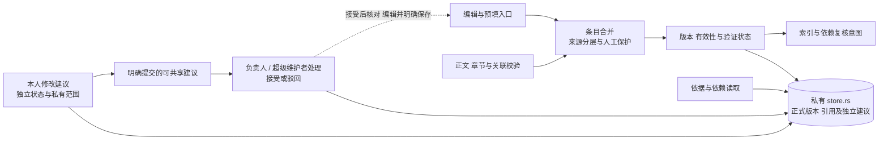

### F02 知识版本与人工覆盖

接受建议不改变正式语义，后续明确保存才进入正式版本事务。Datasight 查询执行在独立流程中校验。

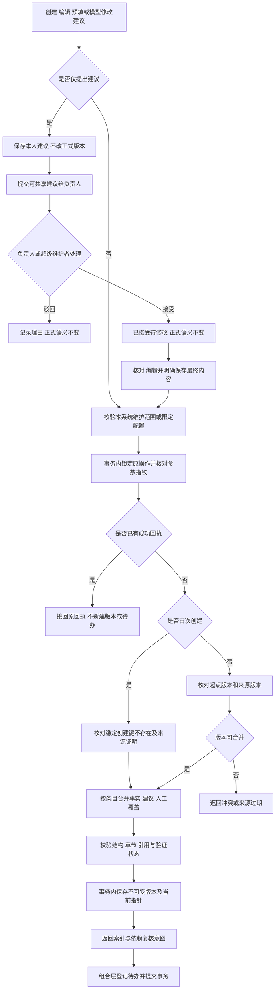

## 4. M03 `ingestion`：来源同步与增量预填

**职责：**完整导入可获取目录、DDL、血缘和加工 SQL，保留快照与同步范围；解析确定事实，构造预填输入并校验模型结果。全空间先基础预填并可检索，常用表优先深入分析，其余按需补齐；常用范围由维护者指定，不假设平台有热度接口。

**私有数据：**`source_snapshots`、`source_heads`、同步批次/游标及采集前基线、平台对象稳定映射、来源变化、解析结果、预填尝试与输入指纹。原文不可被模型建议覆盖；没有完整同步或可靠删除事件不能把本次缺席对象判定已删除。

常用范围由M03的`table_analysis_preferences`维护：空间及稳定知识表ID、独立配置版本、是否常用及操作者；`analysis_preference_operations`保存命令指纹和原回执。配置不改变知识正文版本。`set_table_analysis_preference`组合用例先核对维护权限、表对象可读及配置版本，再原子保存配置、调整该表/字段尚未领取的队列优先级，并为启用范围的当前版本幂等排队。已领取的调用继续沿用原身份与预算，关闭常用不删除知识或撤回已发送调用。

首次导入所有表/字段立即生成基础事实并进入目录与索引，只有常用范围自动排深入分析；普通表通过`request_prefill`按需分析。来源改版仍为所有受影响对象自动排重分析（D05），不能受常用开关阻断。领取按常用优先、再按创建时间排序。知识管理读取返回当前`analysis_preference`及现有`prefill_status`；历史知识版本不混入当前维护配置。没有配置记录时返回默认非优先、配置版本1，首次修改在事务内以唯一键建立默认行并校验该起点。

| 公开操作 | 输入 | 输出 | 错误、副作用与幂等 |
| --- | --- | --- | --- |
| `begin_source_read_in_tx` | 已授权的本批来源范围、稳定批次 ID | 已持久化 `read_token`，含范围内采集前的来源头修订/不存在基线 | 网络读取前短事务完成；同批次重传返回原基线；新采集须新批次，不把旧载荷改绑新基线 |
| `fetch_source_batch` | 已授权空间/来源、游标、能力与大小限制 | 来源片段、版本、完整性、下一游标 | 事务外平台读取；`source_unavailable` / `unsupported_capability`；不以空批次伪装成功 |
| `save_snapshot_in_tx` | `read_token`、来源稳定键、采集版本/指纹、结果、当前作业代次 | 快照引用、`head_advanced / unchanged / historical_only`、变化路径/待办 | 锁来源头并比较采集前 `expected_head_revision`；CAS 冲突返回 `source_head_conflict` 和 `historical_only`，不触发当前知识更新；同载荷重传幂等 |
| `read_source_snapshot` | 来源版本、位置/大小限制 | 原文片段、原始元数据与完整性 | 只读；仅返回内部内容，组合层做读者与端点范围检查 |
| `check_source_heads_in_tx` | 预填引用的来源版本 | 本事务当前来源版本证明 | `stale_source`；只读并锁定相应来源头，防止校验后被并发同步更新 |
| `parse_facts` | 固定快照、方言/解析版本、限额 | 可定位事实、未解析片段及缺口 | 无持久副作用；不执行加工 SQL；循环/深度上限给具体缺口 |
| `prepare_prefill` | 变化路径、M02 依赖查询结果、已授权必要资料、固定维护预算范围 | 固定输入版本与预算范围的预填请求、受影响条目 | 缺正文/上游保留缺口；不直接调用其他业务模块，不决定公共口径 |
| `read_analysis_preference_in_tx` | 可读表或字段对象、空间 | 当前常用范围及配置版本；字段继承所属表 | 只读，不改变知识正文；其他对象不附表级设置 |
| `save_analysis_preference_in_tx` | 稳定表ID、是否常用、配置起点版本、命令ID | 配置回执及是否发生变化 | 维护权限由组合层核对；同命令同参数返回原回执，改参数冲突；调整未领取任务优先级，启用后由组合层登记表及字段分析 |
| `run_prefill` | 预填请求、组合层取得的 M08 单次调用许可 | `PrefillModelPort` 返回的结构化建议或未知/失败 | 事务外固定分析、依据复核各一次；两次分别取原维护范围许可并结算；复核失败不应用分析草稿；`budget_unavailable` 时保留事实等待补充；实际重试须新许可并扣原范围 |
| `validate_prefill_result` | 模型结构化建议、原输入与来源版本 | 合法条目建议、依据与冲突 | `invalid_prefill` / `stale_source`；逐个覆盖本次语义目标，拒绝空结果、遗漏/重复/多余条目及DDL/ETL/type；解释可留空但须有明确缺口和引用，不沿用旧建议冒充成功；拒绝不存在的来源/路径，不把推测升格为事实 |
| `record_prefill_in_tx` | 输入指纹、结果/失败、当前领取代次 | 尝试记录及提交知识的意图 | 旧代次拒绝；稳定操作幂等，M02 正式版本由组合层另行提交 |

来源头保存本地 `head_revision`、当前快照引用及可用的平台单调版本。采集前基线以本批范围的数据库快照为准，新键使用当时确认不存在的基线；读取后才发现的新键不能先读取最新头再把旧采集结果当成新结果写入。回写只在起点仍匹配时推进来源头并递增修订；平台提供可靠单调版本时还须拒绝倒退版本，不能用采集结束时间或字符串大小猜顺序。

两个独立同步作业即使租约都有效，也必须通过上述来源头 CAS。失败可保留旧快照作历史，当前来源头、知识变化和待办均不改变；需要继续时重新捕获基线并重新读取平台，禁止仅替换 `expected_head_revision` 重交同一旧载荷。相同内容无需换头；部分失败、未完成分页不推进完整同步标记，也不推断删除。CAS 保证本地采集竞争不回退，不承诺平台自身返回了全局一致快照。

**当前实施：**M03 通过所属 `PrefillModelPort` 适配器做固定两次结构化维护调用（分析及依据复核），不创建聊天会话或第二个 Agent 循环。原生提交工具携带同源 `PrefillResult` 参数Schema；只接收一次完整同名工具参数作为建议，截断、坏身份和坏结构均拒绝，不执行模型声明的业务副作用。DeepSeek思考模式使用auto工具选择，off可指定提交工具，原profile与持久预算保持一致。所有实际模型调用（含预填、Embedding）取得 M08 许可；预算范围区分 `user_request` 与 `maintenance`。自动来源变化只引用维护配置已限定的范围，不自建额度；未配置时保留同步事实并等待模型补充。当前使用明确配置及持久账本，真实模型结果与本地回环分别验收。

当前组合操作：`prefill_materials::collect_in_tx` 组装有界材料；`knowledge_sources::read_in_tx/versions_in_tx/assert_in_tx`统一原始来源与M02文档版本检查；`knowledge::related_documents_in_tx`查直接关联和相关表的字段专属文档。它们不允许跨模块访问私有存储。资料限额、目录冻结时机及模型正文投影详见[实现设计](implementation-design.md#语义材料与实际上下文依赖)。

### S03 模块内部结构

图中是 M03 内部职责；所属 port 由适配器实现。输入由组合层提供授权与预算许可，预填不构成新的 Agent 服务。

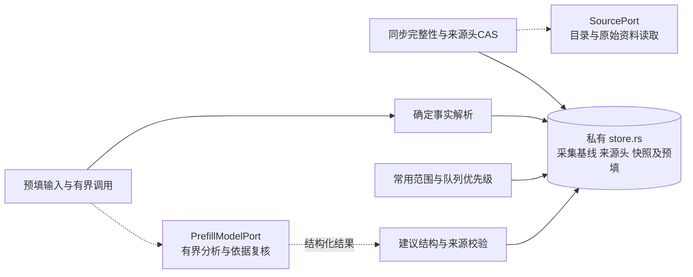

### F03 来源同步与增量预填

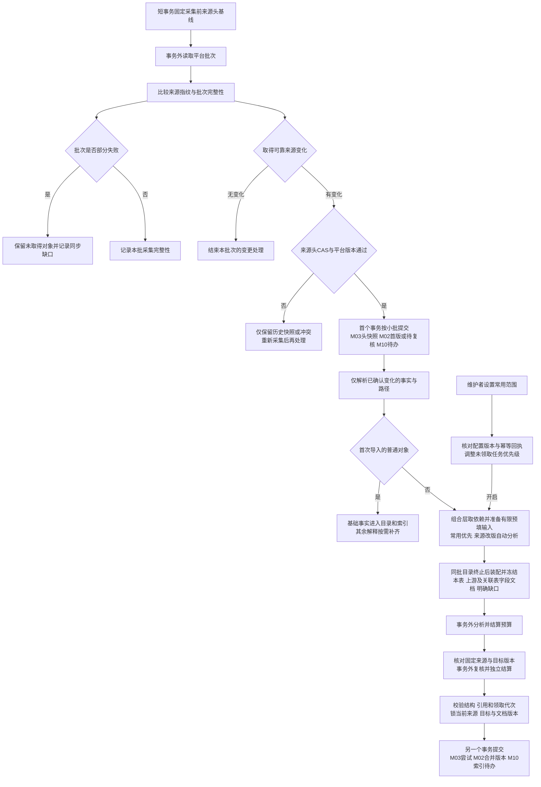

## 5. M04 `retrieval`：候选检索与派生索引

**职责：**按类型结合精确、关键词和向量候选，维护可重建索引与更新状态。正式正文与授权判断仍属于 M02 / M09 / M01；相似度不等于适用性或执行许可。另一个重排模型、Embedding 选择与参数由样例试验决定。

**私有数据：**索引配置/版本、向量模型与文本处理版本、索引应用状态；Milvus/Zilliz 派生条目包含空间、个人归属、对象 ID、正文版本、章节位置和检索文本。业务明细、原始对话、个人标识和凭据不批量写入共享索引。

| 公开操作 | 输入 | 输出 | 错误、副作用与幂等 |
| --- | --- | --- | --- |
| `search_candidates` | 问句、可选向量、类型/本批候选量、M01 范围、索引版本、内部 `continuation?` | 候选 ID/版本/评分、各通道续取位置、耗尽状态 | 只读，不暗中向量化；续取绑定问句/范围/索引指纹；无法继续返回 `continuation_invalid`，服务失败区别于无命中 |
| `merge_candidates` | 向量/关键词候选、M02/M09 精确与更新项候选 | 去重且保留各类型的候选 | 无持久副作用；相同输入确定融合，不以统一分数代替口径判断 |
| `build_index_payload` | 组合层交付的有效正文、允许索引范围、版本 | 检索文本与确定的片段键 | 字段保留完整含义/计算/提醒，指标保留分母与限制；不擅自读取正式表 |
| `embed_payload` | 已获端点授权的问句/索引文本及指纹、模型版本、M08 单次调用许可 | 对应文本/模型版本的向量或失败/未知 | 事务外调用；预算不可用时不发送；重试仍扣原预算范围 |
| `apply_index` | 对象/正文/索引版本、片段键、upsert/delete | 外部写入回执或未知状态 | 网络在事务外；版本化键幂等，未知先查证；删除限指定版本键，旧任务不覆盖/误删新版 |
| `record_index_state_in_tx` | 写入回执、目标版本、租约代次 | 当前/失败/未知索引状态 | 仅匹配目标版本与代次可推进；旧任务结果不回退当前索引状态 |

`retrieve_context` 先经 M01 核对问句/必要资料可发送到 Embedding 端点，再以原 `user_request` 范围取得 M08 许可，复用 `embed_payload` 生成问句向量后传入只读检索。维护索引向量化沿用 `maintenance` 范围。没有向量许可时可用关键词/精确匹配继续，返回中明确降级范围；不得伪装已完成语义检索。

旧索引命中先回源取当前版本，再核对相关性、依赖、权限与状态；组合层还经 M03 核对引用的来源头，来源已变而依赖标记尚未扫完时也不能继续作为已核实依据。更新尚未完成时，从正式存储补查精确标识、别名和最新关联纠错；覆盖不足明确标为降级。长文命中补齐章节标题、范围、必要邻段与被引用规则，每段独立核对资料范围。

当前正式知识索引待办归 M02 的私有存储。领取先无锁查有待办的对象，再按对象 ID 取得主键行锁，跳过其他事务正在修改的对象，最后按作业主键处理当前版本；旧作业每对象每轮最多清理 64 条，领取每批最多 64 个当前对象。语义保存和受控重建同样先锁对象、后写作业，避免索引扫描持有作业锁再等待正在保存的对象。候选快照只提供查找范围，版本、目标代次、租约与三次耗尽条件都在锁内重新核对；正文读取锁内确定的不可变版本。网络索引仍在提交领取事务之后执行。

`retrieve_context` 按**回源、授权、去重后的有效对象数**核对每类配额，多个历史版本/片段不能占满对象配额；单对象片段另受上下文大小限制。配额不足且候选未耗尽时，使用内部续取位置补查并重复校验，不能首批过滤后直接判定资料不足。向量服务没有游标时，适配器用有界扩大候选量和已见键去重实现续取，不谎称有稳定分页能力。

初始补取限制建议为最多 5 批、累计 200 个候选、检索与回源合计 2 秒，均为配置初值并待小样调整，任一先到即停止；复用同一问句向量，不每批新调模型。范围/索引发生变化时在剩余总限制内重新开始，所有已见工作仍计入上限。结果记录 `quota_met / candidates_exhausted / bounded`；`bounded` 明确本轮覆盖不完整，候选耗尽只描述所查通道，不证明整个知识库不存在答案。外部仅返回允许内容、可见结果游标和通用覆盖说明，内部续取位置、被过滤数量及受限对象存在性不外泄。

### S04 模块内部结构

图中是 M04 内部职责；搜索与索引构建共用所属向量接口，问句向量和正式正文由组合层提供，不新增检索服务。

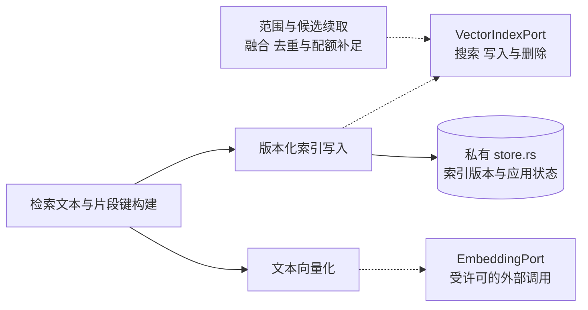

### F04 候选检索与回源

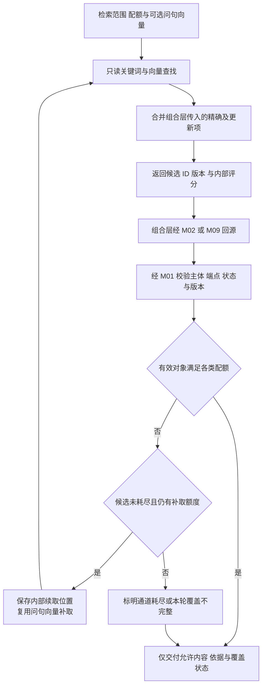

## 6. M09 `assets`：个人记忆、纠错与 Skill

**职责：**按用户与空间管理独立版本的记忆和 Skill，核对适用范围、依赖、验证和替代关系。会话删除不自动删除已独立保存资产，来源显示已删除且不可读回正文；个人聊天不直接修改公共定义。

**私有数据：**`personal_assets`、`personal_asset_versions`、`personal_memory_index_jobs`、来源/知识依赖、替代关系、资产验证、Skill 选择与采用记录。记忆保存原话与整理后修正、错误反例、范围/例外、来源任务及依据；Skill 保存名称、说明、参数、步骤、输出要求和依赖。选择前由组合层向 M05 / M06 核对会话/任务归属；选择与采用由 M09 独占保存，M05 / M06 只引用记录 ID。

| 公开操作 | 输入 | 输出 | 错误、副作用与幂等 |
| --- | --- | --- | --- |
| `read_assets` / `list_assets` | 可信归属、ID/版本或类型/游标、管理/采用用途 | 资产正文、范围、依赖及状态 | 只读；管理页可读自己的停用项，采用读取排除停用/删除项；跨用户统一不可用 |
| `find_related` | 可信归属、对象、问题范围、最新版本条件 | 明确关联的最新记忆/Skill 候选 | 只读；索引滞后时补查，候选不代表已采用 |
| `save_memory_in_tx` | 明确纠错/记住请求、范围、原话、整理值、依据 | 个人记忆版本、索引意图、可告知的保存范围 | `scope_incomplete` 可保存待核对线索；“仅本次”不写长期记忆；失败不告知已记住 |
| `save_skill_in_tx` | 用户保存/编辑请求、草稿、名称/参数/依赖、起点版本 | 草稿或启用版本、索引意图 | 用户保存/启用；已有清楚保存请求可直接保存，不强制改名或编辑；不执行任意用户脚本；稳定操作幂等 |
| `check_applicability` | 当前资产、任务条件、已回源依赖/授权结果 | 可用线索、冲突、需复核或不可用 | 只读；未验证记忆仅作检查线索，依赖变化不得悄悄沿用旧定义 |
| `select_skill_in_tx` | 宿主确认的用户选择、Skill ID/版本、组合层核对的会话/任务归属及条件 | 选择记录 ID、固定版本、适用性结果 | `not_available` / `version_conflict` / `not_applicable` / `idempotency_conflict`；按用户与操作保存含会话的请求指纹和原回执，异参拒绝；同参重传不重新激活已改版/停用的旧选择 |
| `load_selected_skill` | 宿主保存的用户选择、当前启用版本、适用性结果 | 本次方法正文及固定引用版本 | `selection_required` / `version_conflict`；推荐不构成选择，模型不能伪造用户选用 |
| `record_adoption_in_tx` | 实际采用的资产/依赖版本、运行与任务引用、范围/采用方式、Skill 选择记录（如有） | 采用记录 ID 与引用版本 | 记忆线索与执行方法分别标明；Skill 无有效选择拒绝；同运行/操作重传不重复记录 |
| `revise_or_replace_in_tx` | 起点版本、修订值或替代关系、依据 | 新版本、旧项替代状态、待办 | 不静默合并不同范围；共享语义修正通过组合层另走 M02 维护权限 |
| `change_asset_status_in_tx` | 起点版本、启用/停用/删除 | 新状态、索引及上下文失效意图 | 归属与版本必查；停用/删除立即阻止后续采用，派生清理异步且可追踪 |

2026-10-06选择Mem0 OSS 2.2.1作为正式提取/检索适配器。MySQL保留正式正文与版本；Mem0/Milvus保存待提交及已提交向量，SQLite保存技术回执与SDK历史。Skill 正文兼容 `SKILL.md`，M11 使用经宿主核对的正文，不通过任意路径读取或默认资源发现加载。

自动保存/修订时，组合用例将Mem0最终正文同时绑定为`body`与`scope`，`name`取该正文前40个Unicode字符。范围保留整段限定，不另调模型压缩或让Pi追加别名；完整原话另存`source_text`，临时要求由提取排除。builtin模型替身的最终正文也遵守相同绑定。人工`POST /assets`继续按用户显式编辑保存名称/范围；已有版本不会被后台悄悄重写。

### 正式Mem0接缝（同源契约）

| 接口 | 输入与输出 | 约束 |
| --- | --- | --- |
| `POST /extract` | `MemoryExtractionRequest → MemoryExtractionReceipt`：稳定operation、宿主归属、完整消息与引用、预算绑定 → 正文及replayed | 保存前调用；pending不可检索；同操作同指纹接回，未知不重新提取 |
| `POST /index` | `MemoryIndexRequest → MemoryIndexReceipt`：正式资产快照、版本、提取operation（可空）→ ready/removed/superseded | 有提取回执时提交现成向量；人工正文直接embedding；旧版本不覆盖新版本 |
| `POST /search` | `MemorySearchRequest → MemorySearchReceipt`：宿主归属、问题、预算 → asset_id/version候选与bounded | 过滤ready后排序，最多200候选；Rust按当前权限/版本/状态/依赖回源 |
| `POST /internal/memory/model-calls` | `MemoryModelCall`：issue/finalize、调用ID、用途、上限、usage | 内部token；M08逐调用许可和结算；run或索引作业还原原预算 |
| 现有`GET /assets` | Asset新增可选`memory_index_state` | queued/issued/indexed/failed/superseded，正式保存与索引完成分开显示 |

以上Schema位于`packages/contracts/schema.json`；Rust入口记在OpenAPI。侧车路由只监听回环并使用内部token，浏览器不能传用户ID调用。`personal_memory`用例组合M09、M08和有效性校验；`memory_provider`薄接缝转换HTTP，不复制SDK算法。

`personal_memory_index_jobs`私属M09，与资产同事务写入；Worker在独立循环按目标集合领取，租约180秒、最多3次。只有明确暂时不可用可重试同任务；未知保留，不换ID补额。领取后的新embedding许可再次核对正式启用版本和依赖，结算不要求旧运行仍有效。资产先保存、索引后提交；UI暴露进度与失败。

存量/重建每批最多32条，从正式正文排队，使用明确维护profile。目标集合绑定数据库；新集合保留旧队列与账本，旧目标不会被当前Worker领取。SQLite回执目录跟随数据库与集合持久保存，服务互斥启动。索引丢失后按开发文档切换新集合重建，不重置收费历史。

### S09 模块内部结构

图中是 M09 内部职责；记忆与 Skill 共用归属和版本规则，选择及采用记录仍由本模块保存，Mem0通过窄HTTP接缝提供提取与检索，不接管业务授权。

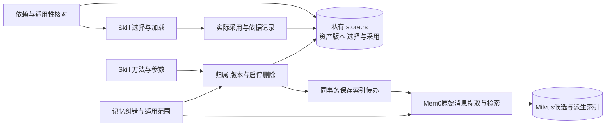

### F09 个人记忆与 Skill 保存采用

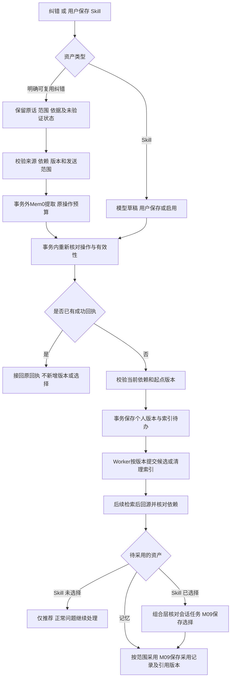

## 7. 完整流程：来源变化到可用检索结果

`sync_sources`、`apply_prefill_result`、`refresh_index`、`retrieve_context` 是组合函数示例；名字表达业务动作，不是一个顺序强制的 Agent 流水线。模型可按任务自主补查，程序守住每次操作边界。

### F13 来源变化到预填、索引与检索回源

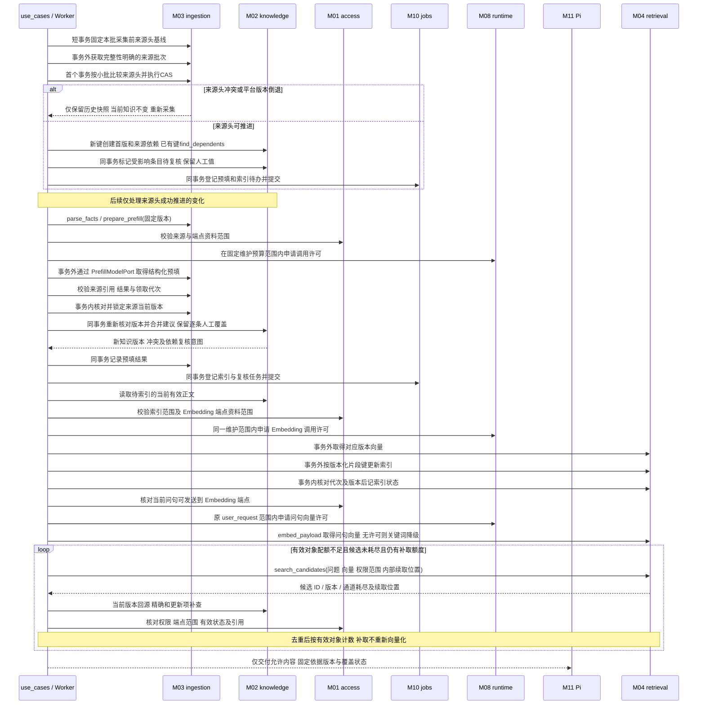

### 验证重点

- 来源部分失败不误删；无法解析保留缺口；旧预填晚到、人工并发修改、重复任务均不覆盖人工值或回退版本。
- 两个同步作业均持有效租约，先读 S1 的作业晚于 S2 回写：S1 仅留历史，来源头/知识仍指 S2；换 CAS 起点重交旧载荷必须拒绝，重新采集才可推进。初始不存在键被其他作业先创建也按相同规则处理。
- 两个事务同时创建同一稳定来源键：只产生一个对象和首版；重复操作返回原回执，不同载荷不覆盖。新表/字段首次同步即有来源依赖与待办；随后来源变更能找到这些条目，改名不创建重复对象。
- 保存版本与任务同事务，索引故障后正式记录仍可读；旧索引命中停用/删除对象时不泄漏内容或存在性。
- 首批候选全被权限/状态过滤或被历史版本占满，后续存在有效对象时能补足；达到候选/批次/时间上限仍不足则返回覆盖不完整。向量查询次数可增加，Embedding 调用不随分页增加；对外无被过滤数量、内部游标或受限对象提示。
- 非维护用户调用 `propose_semantic_change` 只能得到本人建议，正式版本/索引不变；维护用户提出建议也不自动生效。本人具备维护权后明确保存，知识版本/建议 `applied`/待办同事务；保存重传不重复生成版本，旧基版冲突不丢建议。
- 建议包含私人对话、记忆或结果时，维护权限不能使其自动出现在公共正文/引用；未整理公共可用补丁前返回 `public_scope_required`。其他用户与后台服务不能读/采用该私人建议，服务身份也不能访问个人资产/会话。
- 文档章节改版不错引，关系两端分别授权；同名跨用户记忆/Skill 隔离；未选用 Skill 不加载正文。
- 明确纠错保存并告知，“仅本次”不长期化，存储失败不显示成功；未验证纠错不自动晋升公共规则。
- 撤权、停用和删除后，新轮次及重启恢复的实际模型输入均无失效资料；模型端点范围小于用户读取范围时确实裁剪。
- 以上是实现时的行为验收要求；本文的文档结构和链接检查不能替代这些运行证据。

### 当前合成MVP落点

M03的事实提取与单次模型适配器位于`modules/ingestion/prefill.rs`；尝试记录、固定输入指纹、领取过期和命令去重位于其私有store，组合流程为`use_cases/semantic_prefill.rs`。`prefill_attempts`归M03，`maintenance_model_calls`归M08，复用持久`model_trials`保留原预算和到期时间。

维护profile默认不配置；来源结构事实正常更新，模型阶段显示budget_unavailable。显式配置`DATA_AGENT_PREFILL_PROFILE`（共用ModelProfile）、`DATA_AGENT_PREFILL_URL`及受控进程凭据才可分析。请求有体积/输出上限和一次性维护许可，不重试未知HTTP；回环测试必须设置DATA_AGENT_PREFILL_TEST=1且URL为127.0.0.1。正式地址只接受api.deepseek.com的HTTPS。公开配置不包含凭据。

单次输出`PrefillResult`包含条目值、缺口与固定source_id/version/quote/location；宿主核对每条原文引用和条目标识。引用校验不等于业务推导正确。网络调用在事务外，提交时锁来源头、核对对象版本，复用M02人工保护。45秒后未完成的领取显示unknown，保留预留且不重发；需新的明确维护操作再分析。

个人资产目录通过search_knowledge按query检索，query=*及asset_after翻页。正文仍按read_knowledge固定版本分段，启动16KB候选被裁掉的本人memory和已选Skill保持可发现；未选Skill不进入目录。

### 百炼Embedding及目录实施细化

- 共享Embedding固定为百炼 `qwen3.7-text-embedding`、1024维，M04只处理HTTP协议、有限分批和向量校验，`use_cases/knowledge_embeddings.rs`组合M01权限、M02版本/索引租约、M08预算。每批最多20条，以每条UTF-8字节数加64 tokens模板余量分批，总预估不超过8192 tokens（正文也不超过8192字节），单次20秒、无隐式重试；不添加旧模型文本前缀。模型版本进入片段键和索引目标。
- M08的`runtime::provider_calls`保存逐调用许可、usage与成功向量回执。聊天使用原工具operation_id和budget_scope_id；索引使用空间/对象/版本/模型/固定片段批次，页面检索使用当前请求身份。成功向量和费用原子提交；未知保持预留，不换ID重发。向量内容失败但有usage仍结算真实用量。共享与个人向量调用复用账本，Mem0对外协议不新增共享用途。
- `EmbeddingProfile`由共用Schema生成，字段为trial_id、call_limit、cost_limit_micros。索引首次授权冻结到`knowledge_index_jobs.embedding_profile`；集合变化、重试、换当前配置均不替换该版本原额度。索引一次领取一个对象，每批发送前在同代有效租约内续期120秒；过期、版本变化或换代拒绝发送。
- MySQL的正式正文保留，`model_call_attempts.response_json`保存可复用向量；Milvus以新1024维共享集合重建。集合维度不符明确拒绝，旧384维集合与个人集合不自动删除。候选继续回源核权限、状态、版本。向量失败明确降级，精确/词法通道继续。当前外发范围仅为公开合成demo空间。
- 模拟启动默认词法检索；真实Flash模式默认共享Qwen混合检索，需显式维护预算和本地凭据文件。无配置不自动申请新额度；账本沿用当前试用的一小时期限，重启不延长。
- M03目录同步捕获来源头及namespace范围代次。完整同步即使正文未变，也推进范围代次；缺席退休与成功回执在同一事务提交。分页不完整、过期或旧基线不能批量删除。新表/字段和来源改版在同一小事务排队分析与复核，保护人工覆盖；未配置维护模型则明确保留缺口。
- 派生索引进度由M02私有store存储，M04只负责生成候选/向量及Milvus协议；具名知识用例组合领取、外部计算和回写。索引目标绑定collection与模型；第三次领取崩溃明确失败，维护者可用幂等命令将当前知识重新排队，不改变正文或版本。

### 维护重传与来源变化的实现边界

- M02/M09维护先在本事务预占并锁定原操作记录，核对参数指纹；已有回执直接接回，首次执行才检查对象版本并写入不可变版本。占位与业务失败一起回滚。同操作异参拒绝，不同操作仍按原expected_version竞争。重分析先接回原操作，再采集当前来源；同一外部命令不把重新采集的source_version计入身份，不重复登记预填。
- 来源条目另存source_facts.value作为准确基础值，quote只表示引用。清除人工覆盖依次采用有效建议、来源基础值；旧条目无基础值时由组合用例读取同版本当前候选补齐，无来源纯人工正文退空。
- 节点移除后仍生成当前来源版本的lineage缺口；旧血缘留在历史，人工覆盖保留并标待复核。整张表及其余当前事实仍能回源检索和读取。
- M03维护HTTP每阶段总超时300秒，领取360秒；保存第一阶段草稿后续期一次，第二阶段仍只请求一次。回执未知保留调用及费用预留，不自动重发。聊天Worker运行期限保持现行规则。

- 资产保存与Skill选择的原成功回执先于依赖有效性复查接回；首次保存/选择仍校验当前依赖。接回旧成功回执不会新增版本或重新激活选择，后续采用与正文读取仍需当前有效性检查。预填最终锁内版本冲突会清除本事务的空操作占位，再提交superseded状态；不遗留无回执操作。旧重分析回执按已保存的source_version字符串重建原指纹，仅接受原命令同参，不改旧账本。

### 创建资格与升级边界

`GET /semantic-access` 返回 `can_create` 与 `can_admin`。M01 在创建事务中当前读并锁定有效表维护关系；M02 保存正文、首版与索引待办，具名用例组合登记创建者，任一步失败全部回滚。来源为 `datasight`、`creator` 或 `system`；管理调整后记为 `system`。新增迁移仅回填首版人工记录明确、授权版本为 1 且未指派的独立对象，保留系统预填和主动撤销。表交接更新创建资格，不改变独立对象归属。

### 当前角色边界补充

- `DevelopmentIdentity::members` 从已用于登录的可信配置产生当前空间 `SpaceMembers`；成员快照不携带凭据。`semantic_governance::assign` 先校验操作者和目标成员，再进入既有版本/幂等事务。`GET /semantic-members` 只对超级维护者开放；不新增成员管理或组织服务。
- `catalog_import` 收集本次平台表负责人，在完整目录、版本及租约校验通过的完成事务中统一应用，同时提交同步成功回执。中途失败可以保留已导入的来源知识，但表维护权及创建资格仍取自上次完整成功快照。
- M01 的 `maintainable_ids_in_tx` 为“我负责的”提供当前对象集合；M02 `directory_page_in_tx` 按名称、状态和游标返回启用/停用对象。管理目录与 Agent 的有效知识召回分别调用，不把停用项送回 Agent。

页面的知识与建议列表/详情使用 M01 的已提交权限快照，避免按显示顺序跨表持锁与同步批量改派形成死锁。编辑、建议提交/审核/应用仍使用 `maintenance_in_tx` 的当前读共享锁；页面的 `can_edit` 只作展示，不能授权保存。
