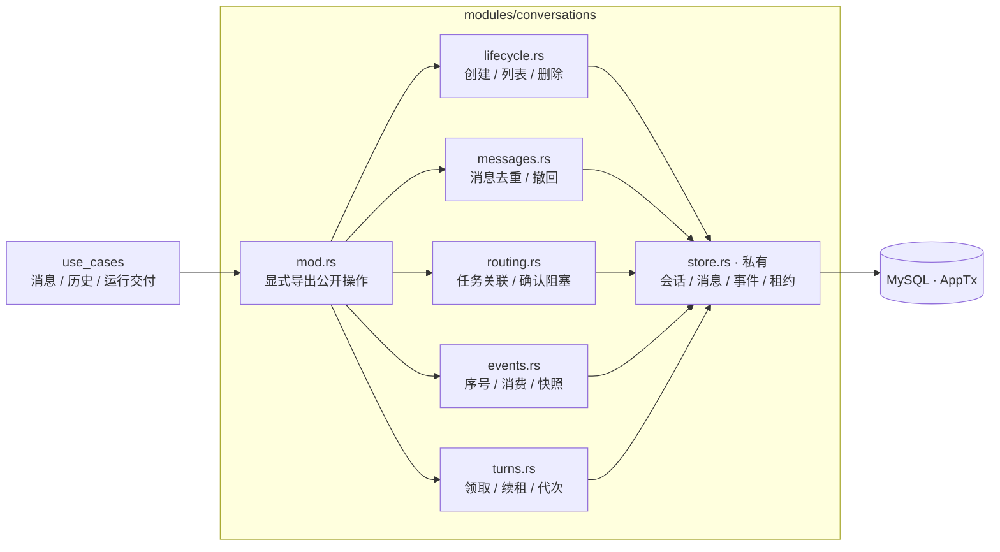
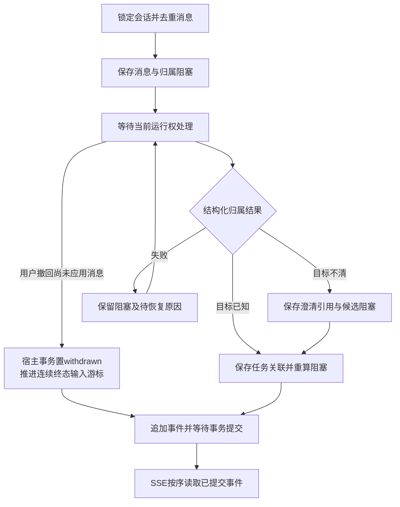
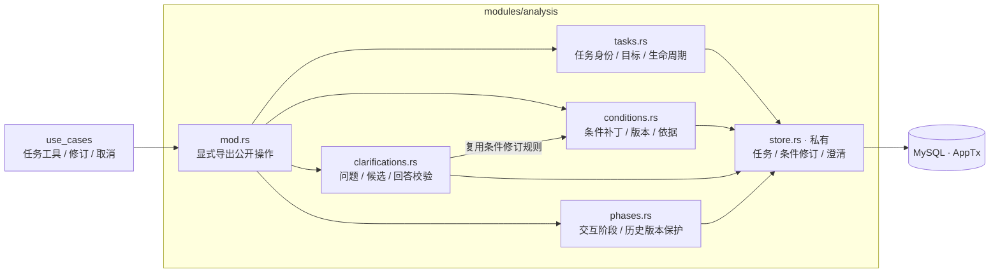
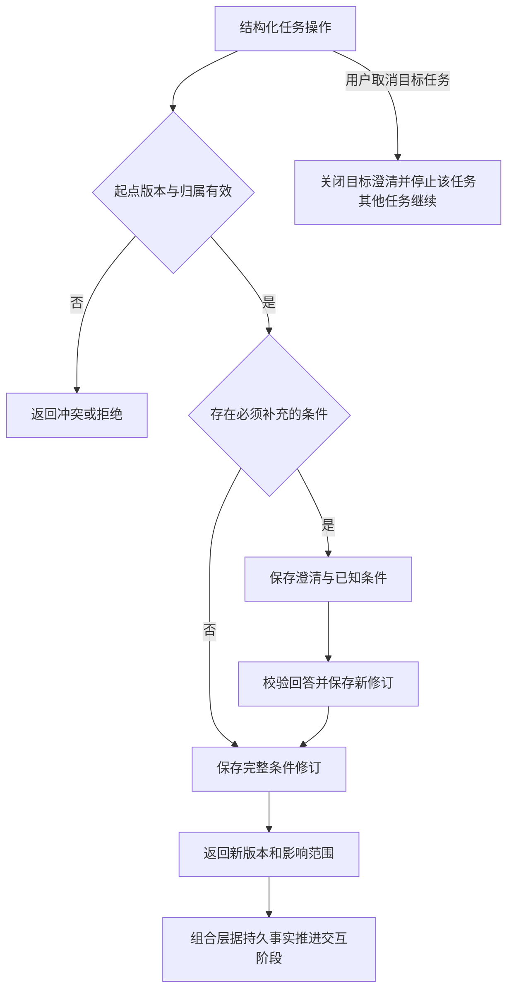
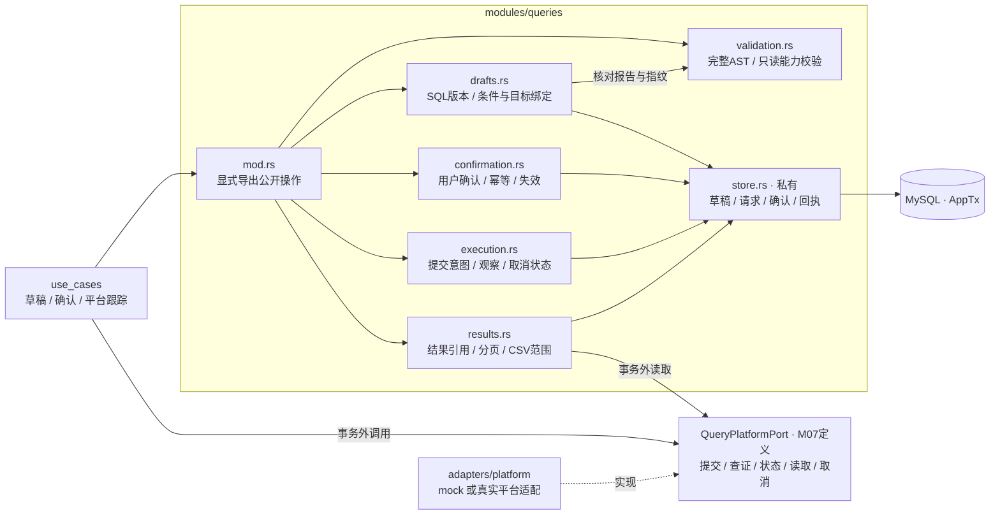
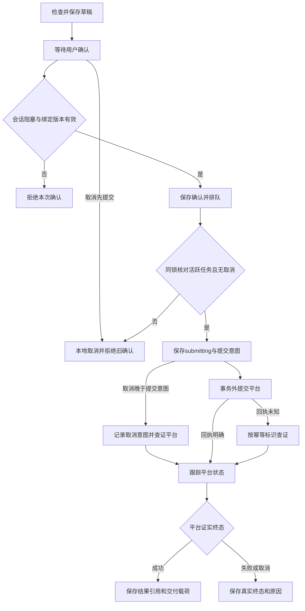
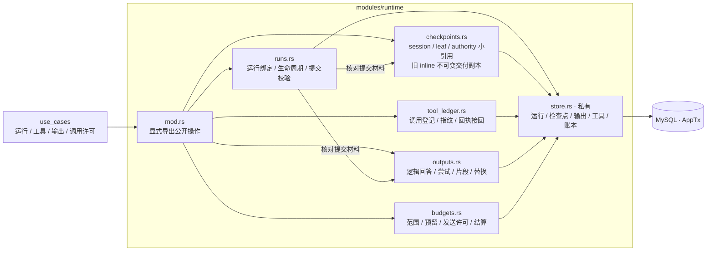
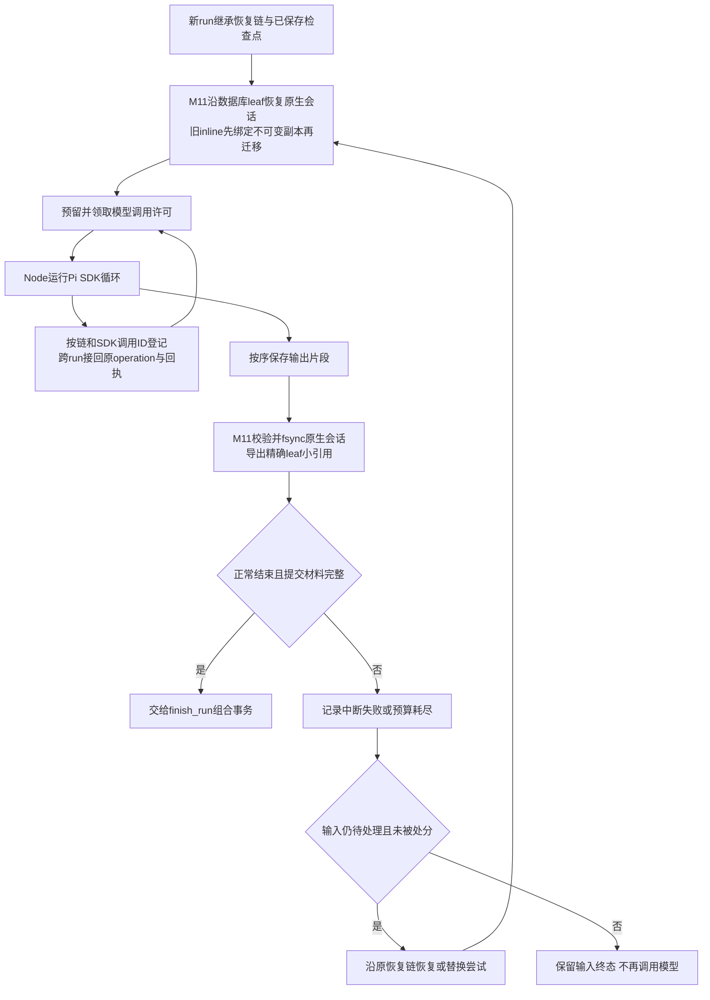

# 会话、分析、查询与运行模块设计

> 设计基线：对应本地MVP实现；实时验收状态见[CURRENT](../CURRENT.md)。本文把[系统设计第 17–20 节](../semantic-retrieval-design.md#17-实施基线与交付顺序2026-10-02)细化为首轮代码接口；不代表 Pi 恢复、平台幂等或真实模型调用已验证。模块 ID 与整体代码模块设计一致，不新增独立服务。

## 1. 共用约定与组合边界

- M05 `conversations`、M06 `analysis`、M07 `queries`、M08 `runtime` 位于单一 Rust 业务库 `data-agent` 的 `modules/` 下，兄弟模块之间不直接依赖。每个模块的私有 `store.rs` 封装 MySQL，只访问自己负责的记录。
- HTTP、Pi 工具和 Worker 调用 `use_cases/` 中按用例命名的小函数，例如 `receive_message`、`apply_analysis_update`、`confirm_query`、`record_query_observation`、`finish_run`。组合层调用公开操作，不执行跨模块裸 SQL，不设置万能 `AgentService`。
- 事务操作以 `_in_tx` 结尾并接受共享 `&mut AppTx`，由组合层开启、提交或回滚；用例层只调公开业务 API 由工程依赖/存储访问检查保证，`AppTx` 类型本身不提供表级隔离。纯校验和外部 I/O 明确标出；事务内不调用 Pi、模型、平台、向量库或 SSE 网络连接。
- `AccessContext` 沿用总设计的 `Principal=user|service`；聊天、查询与个人资产要求 `user`，后台用户任务继续绑定原用户。`RunContext` 固定会话、`run_id`、`recovery_chain_id`、输入事件、原预算与领取代次；`run_id` 标识一次执行，恢复链标识同一次逻辑交付。维护使用配置限定的 `service`，`MaintenanceContext` 不能代替 M01 动作授权；客户端/模型不能覆盖这些字段。
- 模块返回有版本的只读快照或业务回执。跨模块判断所需快照在同一事务和锁范围内读取，由组合层传递；不把前端、模型或事务外旧快照当作当前事实。
- 锁序：会话/输入 → 运行/恢复链 → 工具调用或模型尝试 → 分析任务及其澄清 → 查询请求 → 当前预算范围 → 试验总额度 → 后台任务；每组按 ID 排序。组合层通过下表具名 `lock_*_in_tx` 获取本次涉及的锁，不能写 SQL；查询 Worker 先定位所属会话。创建新记录由父记录锁和唯一约束保护，不得倒置已有记录的锁。
- `lock_*_in_tx` 在私有 `store.rs` 中执行锁定读取，返回限定当前 `AppTx` 的 `Locked*` 快照；状态写入只能使用同事务的锁定事实。普通 `read_*_in_tx` 不隐含写锁。事务外定位只取得不可变归属 ID，锁内重新核对；新增关联先锁同一会话/父对象，不能漏过范围锁定后插入的记录。
- 表中“锁定会话/任务”描述事务内仍持锁的事实，不要求跨模块传递兄弟类型；`use_cases` 将其转换为接收模块自己的具名输入，模块不导入兄弟 `Locked*`，共享仅限 ID/版本/`AppTx` 等小类型，不汇成通用事实容器。
- `operation_id` 是工具/应用写入的稳定标识，附规范化参数指纹。同 ID 同内容返回原回执，不同内容返回 `idempotency_conflict`；消息、确认、平台观察、输出另有下文业务唯一键。
- 通用错误为 `not_available`、`version_conflict`、`lease_lost`、`invalid_input`、`idempotency_conflict`、`unavailable`。不可见与不存在对象统一返回 `not_available`，内部保留具体拒绝原因；错误附可关联 ID，外部失败不转为空成功。
- 使用显式版本字段和窄类型 DTO；条件、目标、草稿、输出、检查点各自版本不可混用。跨语言契约按总设计第 4.5 节的固定真源生成边界类型，并进行边界运行时校验；Pi SDK 条目只在 M11 `pi-bridge` 适配边界解析。

## 2. M05 `conversations`：消息、归属与会话串行

**负责：**会话归属、消息去重、持久事件序号、消息与任务关联、确认阻塞范围、Pi 会话的领取代次和消费进度。

**边界：**不解析自然语言、不修改条件/SQL/预算、不把 SSE 连接当作运行生命周期。会话租约区别于 M10 后台任务租约；领取一个 job 不等于取得 Pi 会话写权。

**私有数据：**`conversations`、`conversation_events`，以及消息正文/指纹、归属记录、阻塞项、事件消费记录。保留消息/事件 ID、展示 `event_seq`、仅 Agent 输入的 `input_seq`、`schema_version`、归属、对象引用和原预算；两个序列与游标分别保存。

| 字段 | 初始状态设计 | 规则 |
| --- | --- | --- |
| `routing_state` | `pending / new_task / task_update / task_question / needs_target / withdrawn` | 归属由结构化操作保存；已应用消息不可撤回删除历史 |
| `processing_state` | `unprocessed / processing / applied / retryable_failed` | 失败不解除阻塞；错误与恢复原因单独记录 |
| 输入 `disposition` | `pending / consumed / withdrawn / suppressed` | 后三者为持久终态；`consumed` 由运行提交，撤回/取消/删除等宿主动作可处分对应输入，不能替模型消费其他输入 |
| `confirmation_block` | `none / conversation / task_set` | 按全部未解决消息/澄清求并集；不能用一个“忙碌”布尔值覆盖 |
| 会话运行权 | `lease_owner / lease_until / lease_epoch` | 接管递增代次；超时和代次校验均由数据库时间决定 |

| 对外操作 | 输入 → 输出 | 关键校验、副作用与幂等 |
| --- | --- | --- |
| `create_conversation_in_tx` | `AccessContext, client_creation_id` → 会话 ID | 用户首次发送时创建；创建 ID 幂等，纯空白页不创建持久记录 |
| `list_conversations_in_tx` | `AccessContext, cursor, limit` → 有权读取的摘要页 | 返回会话、最新事件和未完成关联引用；不跨模块读任务/查询私表 |
| `read_snapshot_in_tx` | `AccessContext, conversation_id` → 消息/事件游标/任务引用快照 | 组合层另读 M06/M07 汇总；SSE 游标失效后以快照重建再续读 |
| `delete_conversation_in_tx` | 用户动作、会话 ID、期望修订 → 删除回执与收尾引用 | 幂等保存删除标记、终止新的加载/运行权；组合层停止任务并安排查询查证/取消，不删除独立个人资产 |
| `lock_conversation_in_tx` | `AccessContext, conversation_id` → 锁定的会话快照 | 校验归属/未删除，取得所有组合写入的首把行锁；可信收尾路径只允许已删除会话的必要查证 |
| `lock_inputs_in_tx` | 锁定会话、输入 ID/待处理范围 → 按 `input_seq` 锁定的输入与处分 | 只读本模块记录，校验输入归属；领取、撤回和推进输入游标使用同一会话锁 |
| `accept_message_in_tx` | `client_message_id, text, explicit_task?, clarification_id?, budget_scope_id` → `message_id, event_id, routing_state` | 同用户客户端 ID 唯一；不同会话、正文或目标冲突；保存 `pending` 和会话阻塞，明确目标另返回需冻结的任务 ID |
| `apply_routing_in_tx` | `message_id, decision, task_refs, clarification_ref?, block_scope` → 新归属与剩余阻塞 | `decision` 限定上述归属枚举；组合层提供同事务已校验的任务/澄清引用；不能解除其他消息的阻塞 |
| `withdraw_message_in_tx` | 用户动作、锁定消息、期望修订 → 撤回事件与剩余阻塞 | 仅尚未应用消息可撤回；同事务将对应输入置 `withdrawn` 并推进可推进的输入游标；已应用返回 `already_applied`，不改写旧条件 |
| `claim_turn_in_tx / assert_turn_in_tx / renew_turn_in_tx / release_turn_in_tx / revoke_turn_in_tx` | 领取者或 `run_id, lease_epoch`，撤销另带用户动作 → 当前运行权 | 领取/接管/撤销增加代次，续租只限未过期当前持有者；工具/输出/提交前检查运行权；等待用户/查询后释放 |
| `append_events_in_tx` | 带稳定 `event_id` 的事件批次 → 已分配序号 | 同事件 ID 同载荷返回原序号；分配持久递增序号，事务提交后方可投递 SSE |
| `commit_consumption_in_tx` | 运行权、锁定输入、期望输入游标 → 消费回执 | 只将该运行已领取且仍为 `pending` 的输入置 `consumed`；沿连续终态推进 `input_seq`，遇 `pending` 即停止；重复提交返回原结果 |
| `dispose_inputs_in_tx` | 宿主动作及同事务受影响范围、锁定输入、`withdrawn/suppressed` 与原因 → 处分/游标回执 | 宿主短事务仅处分明确撤回消息或已取消任务/已删除会话的对应输入；幂等、不改已消费输入，不以模型失败为由跳过其他消息 |
| `read_events_in_tx` | `AccessContext, conversation_id, after_seq, limit` → 事件页/新游标 | 当前权限回源；游标超出保留范围返回 `snapshot_required`，不静默漏事件 |

输入游标只扫描 Agent 输入，并跨过已经 `consumed/withdrawn/suppressed` 的连续前缀；展示事件无输入序号，不形成缺口。运行提交与宿主处分复用该规则；处分不会调用模型，也不能将仍待判断的其他消息冒充已消费。

### S05 模块内部结构

下图是 `conversations` 内部代码职责。公开操作直接委派给相应子模块；历史和快照只汇总本模块数据，任务/查询详情由组合层补充。

### F05 消息归属与持久事件

## 3. M06 `analysis`：分析目标、条件与澄清

**负责：**任务身份、不可变条件修订、条件来源、缺口、可恢复澄清和任务交互阶段。`update_analysis_task` 的不同动作由组合层分别调用本模块和 M05/M07，不在模块内调用兄弟模块。

**边界：**不判断消息的自然语言含义、不生成 SQL、不保存用户执行确认、不把模型叙述转为平台成功。SQL 草稿和查询状态由 M07 提供事实快照。

**私有数据：**`analysis_tasks`、`condition_revisions`、`clarifications`、`task_lifecycle_operations`；条件包含目标、对象、时间/时区、过滤、维度、粒度、依据与来源、未解决问题。澄清含问题、候选任务、可选答案、创建事件、回答消息和解决版本；无明确任务时可暂挂会话。取消命令按用户和操作身份保存载荷指纹与回执；相同载荷重传直接取回执，换目标或版本拒绝冲突，已取消终态不再次中断剩余目标。

Pi工具的`AnalysisUpdate`沿用同源JSON Schema：新建任务须带完整`conditions`，新建可省略尚未分配的`task_id/expected_version`（保留接受JSON null），已有任务必须给真实ID与当前版本；未指定标量保留null、列表保留空数组。已有任务版本使用工具回执中的数字字符串。没有需要用户补充的歧义时省略`question`并传`options=[]`（仍接受JSON null）。`knowledge_refs`引用知识对象的`id/version/path`，来源读取的`source_id`不能充当知识对象ID。校验失败仍作为Pi工具错误交模型修正，不由宿主猜测任务条件。

已有任务的`revise/clarify`须带`condition_patch`及当前版本；空白问题和字符串`null/undefined`不能生成澄清。正式输出取Pi最后一条助手消息，通过`FinishRun.final_start_chunk_seq`绑定其已保存片段；省略该字段的旧请求从片段1核对。Rust始终核对全部片段连续、起点范围和正式文本相等，调查过程仍作为事件保留。

`route`只登记消息归属，禁止附带`conditions/condition_patch`或澄清问题。修改渠道、时间、指标等条件使用`revise`，获得新的条件版本并失效旧待确认草稿；只有条件保持不变而改写SQL时，`route`可带`replaces_query_id`声明修订。错误动作与参数组合在共享契约边界拒绝，不能成功返回后静默丢掉修改。

| 状态维度 | 初始状态设计 | 规则 |
| --- | --- | --- |
| 任务生命周期 | `active / cancelled` | 取消停止后续推进；相关查询的真实终态单独保存 |
| 当前交互阶段 | `investigating / waiting_clarification / waiting_confirmation / waiting_query / answered / failed` | 带条件版本和阶段修订号；历史查询运行不阻止新条件进入调查 |
| 澄清状态 | `open / resolved / withdrawn` | 目标澄清可保持会话级；业务口径澄清在归属明确后仅影响对应任务 |

| 对外操作 | 输入 → 输出 | 关键校验、副作用与幂等 |
| --- | --- | --- |
| `lock_tasks_in_tx` | 锁定会话、任务 ID 集合、关联澄清范围 → `LockedTask` / 澄清快照 | 任务 ID 排序后锁相关澄清；校验同会话归属，返回当前生命周期与版本；取消、修订和查询确认均用此快照 |
| `create_task_in_tx` | 消息引用、目标、已知条件、依据/缺口 → 任务与首个条件版本 | 创建归属固定的任务；重复工具操作返回原任务；不自行关联消息 |
| `revise_conditions_in_tx` | `task_id, base_revision, patch, evidence` → 新版本与受影响字段 | 校验起点版本；补丁只允许 `set/unset` 和允许路径；未提及字段与来源保留 |
| `open_clarification_in_tx` | 消息、目标/候选、字段、问题、选项、可选条件补丁 → 澄清 ID/条件版本 | 候选均属同会话；修订须带起点版本；问题和附带修订同事务保存 |
| `resolve_clarification_in_tx` | 澄清 ID、回答消息、确定任务、起点版本/补丁 → 条件版本与解决回执 | 校验尚未解决、回答属于同会话；旧版回答返回冲突，不生成或确认 SQL |
| `read_task_context_in_tx` | `task_id, condition_revision?` → 当前或历史条件/澄清快照 | 不用当前条件替换查询绑定的历史条件；当前归属和权限由组合层核对 |
| `set_interaction_phase_in_tx` | 期望任务/条件修订、受控事实摘要 → 新阶段 | 组合层汇集未解决澄清、当前待确认请求、相关查询和提交输出；拒绝模型任意状态字符串 |
| `cancel_task_in_tx` | 用户动作、锁定任务、期望修订 → 停止回执、关闭澄清与待收尾关联范围 | 只取消指定任务并关闭其业务澄清；多候选目标澄清移除该任务，仍有其他候选则保留；组合层拒绝该任务原待确认并安排查询取消，不宣称平台已取消 |

阶段更新由保存的业务事实决定：开放澄清优先等待澄清；可执行当前草稿等待确认；当前条件的已确认查询未结束则等待查询；允许交付且输出已提交才可标为已回答。已取消任务拒绝新条件、澄清回答和查询推进；旧条件结果只写历史事件，不能推进当前条件阶段。缺口与失败原因保留。

### S06 模块内部结构

`conditions` 保持条件字段与来源的修订规则，`phases` 根据组合层传入的受控事实判断交互阶段。二者共享本模块存储，不读取查询或会话私表。

### F06 条件修订与澄清

## 4. M07 `queries`：SQL 版本、用户确认与平台执行

**负责：**SQL 草稿/参数/依据/条件/执行目标绑定、完整语法与只读能力检查、待确认请求、真实用户确认、平台提交与查证、结果引用和取消记录。

**边界：**`request_query` 只检查和保存草稿，成功返回 `awaiting_confirmation`；它没有用户确认能力。该工具通过组合层调用下表操作。模块不整理条件、不解释结果、不把本地超时推断成平台失败或取消成功。

**私有数据：**`sql_drafts` 及不可变版本、`query_requests`、确认记录、平台提交/观察/取消回执；每个请求固定 `task_id, condition_revision, draft_version, target_id, target_version, budget_scope_id`。主键在预览时创建；主动重跑创建新待确认请求，SQL 相同仍需用户确认。

| 状态维度 | 初始状态设计 | 规则 |
| --- | --- | --- |
| 草稿检查 | `passed / rejected / unsupported` | 整条语句可解析且目标能力允许才通过；失败也保留草稿与理由 |
| 确认 | `awaiting_confirmation / modifying / superseded / confirmed` | 只影响未确认请求；`confirmed` 保留真实用户、时间、绑定版本，不被新消息改写 |
| 执行 | `not_submitted / queued / submitting / submission_unknown / running / succeeded / failed / cancelled` | `submitting` 崩溃按可能已发出处理；`submission_unknown` 先查证；状态查询超时保留最近已知状态并标 `observation_unknown` |
| 取消 | `none / requested / acknowledged / unsupported / unknown / rejected / completed` | `acknowledged` 只表示平台收到请求；未生成提交意图可凭本地事务进入取消终态，可能发出后须平台证据 |
| 结果 | `unavailable / available / expired / access_denied` | 空行可以是成功；分页完整性、截断、上游到齐状态分别记录 |

| 对外操作 | 输入 → 输出 | 关键校验、副作用与幂等 |
| --- | --- | --- |
| `lock_requests_in_tx` | 锁定会话/任务、查询请求 ID 集合 → `LockedQueryRequest` 集合 | 按 ID 锁定请求及其确认/取消状态；只读状态接口不能替代此锁；提交与取消竞争使用同一组锁 |
| `check_sql`（纯操作） | SQL、参数、目标能力快照 → 检查报告/指纹 | 检查完整 AST、单条只读、函数和外部访问；未知能力/语法返回 `unsupported` |
| `begin_revision_in_tx / save_draft_in_tx` | 条件快照、SQL、依据、目标版本、报告、预算范围、可选 `replaces_query_id` → 草稿版本/待确认请求 | SQL修订声明与消息归属同事务，声明后即失效目标旧稿，再进行外部检查。route声明须带task_id/expected_version/replaces_query_id；request_query可直接完成声明。引用限同用户/会话/任务/目标，检查失败也不恢复旧稿。独立新查询传null；已确认原查询独立收尾；已有后继的祖先不能再次修订 |
| `hold_pending_in_tx / supersede_pending_in_tx` | 任务范围、消息/条件修订引用 → 受影响请求 ID | 明确补充先置 `modifying`；新修订置 `superseded`；不改变已确认或执行中的请求 |
| `release_pending_in_tx` | 需释放的消息阻塞及同事务剩余阻塞快照 → 可恢复请求 | 仅撤回或确定不影响时恢复未失效请求；不得复活已替代的草稿 |
| `confirm_request_in_tx` | 可信用户动作、锁定请求/会话/任务、展示草稿版本、确认 ID → 同一查询 ID | 已确认重传只返回现状，不重新排队；首次仅从 `awaiting_confirmation + not_submitted + active task + cancel=none` 进入 `queued`，并核对阻塞/版本/目标/权限；取消或替代请求拒绝 |
| `begin_submission_in_tx` | 锁定请求/任务、当前 Worker 代次、最新权限/能力检查结果 → 提交包或已有状态 | 仅 `confirmed + queued + active task + cancel=none` 可原子登记提交意图并置 `submitting`；与本地取消按同锁事务提交顺序竞争；网络在提交后调用 |
| `record_submission_in_tx` | 请求 ID、代次、提交回执/未知原因 → 平台 ID/执行状态 | 同次提交回执幂等；明确拒绝进入 failed，未知置 `submission_unknown` 后先查证；仅平台确认未接收才可重排，最多三次提交；旧代次拒绝。保存平台错误类别与至多1000字符诊断，查询工具和页面可读取 |
| `record_observation_in_tx` | 请求 ID、代次、稳定观察 ID、平台状态/结果引用 → 状态变化及交付载荷 | 校验平台身份与版本；不从终态回退；同观察去重，终态交付 ID 按查询固定；与交付事件登记共事务 |
| `request_cancel_in_tx / record_cancel_in_tx` | 可信取消动作或平台回执、锁定请求 → 已知取消/执行状态 | `not_submitted/queued` 且无提交意图可本地置 `execution=cancelled, cancel=completed`；未确认置 `superseded`，已确认保留 `confirmed` 历史；`submitting` 以后先查证/发取消，终态竞争保留平台证据 |
| `read_query_in_tx / resolve_result_ref_in_tx` | 查询 ID、当前授权 → 查询快照/结果引用 | 回看重新核对权限和有效期；过期不自动重跑；历史条件版本保持不变 |
| `fetch_result_page`（事务外） | 已授权结果引用、游标、范围 → 标准结果页 | 经平台适配器读取；明确字段类型、精确数值编码、完整性/截断/来源；CSV 仅导出同一已授权范围，不提交 SQL |

平台接口为 `submit_query / lookup_submission / get_status / read_results / cancel_query`。组合层在数据库事务之间调用适配器；提交前重新核对权限和目标能力。网络检查返回的版本/有效期在落库前核对，实际平台仍负责最终权限与只读约束。

本地取消先提交，Worker 随后不得发出查询；提交意图先提交，即使网络尚未发送也按可能已发出处理，后续取消走查证路径，不谎报本地取消成功。所有取消终态都不能被旧确认或重传恢复为 `queued`；主动重跑须新请求、新确认。

晚到结果属于已保存的原任务和条件。旧 Worker 的回执只能触发当前持有者重新查证，不能越过代次直接写状态；真实 `succeeded` 不被晚到取消确认覆盖，冲突或不明回执保留证据并查证。

### S07 模块内部结构

`validation` 做纯语法/能力校验；`execution` 保存提交与观察状态，不在事务内发网络请求。M07 定义 `QueryPlatformPort`，适配器实现它；组合层在事务之间调用提交/查证，`results` 的结果读取同样在事务外。

### F07 SQL 确认与平台查证

## 5. M08 `runtime`：运行、检查点、工具、输出与预算

**负责：**运行绑定与恢复记录、工具调用账本、输出尝试及片段、模型调用许可与原范围预算。Node/M11 负责唯一 SDK 循环，M08 只执行约束与持久化，不另设规划器。

**边界：**不根据文本承诺修改任务/查询，不重放已成功业务副作用，不自行给新运行补额度。Pi 检查点不是条件、确认或长期记忆的替代品。

**私有数据：**`agent_runs`、`pi_checkpoints`、`tool_calls`、`assistant_outputs`/尝试/片段、`budget_scopes`、`model_call_attempts`。当前检查点含 SDK 格式版本、原 session、私有 JSONL 文件名、精确 leaf 和 authority；完整原生树由 M11 保存。旧 inline 在交付事务绑定不可变副本及指纹，受当前运行权校验后只读迁移；凭据不在其中。

`recovery_chain_id` 绑定一次逻辑交付、原输入/预算和 `output_id`，重启或替换执行创建新 `run_id` 时继承；新用户操作/新结果交付另建恢复链。工具业务唯一键为 `(conversation_id, operation_id)`；恢复映射另以 `(conversation_id, recovery_chain_id, sdk_tool_call_id)` 唯一，指向同一稳定操作，保存工具名/参数指纹、`origin_run_id` 与接回记录。去重不按 SQL/参数永久生效；相同参数的新操作可以正常执行，已提交调用恢复不能换链或操作身份。

恢复包的依据清单覆盖原资料及其派生回答、工具结果和压缩摘要。发送前发现引用失效，保守剔除所有依赖该引用的派生条目；无法证明依赖清单完整时，只从当前允许的用户消息与业务事实重建，不能仅删引用标签而保留正文。当前沿用Pi原生SessionManager和压缩接口，运行清单使用`dependency_schema=1`记录真正交付的知识/来源/记忆/Skill版本。启动材料裁剪后登记，工具回传后同事务累积，跨新输入和压缩保留并集；实际引用回源失效才重建。旧清单缺失或格式不完整时保守重建，新输入可重新调查，同输入恢复不得换SDK操作身份。额外近期材料仅含用户消息，助手历史从核对过的Pi检查点恢复。具体验证范围以CURRENT为准。

**内部文件：**`runs.rs`、`checkpoints.rs`、`outputs.rs`、`tool_ledger.rs`、`budgets.rs` 分担本模块规则，`store.rs` 保存存储细节；这些是内部职责边界，不导出一个同时处理全部动作的 Agent 类。

| 对象 | 初始状态设计 | 不变量 |
| --- | --- | --- |
| 运行 | `queued / running / finished / interrupted / failed / cancelled / budget_exhausted` | 运行结束原因和任务等待原因分开；一个运行固定一个原预算范围 |
| 工具调用 | `registered / processing / succeeded / failed / unknown` | 同调用 ID/参数接回回执；副作用未知先查证，不能换 ID 重做 |
| 输出尝试 | `streaming / committed / interrupted / superseded` | 同一逻辑 `output_id` 最多一个有效提交；不同尝试不拼接 |
| 模型调用 | `reserved / issued / settled / unknown / released` | `issued` 只授权首次发送；未知保留预留，证实未发出才可释放 |

| 对外操作 | 输入 → 输出 | 关键校验、副作用与幂等 |
| --- | --- | --- |
| `lock_run_in_tx` | 锁定会话、运行 ID → 锁定运行/恢复链 | 校验运行与会话/链的归属，提供实际关联任务和原预算；历史回执读取不要求原运行仍持有租约，新写入须当前运行权 |
| `lock_tool_call_in_tx / lock_model_attempt_in_tx` | 锁定运行/链或维护上下文、调用键/尝试 ID → 锁定账本记录 | 工具按会话/链/SDK 调用键读取；模型按尝试 ID 读取，两者不混用；同类多记录按 ID 排序，新记录由唯一键保护 |
| `lock_budget_scope_in_tx / lock_trial_budget_in_tx` | 固定范围/试验 ID → 锁定额度快照 | 先范围后试验总额；预留/结算在短事务用当前额度，不接受事务外余额；维护调用同样适用 |
| `open_budget_scope_in_tx` | 主动用户消息、配置限额版本、试验总额度引用 → 范围 ID | 与接收消息同事务；同消息唯一；确认、Worker 和结果事件不新建额度 |
| `resolve_maintenance_budget_in_tx` | 空间、维护配置版本、作业类别/批次 → 已配置范围 ID | 仅采用运维配置限定的维护额度；无配置返回 `budget_unavailable`，作业/重试不能自建额度 |
| `start_run_in_tx` | 会话运行权、锁定输入、恢复链或新交付、目标/条件、原预算 → 运行/链/输出/尝试 ID | 输入须未被宿主终态处分；校验归属与预算，不同范围串行；恢复继承原链/逻辑输出并映射新运行，模型不得新建链绕过去重 |
| `stop_run_in_tx` | 锁定运行、停止原因/目标范围、期望版本 → 终止回执/中断尝试引用 | 仅中断匹配范围的运行；停止新增调用，保留已提交工具；只有它是当前租约持有者时才同事务撤销运行权，不撤销同会话其他任务的运行 |
| `read_recovery_bundle_in_tx` | 运行/链/检查点版本、可见性判定 → 恢复包或重建要求 | 沿恢复链接回原调用及 `operation_id`，只包含已提交输出和已查证工具结果；权限、资产变化经组合层校验后重建 |
| `register_tool_call_in_tx` | 当前运行权、恢复链、SDK 调用 ID、参数指纹、SDK 条目 → 稳定操作 ID/历史回执 | 先保存调用与恢复条目再执行；同链同调用跨运行接回原记录，异参冲突；不接受新链/新 ID 代替已提交调用恢复 |
| `read_tool_call_in_tx` | 当前运行权、锁定调用、稳定操作 ID/指纹 → 状态/历史回执 | 校验当前运行可接回该恢复链；成功返回原结果，未知先查证，不因 `run_id` 改变执行新副作用 |
| `record_tool_receipt_in_tx` | 锁定调用、稳定操作 ID、业务回执/错误/未知 → 持久回执 | 应用内业务写入和成功回执同事务；保留原运行出处，外部 I/O 分段登记；仅明确失败标 `failed` |
| `append_output_in_tx` | 运行权、输出/尝试 ID、`chunk_seq, text` → 接受序号/缺口 | 同序号同内容去重，异内容拒绝；推荐仅接收下一连续片段，乱序返回 `chunk_gap` 供重传 |
| `interrupt_output_in_tx / replace_output_in_tx` | 尝试 ID、原因或新尝试请求 → 中断/替换引用 | 新尝试记录 `replaces_attempt_id`；组合层追加替换事件；旧片段不得作为完整历史 |
| `reserve_model_call_in_tx` | 运行权、`call_attempt_id`、参数指纹、输入/输出上界 → 许可 | 原子检查范围和试验总限额；同 ID 幂等预留；真正重试另 ID，仍扣原范围；额度不足返回 `budget_exhausted` |
| `issue_model_call_in_tx` | 许可 ID、运行权 → 一次性发送许可或已知状态 | 检查代次、参数、限额版本、到期时间；仅首次 `reserved→issued` 返回可发送，不因重传再次授权 |
| `settle_model_call_in_tx` | 尝试 ID、可靠用量/未发出证据/未知原因 → 结算状态 | 用量幂等结算；超时未知不退款；会话删除/取消后允许核对归属、原运行代次与指纹后结算原尝试，不能获得新发送权 |
| `prepare_run_commit_in_tx` | 运行权、最终片段摘要、SDK 检查点、消费事件列表 → 已验证提交材料 | 检查完整片段、格式版本、事件/输出归属和未决工具；不接收任意任务/查询状态；纯验证不提前提交 |
| `commit_run_in_tx` | 提交材料、稳定 `commit_id` → 最终输出引用/运行回执 | 在组合层事务内保存最终正文、检查点和运行终态；同 ID/摘要返回原提交，冲突拒绝；旧代次不能新增提交 |

预算新增 `scope_kind=user_request|maintenance`。用户范围继续严格遵守第 19.8 节；资料预填和 Embedding 等后台付费调用采用已配置的有界 `maintenance` 范围，并受试验总上限约束。M03 单次结构化分析可经 `PrefillModelPort` 调模型；它不建立自主循环，也须先申请 M08 许可。

调用许可接受宿主绑定的 `RunContext` 或 `MaintenanceContext`；后者固定作业 ID、领取代次、配置/模型/资料范围、预算引用。维护调用校验 M10 的当前代次；工具/聊天接口不接受维护上下文，模型不能借此改换预算。若资料同步仅调用不计费平台读取，则不扣模型额度。

`append_output` 组合用例在一事务保存 M08 片段和 M05 流式事件，提交后才投递；事件携带输出/尝试/片段 ID。模型消费推进 `input_seq`，SSE 按 `event_seq` 读取；输出/展示事件不重新成为 Agent 输入。

模型选择来自持久 `ModelProfile`，Pi 从锁定 SDK 的对应目录项加载，维护预填使用同一模型 ID。允许 Flash 与 Pro 的明确价格版本配对；Pro 当前支持 off/high，原 I0 task 配置继续限 Flash。模型和价格都属于试验指纹，不能在旧试验中改换。聊天与维护按各自模型的高峰缓存未命中价保守计账，不声称等于服务商实际折扣账单。

调用耗时和 token/调用数跨重启累计，等待用户/查询不算模型运行时长。SDK 每次实际网络尝试均先取许可；不能拦截的隐式重试必须关闭，否则真实模型子项保持阻塞。价格或可计算输入/输出上界缺失时不承诺严格金额上限。

`issued` 落库与网络发送之间不能原子化，崩溃按可能已发出处理；新调用另申请尝试且旧预留保留。模型用量迟到可凭平台回执结算原账本，运行已过期不允许因此提交旧输出或再次发请求。

锁定Pi 1.0.0的恢复接入：从最近assistant消息中找出尚未匹配toolResult的调用，即使检查点以另一工具的结果结尾，也沿原SDK调用及operation_id逐个接回。明确拒绝的持久回执接为isError结果，成功的只写一次。工具提交响应失败后，通过内部只读`/internal/data/tool-rejections`按当前运行权、原SDK调用和参数指纹查证；仅返回已持久的rejected回执，不执行原工具、不返回成功正文，不存在或失权继续保留原错误。首次业务拒绝也在同次恢复交给Pi，不额外耗费一次Worker交付。执行前工具名/参数校验失败也接为未执行的isError结果，交Pi修正；登记与提交未知继续抛出，不能伪装成明确失败。接回后使用公开的`session.prompt(RECOVERY_NOTICE, { expandPromptTemplates: false })`继续原输入，先刷新当前资源，再经SDK会话的原生完成后处理与溢出压缩；不直接调用底层`session.agent.continue()`。恢复通知绑定原message_id/recovery_chain_id，不创建新业务输入或新预算。

正式回答交付若被`finish_run`明确拒绝`message_pending`，说明当前消息尚未登记归属且输出未提交。SDK明确报告`stopReason=length`时同样拒绝提交半截回答。Node仅通过Pi原生`sendCustomMessage`反馈一次相应拒绝，让模型补齐归属/澄清或重写简洁完整的回答，再提交修正后的完整文本。沿用原会话、run、message、恢复链和调用预算；宿主不替模型创建任务。取消后不起补正轮；再次拒绝、其他错误和未知回执均继续失败，不循环追加反馈或重做未知提交。验证覆盖修正成功、持续遗漏仅反馈一次、明确length不提交及最后回答替代前轮文本。`stopReason=stop`并不能证明自然语言完整或正确，仍需业务质量审查。

交付从Pi原生`message_end`事件取得最近完成的助手消息。SDK为整理上下文可能从`agent.state.messages`移除length消息；不能从整理后的上下文倒查输出，否则会拿前一条工具调用文字冒充最终回答。`message_start`继续绑定正式片段起点，完整片段校验仍由Rust执行。

### S08 模块内部结构

五项职责共享私有存储；`runs` 负责运行生命周期，不吸收选表、条件、查询提交等业务。`budgets` 只核发调用许可；实际模型外发由 M11 或维护模型适配器完成，M08 不拥有模型循环。

### F08 Pi 运行与提交

## 6. 四组必须直接映射到代码的组合用例

### 6.1 `receive_message / apply_analysis_update / confirm_query`

1. `receive_message` 开启事务，M05 锁会话并查客户端消息唯一键；明确补充先经 M06/M07 锁定目标任务与请求，再由 M08 取得所需预算锁并创建范围。取得本次全部锁后保存消息/阻塞、冻结旧待确认并由 M10 登记工作，同事务提交；重复消息返回原消息与预算，不倒置为预算锁后再取请求锁。
2. 工具入口先用短事务按恢复链/SDK 调用键登记调用和恢复条目。业务事务依次调用 M05 会话/输入锁、M08 运行/调用锁、M06 任务锁、M07 请求锁，并核对代次；已成功操作先接回原回执。新操作由 M06 修订、M05 保存归属、M07 替代/释放请求、M08 保存回执，同事务提交；恢复与事务重试沿用原 `operation_id`。
3. `confirm_query` 使用同一会话锁并经 `lock_tasks_in_tx / lock_requests_in_tx` 取得当前事实。已确认重传只返回原查询现状，包括已取消，不重新排队；首次确认核对活跃任务、未取消/未失效请求及版本/阻塞后转 `queued`，M10 同事务登记 job。更换确认 ID 不产生第二次查询。
4. 消息先提交则确认返回 `message_pending` 或版本冲突；确认先提交则原查询继续。只解除一条消息不能清空其他阻塞；范围明确的目标澄清只阻塞候选任务，范围未知保持会话阻塞。失败/预算耗尽保留阻塞和恢复原因。
5. `withdraw_pending_message` 在宿主短事务将未应用消息的输入置 `withdrawn`、推进连续终态输入游标，并组合 M05/M07 重算阻塞和释放。仅当当前运行正处理该消息时撤销其运行权并中断输出，提交后通知 Node；其他输入不能由此标已消费。已应用条件用新修订恢复；解除后仍由用户确认，编辑未发送草稿不触发本用例。

### 6.2 `record_query_observation / explain_query_result`

1. Worker 事务外读取平台状态，事务内经 M05 会话锁、M06 任务锁、M07 请求锁及 M10 代次校验保存观察。M05 登记稳定 `query_id + terminal_delivery` 展示事件，仅任务仍可推进时才登记 Agent 输入与 M10 交付；重复观察不重复交付。
2. 交付固定原任务、条件、草稿和预算范围；页面立即可见结果状态，Pi 会话忙时排队。取得新会话运行权后，组合层读取历史条件和当前授权的结果范围，M08 启动原范围的解释运行，经 M11 交给 Pi。
3. 原预算耗尽仍保存查询结果，解释标为未完成并说明原因；新消息“继续解释 Q1”可创建仅针对 Q1 的新解释操作，不修改旧范围、不重跑查询。解释失败/重试也不调用 `submit_query`。
4. 旧条件结果晚到，保留原条件标签和结果事件，不覆盖新条件/阶段。取消任务或删除会话只查证/收尾；已排队输入由宿主按明确范围置 `suppressed`，新终态仅记展示事件，不唤醒解释。读取结果再查权限和过期，失败保持明确状态。

### 6.3 `finish_run`

1. Node 发送 `run_id, recovery_chain_id, lease_epoch, commit_id, output_id, attempt_id`、连续片段摘要/正文、检查点与消费事件 ID。组合层可先查已提交回执；返回内容仍经当前权限校验，不重新执行业务副作用。
2. 事务内按具名锁接口锁会话/输入、运行/恢复链及相关工具记录、受影响任务；M06 阶段判断需要查询事实时，再锁关联请求并读取当前快照。锁内重查同 `commit_id/指纹` 回执覆盖并发重传；有回执只返回原结果，否则校验运行权。M08 核对完整输出/检查点与未决工具，M05 核对待消费输入；缺口拒绝，不部分提交。
3. M08 `commit_run_in_tx` 保存最终输出/检查点/运行终态；M05 `commit_consumption_in_tx` 保存消费进度并追加正式输出事件；M06 按已保存事实更新对应条件的交互阶段；M05 释放运行权，M10 完成本次工作并登记下一待处理事件。全部共用一个 MySQL 事务。
4. 提交成功再返回 Node 和通知 SSE。提交前退出，新执行沿原恢复链恢复检查点并接回已成功工具；提交后丢回执按原提交 ID 返回结果，不增加输出事件。旧代次不能新写片段/检查点/结束状态；已完成回执只读接回不受此限制。
5. 若 SDK 无法续接半段，事务外由适配层提出替换尝试，Rust 保存替换关系和事件后重新生成；最终只一个有效回答。等待澄清/确认/查询的说明可以正常提交，`run=finished` 不意味着任务或平台查询完成。

### 6.4 `cancel_task / cancel_query`

1. `cancel_task` 锁会话/相关输入、当前运行、目标任务/澄清、其查询请求。M06 只取消目标任务并关闭其业务澄清；多目标澄清保留其他候选。M07 失效原待确认，并按是否已有提交意图决定本地取消或平台查证；M05 重算剩余阻塞，按明确归属抑制该任务的未交付输入，M10 登记收尾，共同提交。
2. 当前运行明确绑定被取消任务时，M08 停止它且 M05 撤销其运行权；Worker续租失效或传输中断后以原run/代次通知Node，复用`/cancel-run`和Pi原生`session.abort()`中止旧请求。Bridge明确409未接纳时，具名`defer_busy_delivery`事务将该run标为interrupted、释放自身运行权并只退回本次交付尝试，原历史失败、输入/链/预算不变，有界退避后重排。若运行属于同会话 B 任务则保持不变。未明确归属的运行不能仅因同会话而被取消，后续工具会拒绝推进已取消任务；中断包含其他待处理输入的运行时，剩余输入按原链/预算重新登记，不冒充已消费。
3. `cancel_query` 只作用于指定请求，不关闭任务或其他澄清。它与 `begin_submission` 使用相同会话/任务/请求锁：取消先提交则终态阻止发送，提交意图先提交则以可能已发送处理。所有平台 I/O 在事务外；已确认历史保留，重传确认只能读现状。
4. 模型取消工具及其历史回执重放只返回同源`QueryCancellation`：查询ID、任务ID、条件版本、执行状态和取消状态。依据失效仍允许取消收尾，SQL、说明、参数及引用不从此入口回流。用户HTTP查询详情继续返回`QueryView`，工具读取正文仍核对依据有效性。

## 7. 设计验收与实现顺序

- I0 先实现首条链路涉及的最小表和上述接口子集，验证工具业务提交前、提交后丢回执、最终输出后检查点未提交三类故障；其余记录随 I1/I2 增量加入，不一次铺齐。
- 必测消息/确认两种提交顺序、跨页面重复确认、两条消息仅完成一条、目标澄清、处理失败后恢复、同消息 ID 异内容、晚到旧条件结果、取消与成功竞争。
- 必测同调用/片段/提交重传、旧代次写入、未知提交查证、最后额度并发争抢、结果唤醒不补额、SDK 重试逐次授权、权限变化后的恢复输入；证据看记录和实际调用次数。
- 单任务取消：A 查询等待时 B 正在运行，取消 A 后 B 租约/输出不变；A 澄清关闭、原待确认拒绝，A 晚到结果只收尾。同请求本地取消与提交意图两种提交顺序均测试，确认重传保持 `cancelled` 且平台提交计数不增加。
- 跨运行恢复：R1 工具已写业务但回执丢失，R2 同链/SDK ID 接回同一 `operation_id`，业务只写一次；同键异参拒绝；新交付相同参数仍可创建新操作。未知回执不因新运行重复执行。
- 输入处分：E1 未应用时撤回、E2 正常提交，连续输入游标跨过 E1/E2；展示事件不形成缺口，仍 `pending` 的其他输入不能被跳过；取消 A 不抑制 B 输入。
- 锁与恢复：在一致性快照已建立后另一事务变更状态，`lock_*` 仍读到锁内当前事实；并发同 `commit_id` 只提交一次。失效资料的派生回答/工具结果/摘要均从实际模型输入剔除，清单不完整时重建，不仅删除引用标签。
- 本文完成标准是接口、状态、归属和事务边界可相互核对；文档检查不证明实现、mock 不证明真实 Pi/模型/平台行为。真实验证范围与下一步由唯一当前记录 [CURRENT.md](../CURRENT.md) 维护。

### M08：Mem0调用的预算接入（2026-10-06）

沿用`model_call_attempts`与`model_trials`，增加purpose（agent/memory_extraction/memory_embedding）、稳定operation及trial/price_version，不建第二份总账。提取与搜索绑定原run的budget_scope；后台人工编辑与重建使用明确维护profile。每次实际LLM/embedding请求各计一次。发送许可一次性；收到usage先结算，再检查内容；未知保留预留，SDK批量失败的逐条降级不得继续发送。迟到结算只处理原调用，不能授予新发送权。

DeepSeek提取固定Flash、4096输出上限、关闭思考；Agent仍沿用自己的profile。百炼原价¥0.5/百万输入token，预算按US$0.10/百万token保守折算，固定`2026-10-05-qwen-cny-usd-ceiling`；报告列用量和估算，不冒称账单或实时汇率。实际超上限熔断原trial。Mem0网络边界有总超时，超时后仅按同一operation接回一次持久结果；仍不可核实时明确未知，不能声称已保存。
