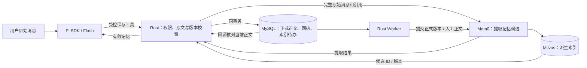

# Mem0 接入、真实试用与问题记录

日期：2026-10-06。当前进度和最终验收入口见 [CURRENT](../CURRENT.md)。本报告保留选型依据、试用样本和发现的问题，后续修复不覆盖本次分数。

> 后续收尾：QUALITY-01与UI-03已修复并通过新的针对性回归，见第6节。下面原始试用5/6及失败记录保留，不改判。当前交付状态以CURRENT为准。

## 1. 选了什么，依据是什么

采用 **Mem0 OSS 2.2.1** 处理个人记忆的提取和检索。上一轮固定输入、两组各两次测量的[对比结果](mem0-extraction-comparison-results.md)：

| 指标 | 原方案 | Mem0 |
| --- | ---: | ---: |
| 完整场景 | 16/18，88.9% | 16/18，88.9% |
| 记忆管理 | 16/18，88.9% | 17/18，94.4% |
| SQL | 22/24，91.7% | 24/24，100% |

完整场景持平，以记忆和SQL分项较高作为选择依据。这个小样不足以证明稳定或统计上的优势。历史报告和失败题保留；本轮单组试用不与历史A/B数字拼接。

## 2. 正式接入后的职责

- **Mem0先提取，Rust再把校验后的正文存入MySQL。** 提取期间的候选标记为pending，正式保存失败的候选不能检索采用。Worker只在正式提交后使对应版本可检索。
- MySQL保存本人资产、版本、启停状态、依赖、操作回执和待办。修改、停用、删除先改变正式状态；索引失败不会复活旧版本。
- Milvus保存个人记忆向量和候选标识，可以从MySQL正式正文重建。数据库和索引目标隔离；切换新集合自动分批回填启用资产，旧任务和账本保留。
- SQLite只保存Mem0 SDK历史和技术回执。人工编辑使用 `infer=False`，不让模型再次改写人工正文。
- Flash负责聊天和提取；提取关闭思考，Agent沿用原生high。个人记忆使用百炼 `qwen3.7-text-embedding` 1024维；共享语义仍使用本地E5 384维，二者索引分开。
- 每次模型/embedding调用经现有M08预算许可、结算和未知回执规则。SDK在未知调用后尝试的隐式重发会被适配边界阻止。搜索、提取、索引均保存操作身份；未知结果不会换ID重做。
- Pi仍是唯一Agent循环，负责多轮会话和原生上下文压缩；Mem0不替换Pi会话。资料有效性和采用授权由Rust检查。

详细接口见[个人资产模块](../architecture/knowledge-modules.md)、[同源OpenAPI](../../packages/contracts/openapi.json)及[启动、存储与重建说明](../development.md#7-mem0个人记忆)。

## 3. 新增真实试用

使用真实Pi SDK、DeepSeek Flash、Mem0、百炼embedding、MySQL和Milvus。查询平台为能实际执行SQL的合成平台，全部表、业务文档和数据从零构造。没有接入真实Datasight，也没有将公司资料外发。

正式批包含6场景、10条用户消息，另有1次查询结果自动解释。独立审查读取实际保存的记忆、回答、SQL和结果；程序的 `completed` 只表示流程完成。

| 场景 | 实际行为 | 完整判定 |
| --- | --- | --- |
| 保存混合偏好 | web默认、金额以元、临时要求优先；保持个人范围 | 通过 |
| 新会话复用和临时修订 | web改成本次app，原记忆不变；页面确认执行后返回1600分/16元并解释 | 通过 |
| 修改长期默认 | 同一资产v1→v2，默认改为store，新会话采用新版 | 通过 |
| 停用后继续多轮 | 停用v3后全渠道、分单位；同对话再查月支付客户 | 通过 |
| 另一用户 | Bob没有采用Alice的偏好，也没有保存本次单位要求 | 通过 |
| 保存并复用纠错 | 正文与后续SQL正确，但scope和答复把月支付客户数扩写成“月活” | **失败，保留** |

**完整场景5/6（83.3%）；SQL 7/7（100%）；结果解释1/1。** 只代表这些固定样本。7条SQL另经39次独立数据变体核算，变体不增加场景分母。

SQL独立预期：web净收入100元、app16元、store8元、全渠道12400分、整月支付客户5人。执行按钮实际运行app查询，结果为1600分/16元。匿名客户、全退客户、退款归属、日期和快照边界由独立业务资料核对；答案未提供给模型。

### 证据和费用

- 正式样本：`.local/memory-adoption/trial/verified-result.json`，SHA256 `c5a9309a5a8bdeb642cb9610341bafd7db22f77a672cc2e33c1752d21f7aab65`。
- 独立判分：`.local/memory-adoption/trial/independent-quality-review.json`，逐场景给出依据位置；SQL重新离线执行。
- 初次接入中断样本：同目录 `result.json`，保留契约拒收导致的新会话失败。修复后的正式批单独命名，未覆盖旧失败。
- 累计账本87次调用：Agent62次、记忆embedding21次、提取4次；全部settled，未知预留0；估算 **US$0.328441**。包含前批和诊断，不能称为6场景单独成本，也不等于服务商账单。
- 测量后修改了页面样式、语义关联分页和错误契约。最终独立审查逐文件绑定前后SHA和影响；分数针对冻结输出，不能声称模型在最终源码上重新测过。

## 4. 问题记录

| 编号 | 问题、复现和影响 | 处理与证据 |
| --- | --- | --- |
| MEM-01 | 完整场景持平，不能直接宣布Mem0整体胜出 | 已明确按记忆/SQL分项选择；原对比分数不变 |
| MEM-02 | 首次新会话带记忆时，工作区上下文缺少契约字段；页面索引状态又进入了模型资产投影 | 已修复同源契约和投影；真实正式批新会话通过，原中断批保留 |
| MEM-03 | 多条记忆在相关性检索前被截断，相关记录可能漏入初始上下文 | 已改为先检索再按上限裁剪；25条资产和真实RunEnvelope解码/重启回归 |
| MEM-04 | Mem0 SDK批量embedding回执未知后会隐式逐条重发，且可能吞掉异常 | 同操作失败后阻断新外发并检查SDK实际调用结果；真实SDK离线故障测试通过 |
| MEM-05 | 索引任务领取后资产可能停用/改版，旧正文不能继续外发 | 外部模型调用发出前再读正式资产、版本和依赖；claim后停用测试拒绝发送且无新预留 |
| MEM-06 | 提取完成但首HTTP响应丢失，调用方可能不知道已准备完成 | 使用相同operation接回持久结果一次；断连接回归只提取一次、保存一份。超时不保证所有SDK内部调用已完成 |
| MEM-07 | 索引集合切换、旧资产、并行开发实例可能互相影响 | 目标写入队列唯一键，按当前目标领取；存量分批回填；状态目录隔离与进程互斥；重建/旧队列保留回归 |
| UI-01 | 资产列表旧轮询晚到可能覆盖新编辑结果；长历史标题撑出侧栏 | 请求序号防回退；样式增加可收缩约束，保留截图核对 |
| UI-02 | 大目录中表的字段/指标/文档/关系只筛选已载入目录，详情漏项 | 用120个前置对象和105个字段复现。现有列表接口增加 `related_id` 分页，四类页签独立读取；浏览器回归通过 |
| API-01 | 重建索引未配置时返回 `vector_unconfigured`，AppError未登记，页面报契约错误 | 补齐相关错误码及503映射；按钮显示“尚未配置语义检索服务”。不把失败反馈算成重建成功 |
| UI-03 | 真实长回答中的Markdown标记按纯文本显示，SQL与长说明阅读较费力 | 截图确认，**记录为后续体验改进**，本轮不新增渲染依赖。桌面与390px页面无横向溢出；正式SQL卡片、结果表格与按钮正常 |
| QUALITY-01 | 月支付客户数纠错被保存为含“月活”的范围，答复也扩大了适用口径 | **未修复，真实内容失败保留。** 用户可在“我的积累”编辑范围；后续优化须另用固定样本验证，不能把本次改判通过 |

采集器曾使用不存在的 `Snapshot.runs.message_id`，只补采同一已完成请求，没有重发模型。页面检查过程中修正过文本定位器、等待启用回执及关闭历史弹窗的测试错误；这些不计为产品故障，也不改产品验收预期。

## 5. 接口和按钮检查范围

当前OpenAPI登记32个公开路由模式、38个方法组合；内部模型/工具接口另计。下表把现有接口对应到实际检查程序，不能由数量推定所有参数、故障排列都已穷举。

| 接口组 | 页面操作或集成检查 | 证据程序 |
| --- | --- | --- |
| `/session` GET/POST/DELETE | 登录、刷新、退出、刷新后重新登录、切换Bob | `check-browser.mjs`、`check-management-buttons.mjs` |
| `/conversations` GET/POST；`/{id}` DELETE | 新对话、历史分页/搜索、删除会话 | `check-history-browser.mjs`、`check-management-buttons.mjs` |
| `/conversations/{id}/messages`、`snapshot`、`events` | 提问、流式/重连、长期多轮和任务归属 | `check-conversation-timeline.mjs`、`check-long-conversation.mjs`、运行时检查 |
| `cancel-run`、`messages/{id}/withdraw`、`tasks/{id}/cancel` | 停止生成、撤回未完成输入、继续/取消任务 | `check-model-provider.mjs`、`check-query-boundaries.mjs`、`check-management-buttons.mjs`、`check-lifecycle.mjs` |
| `/knowledge` GET/POST；`/{id}` GET/PATCH | 目录/搜索/分页、展开字段、文档录入及多表关联、编辑/放弃/清除覆盖 | `check-browser.mjs`、`check-history-browser.mjs`、`check-related-knowledge-browser.mjs`、`check-management-buttons.mjs` |
| `/knowledge/{id}/{disable,enable,delete,reanalyze}` | 启停、重新预填、人工保护；delete只有API，没有额外页面按钮 | `check-management-buttons.mjs`、`check-model-startup.mjs`、`check-knowledge-workflow.mjs` |
| `/knowledge/{id}/analysis-preference` | 常用表开关、持久保存、旧响应不回退 | `check-browser.mjs`、`check-analysis-preference.mjs` |
| `/sources/{id}`、`/source-syncs` | 来源正文弹窗、同步来源按钮、历史版本读取 | `check-management-buttons.mjs`、`check-prefill-materials.mjs`、`check-catalog-import.mjs` |
| `/knowledge-index/rebuilds` | 按钮无服务时明确503；有服务的成功排队/重建由集成检查验证 | `check-management-buttons.mjs`、`check-retrieval-coverage.mjs` |
| `/knowledge-proposals` GET、`/{id}/apply` POST | 非空本人建议、Bob隔离、明确应用后版本更新、冲突回归 | `check-management-buttons.mjs`、`check-boundaries.mjs` |
| `/assets` GET/POST；`/{id}/{disable,enable,delete}` | 新增记忆/Skill、人工核对勾选、来源、编辑、启停、删除、索引状态 | `check-management-buttons.mjs`、`check-browser.mjs`、`check-memory-provider.mjs` |
| `/conversations/{id}/skill-selections` | 选用Skill后回工作台；未选/旧版/停用拒绝 | `check-browser.mjs`、`check-knowledge-workflow.mjs`、`check-boundaries.mjs` |
| `/conversations/{id}/queries`、`/queries/{id}`、`confirm`、`cancel` | 完整SQL、复制、补充纠正、执行/取消；旧确认和并发拒绝 | `check-browser.mjs`、`check-management-buttons.mjs`、`check-query-workflow.mjs`及真实试用 |
| `/queries/{id}/results`、`export.csv` | 表格/图表、下一页、导出、数字精度、缓存失效/截断、隔离 | `check-browser.mjs`、`check-query-boundaries.mjs` |
| `/internal/memory/model-calls` 与既有内部工具/模型接口 | 内部认证、预算、发送前有效性、重复调用/未知、Pi续接/恢复/压缩 | `check-memory-provider.mjs`、`tests/memory/`、运行时与原生Pi检查 |

程序名均位于 `tests/mvp/`，`check-model-provider.mjs` 位于 `tests/runtime/`。按钮巡检使用真实React/API/MySQL、模型和索引HTTP替身，不产生官方请求；真实模型试用另列于第3节。合成失败事件用于撤回按钮，不能代替真实服务故障测试。当前版本最终命令、完整退出结果和审查指纹统一记录到CURRENT与增量收据。

## 6. 仍然没有证明的部分

- 没有真实Datasight接口、公司业务数据、正式认证和同事实际使用反馈；本轮是代理操作真实产品的合成试用。
- 六个场景不足以证明任意问题成功率；原MVP的其他质量错误仍保留在[原质量报告](../reviews/mvp-accuracy-20261005.md)。
- 未开展大规模个人记忆库、长期成本/延迟或稳定统计优势测量。Milvus重建和SDK失败边界有集成回归，不能泛化成任意灾难恢复保证。
- `QUALITY-01`仍存在；不通过更换样本、补跑成功项或改评分追求100%。
- 长回答排版的`UI-03`保留，未作为内容通过或奖项级设计证据。最终页面截图在试用目录 `final-page-desktop.png`、`final-page-mobile.png`，只重开已有结果，没有增加模型调用。

## 6. 两项修复与MVP收尾（2026-10-06）

用户确认本轮只修QUALITY-01，再修UI-03，验证后结束当前MVP。需求与最终验收范围见CURRENT的`I2-MVP-CLOSEOUT`，不扩展新功能。

### 6.1 QUALITY-01：自动记忆统一内容来源

原生Pi记录证实，主Agent在工具scope中自行加入MAU/月活；Mem0正文正确，但旧保存入口分别采用Mem0正文和主Agent范围，没有约束二者一致。现在自动新建/修订的body和scope均采用同一份最终提取文字，保留完整对象与限定；name取前40个Unicode字符，只作显示标签。工具中的候选名称/范围保留参数兼容，不能成为第二份正式语义。人工页面编辑仍保存明确填写的内容。

Mem0提取提示要求沿用原业务名称，不补写别名、缩写或扩大到其他指标；Pi以正式回执告知和复用。不增加模型调用或自建记忆框架。这个修复消除了字段分开生成的错误路径，不能证明Mem0正文永远正确。历史已保存资产不会被后台批量改写，旧试用数据库和冻结文件继续作为失败证据。

- 新增确定性回归先在旧版复现错误scope，再验证新建、修订、名称、持久读取、重启、跨会话、重复提交及人工编辑。
- `make verify-memory verify-memory-scope`通过：9项Python侧车测试、9组Rust/MySQL记忆集成、2项来源单测、4组资产修订回归。服务替身与真实模型试用分开报告。
- 新的真实试用：同一提醒的保存→新会话复用→原会话修订→再跨会话复用，共4条消息；DeepSeek Flash、Mem0 2.2.1、百炼向量、MySQL/Milvus及合成平台，全部完成。独立审查逐条核对输入、回答、资产和原生Pi记录，4条通过；两条SQL独立核算均为5人，另14次数据变体通过。SQL仍待用户确认，本轮未把离线核算冒称平台执行。
- 首次引用缺少“请记住：”被拒绝后，Pi在同一运行中自行修正并成功；该失败调用保留。26次实际调用全部结算，其中Agent 15次、Mem0提取2次、embedding 9次；原预算80次/US$1，估算支出US$0.073220、未知预留0。金额来自本地价表，不是供应商账单。
- 冻结结果：`.local/mvp-closeout/trial/result.json`，SHA256 `64865e1048deaad2df003989af058c70aa8f54e01c59e6d18f162410de945ee9`；独立内容复核：同目录`quality-review.json`。运行`node tests/mvp/run-memory-scope-trial.mjs --audit`只离线检查，不追加调用。

这是一个缺陷的针对性回归，不能与原6场景合并，也不能推断整体准确率100%。原5/6和历史对比分数保持不变。

### 6.2 UI-03：助手Markdown渲染

工作台新增职责单一的`AssistantMessage`，使用锁定的`react-markdown 10.1.0`与`remark-gfm 4.0.1`。前者负责安全的React渲染，后者提供表格等常见格式；依赖有锁文件，避免自行实现解析器。支持标题、加粗、列表、引用、SQL代码和表格；用户消息保留原文。原始HTML被跳过、危险URL使用组件默认过滤，图片只显示描述，不自动向外部地址请求。

- 三组真实浏览器检查通过：未闭合的流式内容与最终回答替换；格式和HTML/链接/图片边界；1440px与390px局部滚动、刷新恢复且无浏览器错误。
- 合成展示截图：`.local/checks/message-markdown-1440.png`、`message-markdown-390.png`。重开本次真实模型回答另存于试用目录`answer-1440.png`、`answer-390.png`，没有新发用户消息或执行SQL。首次采集等待输入框超时，随后检查登录响应与页面正常，再次采集完成；未确认首次超时的原因，未计入模型内容评分。
- 首次浏览器检查的测试会话未设置标题、后一次选择器同时命中打开/删除按钮；已修正fixture与定位器，所有格式、安全及布局断言保留。试用启动时当前终端代理未排除本机地址，导致Milvus连接失败；为本次进程设置本机代理排除后正常启动，未更改产品配置或发出模型请求。

### 6.3 验证与收尾范围

代码质量、构建、178项同源Rust/TypeScript契约、模块边界、Pi会话续接和原生压缩已通过。独立审查及四组最终增量命令的完成状态与收据只记录在CURRENT。没有新增规划器或压缩器，正式SQL仍需用户确认。

结束的是当前合成平台MVP。真实Datasight、正式认证、同事实际试用，以及长期/大规模记忆质量仍未验证；这些边界保持原记录，本轮不再扩展。
