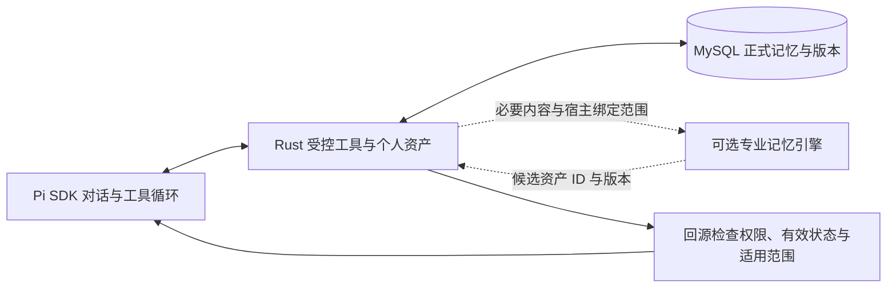

# MVP 后续研究：准确率与个人记忆

核对日期：2026-10-05。本文记录研究结论与候选方案，不改变已经完成的 MVP 范围，也不代表已接入或实测这些产品。

## 1. 结论

**本地合成 MVP 已完成。现在可以研究记忆系统，但没有理由立即换掉已有实现。**

- 目前有基础个人记忆：MySQL 保存纠错和偏好，支持用户与空间隔离、修订、停用和删除；Pi SDK 负责持续对话、恢复和上下文压缩。
- 优先验证 **Mem0 OSS**：有 DeepSeek 和 Milvus 适配，与现有技术选型较接近。它是第一候选，还没有证据证明它在我们的中文数据问题上效果最好。
- **Hindsight** 作为第二候选：有独立的记忆 API、来源文档和多种检索方式，但默认需要额外的 PostgreSQL 与向量/重排配置。
- Graphiti 更适合需要追踪复杂关系和历史变化的场景；Zep 提供托管服务；Letta 当前包含整套 Agent 运行框架。这三者暂不作为我们的首选。
- 准确率改善先关注已有失败：依据不足却下结论、查询状态表述错误、口径遗漏、混淆中间结果和落表约束。专业记忆系统主要帮助复用纠错，不能包办这些问题。

最终选型应看同一批中文纠错的实际效果、额外延迟和总成本，不能用厂商的公开分数替代本项目验证。

## 2. MVP 完成到什么程度

最终十项工程验收通过，独立审查确认收据与当前代码一致。长会话检查点读取的 MySQL 排序内存错误已经修复；查询确认、版本与隔离、个人资产、Pi 原生恢复和压缩、页面及千表合成检索均有对应验收。

原 DeepSeek Flash 测量为 **16 个场景通过 12 个，75%**；四个错误保留。该测量早于最后的检查点工程修复，未重新运行真实模型。真实 Datasight、正式认证、真实用户试用和生产验证仍属于后续范围。

证据见[当前状态](../CURRENT.md)、[质量报告](../reviews/mvp-accuracy-20261005.md)及本地收据 `.local/delivery/I2-MVP-result.json`。工程通过与内容准确率是不同结论。

## 3. 现在的记忆到底是什么

| 内容 | 当前由谁负责 | 用途 |
| --- | --- | --- |
| 当前对话、历史与压缩摘要 | Pi SDK；应用保存恢复记录 | 让同一对话持续多轮、多任务 |
| 用户纠错、默认偏好、个人 Skill | Rust 个人资产模块与 MySQL | 跨对话复用个人积累，并管理版本和启停 |
| 表、指标、文档、公共业务口径 | 语义模块与 MySQL；Milvus 保存检索索引 | 提供可核对的公共知识 |
| 当前任务、SQL 确认、查询状态 | Rust 业务模块与平台适配器 | 保留可查证的运行事实 |

代码核对发现：

- 个人资产写入当前表与历史版本表，读写绑定 `owner_id`、`space_id`；修改检查起点版本。[存储实现](../../crates/data-agent/src/modules/assets/store.rs)
- 个人记忆查找主要按名称、正文、范围做关键词匹配，支持分页；会话启动只放有界候选，更多内容由模型用工具补查。个人资产未混入共享向量索引。[检索实现](../../crates/data-agent/src/modules/retrieval/mod.rs)、[工具组合](../../crates/data-agent/src/use_cases/data_tools.rs)
- 现有公共知识向量检索使用本地 `multilingual-e5-small`、384 维和 Milvus。这不等于个人记忆已有同样的语义召回能力。[向量实现](../../crates/data-agent/src/modules/retrieval/vector.rs)
- 记住什么由现有 Pi 工具循环判断，再经 Rust 保存；没有额外的专业记忆提取、合并和检索服务。

当前基础能力已经存在。后续最值得验证的增益是：**换一种说法也能找回正确纠错，并且不会把别的指标、旧版本或临时要求套过来。**

## 4. 候选系统比较

| 方案 | 与我们最相关的能力 | 接入与维护代价 | 当前建议 |
| --- | --- | --- | --- |
| 现有 MySQL 个人资产 | 明确归属、依据、版本、启停和跨对话复用 | 已在项目中；相近表达和大量记忆的检索还有提升空间 | 保留为基线及正式记录 |
| Mem0 OSS | 提取记忆；语义、关键词、实体等信号检索；有 DeepSeek、Milvus 适配 | 库或内部 HTTP 服务；还要管理嵌入模型、引擎历史和索引同步 | 第一候选，先小样比较 |
| Hindsight | 保存、查找及归纳记忆；来源文档；按 bank 组织记忆 | 默认 PostgreSQL；本地或外部嵌入/重排；归纳也会消耗模型调用 | 第二候选，重点比较跨会话纠错 |
| Graphiti | 实体关系、时间变化、旧事实失效与混合检索 | 需 Neo4j、FalkorDB 等图存储及模型/嵌入配置 | 出现真实关系与历史推理需求再考虑 |
| Zep | 托管图谱、用户/会话管理与上下文检索 | 服务费用及托管依赖；自托管要求要单独看企业方案 | 需要减少运维时再比较 |
| Letta | Agent 自主管理持久记忆、MemFS 和后台整理 | 包含另一套 Agent 运行框架；与 Pi 的职责重叠 | 当前不引入整套 |

### Mem0：匹配技术栈，但不能把自动提取当成纠错裁决

官方 [DeepSeek 配置](https://docs.mem0.ai/components/llms/models/deepseek)与 [Milvus/Zilliz 适配源码](https://github.com/mem0ai/mem0/blob/main/mem0/vector_stores/milvus.py)存在。不过，文档示例仍使用 `deepseek-chat`；这不能证明我们指定的 `deepseek-flash`、中文语义及现有 Milvus 版本已经联合验证。DeepSeek 用于生成，嵌入模型需要单独配置。

新版自动提取采用 **ADD-only**：新增记忆，不在提取阶段自动更新或删除旧条目；显式更新、删除 API 仍然存在。因此“用户改口后旧规则立即失效”仍要通过应用版本和有效状态保证。开源版与托管版能力也有差别，不能把托管版的图能力、时间推理或公开成绩直接当成 OSS 能力。[迁移说明](https://docs.mem0.ai/migration/oss-v2-to-v3)、[REST API](https://docs.mem0.ai/open-source/features/rest-api)

最省改动的试验方式是：先把已有明确纠错作为检索材料，使用 `infer=False` 避免再次改写语义；检索回来后按资产 ID 和版本读取 MySQL 正文。该模式跳过自动提取，也不会自动消除重复，需要保持稳定映射。它只能验证检索增益；自动提取质量应另外比较。[Add Memory](https://docs.mem0.ai/core-concepts/memory-operations/add)

Mem0 为 Apache-2.0。官方完整自托管方案包含 API、管理页面和 PostgreSQL/pgvector，不能说“接上现有 Milvus 就没有其他成本”。只封装 OSS 库可以减少重复设施，但会留下少量我们要维护的适配代码。具体部署方式尚未选定。[仓库与许可](https://github.com/mem0ai/mem0)、[自托管说明](https://docs.mem0.ai/open-source/setup)

### Hindsight：独立记忆服务，来源管理值得验证

它通过 retain、recall、reflect 分别完成保存、检索和归纳；可用 REST 接入，采用 MIT 许可。默认存储是 PostgreSQL，嵌入/重排可在本地运行或配置外部服务。[仓库](https://github.com/vectorize-io/hindsight)、[安装文档](https://hindsight.vectorize.io/developer/installation)

它提供来源文档和删除关联记忆的能力。同一 `document_id` 可替换更新；每个用户与空间映射独立 bank 有利于隔离，但 bank 名称仍必须由宿主绑定，不能允许模型自选别人的 bank。[文档管理](https://hindsight.vectorize.io/developer/api/documents)、[按用户使用记忆](https://hindsight.vectorize.io/cookbook/recipes/per-user-memory)

如果试验，先比较 recall，不启用额外的 reflect 和自动知识页更新。这样容易分清检索带来的收益，也减少与 Pi 生成过程重复的调用。官方有 DeepSeek 配置示例，但示例嵌入模型含英语模型；中文需单独验证，不能直接照搬默认参数。

### Graphiti、Zep 与 Letta：暂缓的具体原因

- **Graphiti** 为 Apache-2.0，负责时序图谱；可以通过 FastAPI 服务接入。官方提示模型需要可靠的结构化输出，OpenAI 兼容接口可接 DeepSeek，但接口兼容不保证提取质量。新增图数据库对当前个人纠错需求的收益还没有证据。[仓库](https://github.com/getzep/graphiti)、[许可](https://github.com/getzep/graphiti/blob/main/LICENSE)
- **Zep 与 Graphiti 不是同一个交付形态**。Zep 在托管系统中使用 Graphiti，并加入自己的存储、用户管理和检索能力。Graphiti 本身需要应用补用户与会话管理。[官方区别](https://help.getzep.com/zep-vs-graphiti)
- **Letta 仍在开发，但当前入口已经改变**：旧 V1 API server 放在 archive 分支，当前源码在 `letta-code`，包含 Agent harness 和 App Server。MemFS 使用 Git 保存记忆，后台 dreaming 会调用其他模型会话。对我们来说，引入整套意味着处理两套 Agent 职责，而不是仅加一个记忆检索器。[当前项目说明](https://github.com/letta-ai/letta)、[记忆机制](https://docs.letta.com/configuration/memory)、[当前许可](https://github.com/letta-ai/letta-code/blob/main/LICENSE)

## 5. 成本怎么比

以下为核对日公开美元价格，不含本项目正常回答问题的模型费用。托管费和 OSS 的自托管成本不能直接混为一列。

| 服务 | 官方公开价格与计量方式 |
| --- | --- |
| Mem0 Cloud | 免费：每月 10,000 次 add、1,000 次 retrieval；Starter $19/月：50,000 次 add、5,000 次 retrieval；Pro $249/月：500,000 次 add、50,000 次 retrieval。[价格页](https://mem0.ai/pricing) |
| Zep Cloud | 免费每月 10,000 credits，有处理优先级/速率等限制；Flex 月付 $125 含 50,000 credits，追加 $25/10,000。每条输入按 UTF-8 字节计：每 350 bytes 或不足部分收 1 credit；检索与存储不按量收费。[价格页](https://www.getzep.com/pricing/) |
| Hindsight Cloud | 无固定月费；retain $10/百万输入 tokens，recall $0.75/百万输出 tokens，reflect $0.05/次；超过 30 天的存储 $0.25/百万 tokens/月。知识页自动刷新也可能收费。[价格页](https://vectorize.io/pricing)、[计费口径](https://docs.hindsight.vectorize.io/billing/) |
| 自托管 Mem0 / Hindsight / Graphiti | 无开源许可用量费；仍需承担模型、嵌入/重排、数据库、计算资源、备份和维护成本。图数据库等底层组件的许可与服务费用另计。 |

一个**假设例子**：每月保存 1,000 条纠错，每条输入 500 tokens；检索 5,000 次，每次返回 1,000 tokens。

- Mem0 Starter 的公开请求额度可覆盖，月费 $19。
- Hindsight 的 retain + recall 为 `0.5 × $10 + 5 × $0.75 = $8.75`，另外计算过期存储及归纳/自动刷新；这是按假设量算的费用，未实际调用。
- Zep 无法从上述 token 数直接换算。如果另假设每条实际为 1,500 UTF-8 bytes，1,000 条约用 5,000 credits，可能落在免费额度内；如果需要付费计划的服务能力，再按其月费比较。中文不能按一个字符一个 byte 估算。

这也说明：请求量小的时候，自托管不一定比托管便宜；读取多、返回内容长或频繁归纳时，费用又会改变。

我们的比较应记录：

`新增总成本 = 记忆处理调用 + 嵌入/重排 + 存储/计算 + 运维 + 记忆进入主模型后的额外输入`

先保存有复用价值的纠错，保留少量相关原文。把每条聊天、完整 SQL 结果都送去记忆，会放大成本和噪声。当前已由 Pi 整理好的记忆可以先直接索引；是否再交给专业系统提取，以实测价值决定。

## 6. 接入后，什么仍由我们负责

以下是候选边界示意，尚未新增接口或服务：

对一条纠错，至少应能回答：谁的、针对什么对象、什么条件下适用、原依据是什么、当前哪个版本有效。现有资产已有正文、范围、来源、依赖、验证状态及版本；无需为了调研重建模型。

例如一条完全合成的纠错：**月购买人数应在整月范围按客户去重，不能相加每日购买人数。** 后续问同一指标时应找到；问另一个按日计次数的指标时不能套用。用户停用后，即使引擎还有旧索引，也不能再采用。

候选引擎负责帮助查找和组织。以下仍沿用既有业务规则：

- 用户与空间范围由 Rust 绑定；返回候选必须回源校验。
- 本次明确条件优先于长期偏好；“仅本次”不能变成永久规则。
- 个人纠错保持个人归属。发现公共口径问题时进入现有语义维护，不能静默覆盖。
- 保存、修订、停用的正式回执来自 MySQL；引擎重试与索引延迟不能复活旧版本。
- Pi 保持唯一的主 Agent 循环。使用引擎 API 不等于安装 Pi CLI 插件，也不增加另一套会话压缩器。

如果试验发现 Mem0 的提升只是普通向量检索带来的，应比较复用现有 Embedding/Milvus 的代价。只有额外的记忆能力确实有收益，才值得增加依赖；我们也不因此自研通用记忆框架。

## 7. 准确率怎么提高，先做什么

行业做法给出的方向比较一致：维护清晰口径、提供经核验的 SQL 示例、限定问题需要的资料、用独立问题持续测量。Databricks 建议优先使用 SQL 表达式和示例，避免堆积相互冲突的长指令；Snowflake 的评测会把被测示例从模型知识中临时移除，避免把答案提前给模型。[Databricks 指南](https://docs.databricks.com/aws/en/genie-agents/best-practices)、[Snowflake 评测机制](https://docs.snowflake.com/en/user-guide/snowflake-cortex/cortex-analyst-evaluations)

我们的四种错误，应分别处理。下面是后续试验假设，尚未证明是唯一根因，也没有在本轮实现：

| 已有错误 | 值得先试的改进 | 验证什么 |
| --- | --- | --- |
| S01：无依据解释零金额的成因 | 把字段计算事实、业务约定和未知原因放在相邻的可引用材料中；要求解释逐项对应证据 | 新问法与不同数据下，不再把相关标记说成原因；允许明确未知 |
| B08：已运行旧查询被说成待确认 | 让状态表述采用当前查询回执，明确查询 ID、条件版本和状态；不用旧聊天描述推断状态 | 等待中继续问另一个问题，两个查询仍被正确描述 |
| P01：金额口径漏掉未知范围 | 将金额单位、计算组成及尚未确定的税费/运费范围组织成完整字段说明 | 初次预填就保留未知，而非追问后才补齐 |
| P02：把中间 NULL 当成可落表值 | 将加工表达式与目标 NOT NULL/CHECK 等约束一起提供，并区分中间计算与成功记录 | 能解释中间结果，同时指出目标写入限制 |

这些要求不少已经写在提示与工具说明中。再追加一句“认真检查”并不能证明有用；需要观察实际送入的资料、读取完整性和输出，再每次只改变一个因素。模型能力本身也可能影响判断，不能先断言所有错误一定来自上下文。

后续最小比较建议：

1. 保留原 16 题及失败；用于诊断，不反复重跑直到全部成功。
2. 准确率改善先比较资料组织与可信案例；模型继续使用同一 Flash/Pi 配置，独立验收答案保持隔离。
3. 记忆先用同一批已保存纠错比较现有检索与 Mem0；必要时再加入 Hindsight。未测试自动提取时，报告只写检索效果。
4. 案例至少覆盖：换说法、多会话、同名不同指标、本次例外、用户改口、停用/删除、另一用户/空间、引用语义改版。
5. 同时记录正确找到、正确采用、错误套用、旧记忆复活、隔离错误、保存/检索延迟、额外 tokens 和费用。只看召回率会漏掉“记住了错误规则”的损害。

增加留出的新问法和反例，固定运行次数并报告波动。只有稳定改善、没有破坏既有边界，才讨论接入；没有明显增益就保留现有方案。这是后续建议，不是新增的 MVP 验收要求。

## 8. 本次研究的证据边界

已核对项目代码、官方文档、公开价格与相关主分支源码。未安装候选库、未调用记忆服务、未发送项目数据给这些服务、未改变模型配置，也未实测候选系统的中文效果。GitHub release API 本次遇到公共限流，因此没有声称核定最新稳定版本；正式试验前应固定实际版本。

公开 benchmark 的数据集、模型、检索长度与托管优化各不相同，本文不据此给系统排效果名次。上述推荐基于当前需求和接入代价，最终效果仍待独立小样比较。
