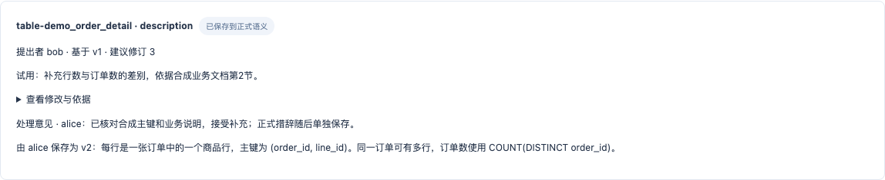
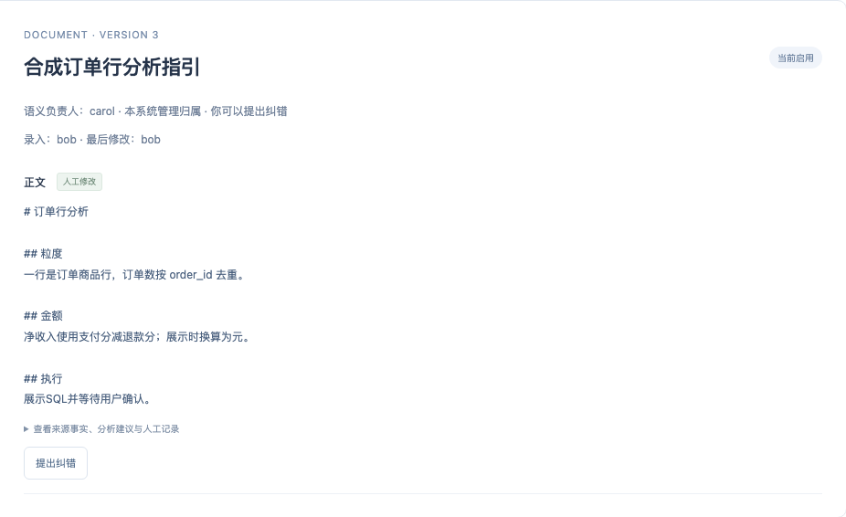
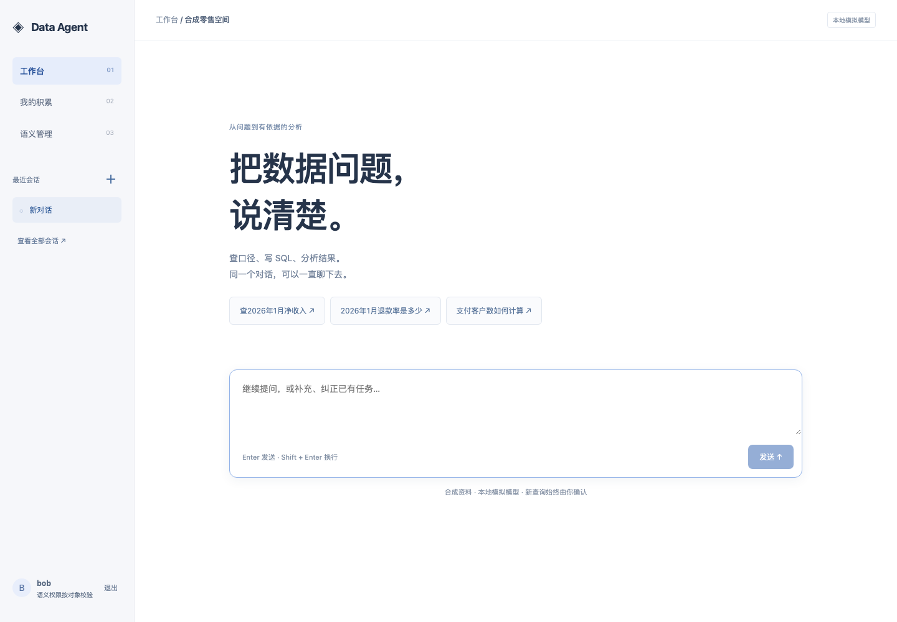

# 角色与语义协作实际试用记录

日期：2026-10-07。试用代码：`a6ee376c3fd1ddb139db347da401fd36602a897c`，分支 `codex/semantic-role-boundaries`。

## 结论

本轮通过实际浏览器操作走通了语义负责人、独立对象创建、停用恢复、跨用户纠错、负责人转交和个人资产管理。未发现新的越权或“接受建议即改正式语义”问题。

**完整真实模型试用被本机服务启动阻塞。** 因此，本记录不能证明当前环境下 Flash 聊天、SQL 生成执行、Mem0 提取召回或 Qwen/Milvus 检索已通过。本轮保留失败，记录四项待处理事项；产品代码没有随试用继续修改。

当前任务状态统一见 [CURRENT](../CURRENT.md)。本报告是试用证据，不新增开发计划。

## 环境与方法

| 部分 | 实际情况 |
| --- | --- |
| 页面与业务服务 | 本提交的 React、Rust API、MySQL，Playwright 驱动真实浏览器点击、输入、切页及刷新 |
| 身份 | 合成空间中的 Alice（超级维护者）、Bob（先为普通成员，再从 mock 同步为表维护人）、Carol（普通成员，后接收文档归属） |
| 平台 | 从零构造的 Datasight mock；修改模拟来源时递增 `platform_version` |
| 完整模型栈尝试 | DeepSeek Flash/high、Pi SDK、Mem0、百炼 `qwen3.7-text-embedding`、Milvus；服务尚未全部就绪 |
| 后续管理页面环境 | 沿用项目 `tests/mvp/harness.mjs`，`capture=true`、`startWorker=false`、内置个人资产路径；界面标注“本地模拟模型” |
| 隔离 | 独立数据库、端口、身份和运行目录；既有常驻实例及旧模型账本保留 |
| 辅助核验 | 通过只读 API 核对版本和当前权限，读取本轮 `skill_selections` 核对选用落库；不靠数据库写入代替用户操作 |

这不是一次模型准确率评测。管理页面没有调用 Agent；操作成功数不折算为模型成功率。原增量的十组冻结验收仍是原来的证据，本轮没有把它们当成新 dogfood 结果。

## 实际操作

| 操作 | 观察到的结果 |
| --- | --- |
| 普通 Bob 打开语义管理 | “同步来源”“录入指标”“录入业务文档”禁用，正式语义无编辑按钮，仍可提出纠错 |
| Bob 保存私人纠错草稿，再明确提交 | 草稿在 Bob 页面可见，Alice 页面不可见；勾选共享确认后才进入协作列表 |
| Alice 接受建议，再核对编辑保存 | 接受前后正式知识均为 **v1**，正文不变；单独保存后变成 **v2**，记录处理者和最终措辞 |
| Bob 提交错误的订单粒度建议 | Alice 驳回；Bob 能看到“主键包含 line_id，一单可以多行”的处理理由；正式版本仍为 v2 |
| 模拟平台将表维护人改为 Bob，递增来源版本后点击同步 | Bob 获得该表维护权及独立对象创建资格；先前人工修改的表含义保留 |
| Bob 创建文档和指标 | 两者的 `created_by` 与负责人均为 Bob；关联到表没有改变独立对象的负责人规则 |
| Bob 停用文档，离开页面后找回 | 从“我负责的对象”及“停用”筛选找到文档，重新启用成功 |
| Carol 查看 Bob 的文档 | 可以阅读和提建议，没有编辑按钮 |
| Alice 将文档转交给 Carol | Carol 获得编辑入口；Bob 的已打开页面再次点击旧目录条目，仍显示 Carol 为负责人，没有恢复编辑按钮。Bob 仍是引用表的维护人，文档权没有随引用传回 |
| Bob 人工保存、编辑、停用再启用个人记忆 | 状态及版本更新；Carol 资产列表为空，无法看到 Bob 的记忆。此项只覆盖应用持久化和用户隔离 |
| Bob 创建 Skill，在当前对话选用 | 服务端存在 Bob、当前会话、该 Skill v1 的选择记录；Carol 没有该 Skill。工作台缺少选用反馈，见 DF-04 |
| 工作台草稿、历史入口及窄屏 | 未发送草稿切页和刷新后保留；从“查看全部会话”打开已创建会话；390px 语义页无横向溢出，本轮三个浏览器页面均无 `pageerror` |

### 纠错保存的证据

上图是在负责人明确保存后截取。接受但未保存时，API 核对仍是 v1，正文与原值相同。

### 转交后旧负责人的页面

## 问题记录

本节优先级表示后续处理顺序，不代表已安排开发。四项均为**已记录，未在本轮修复**。

### DF-01 · P1 · 本机完整服务启动未能就绪

- **复现**：在新的合成数据库和独立端口，按 `scripts/development.py --model deepseek` 配置 Flash、Mem0 和组合检索。
- **预期**：服务启动后可以登录，进行真实模型聊天和记忆试用。
- **实际**：默认启动两次都在 Mem0 的 25 秒健康检查期限结束；仅在忽略目录中的诊断脚本将等待延长到 120 秒，Mem0 仍未就绪。随后用同一试用配置显式改为 builtin/lexical 检查其余服务，Pi Bridge 也未在 120 秒内就绪。两种辅助尝试均未改变产品默认配置。
- **已知证据**：MySQL、Milvus 容器健康；API 已启动；Mem0 服务未输出运行错误。15/30 秒线程栈采样落在 Python `importlib`、Mem0 和 OpenAI 依赖的文件加载中。单独 `from mem0 import Memory` 曾在约 1.62 秒完成，说明加载耗时不稳定，不能据此认定是 Mem0 算法或模型端点故障。Pi 只确认未输出就绪日志，其进一步根因未查清。
- **影响**：本环境的新启动与完整真实试用受阻；聊天、SQL 生成/执行、Mem0 提取和召回、本轮真实共享向量检索均未验证。
- **费用**：保留的新试用账本显示 `allocated_calls=0`、`spent_micros=0`、`reserved_micros=0`；没有通过重置旧账本增加额度。
- **下一步证据**：在同机确认依赖加载和进程初始化的稳定耗时，再确定是否需要调整就绪机制。当前没有足够证据把问题归因到模型、权限或记忆算法。

### DF-02 · P2 · 同步后同名样例表缺少可见区分

- **复现**：新建合成环境，进入语义管理，点击“同步来源”。
- **实际**：目录同时出现种子对象与平台导入对象，例如两条 `demo_order_detail`、两条 `customer_tags`。只显示名称、类型和版本，用户难以判断该维护哪一条。
- **原因范围**：这是当前合成种子与平台目录对象共存的展示问题。代码保留明确样例别名，不能把两条对象误报成越权或证明任意真实平台都会重复。
- **影响**：试用者容易选错对象，也可能把不同版本误解为自己刚才的修改丢失。
- **建议**：整理演示对象，或在目录中显示可识别的来源；具体修复另定，不在本轮改动。

### DF-03 · P2 · 同步冲突只显示 `version_conflict`

- **复现**：在 mock 中修改维护人但暂不递增 `platform_version`，再点“同步来源”。
- **实际**：服务正确拒绝不一致的来源版本，旧负责人保持；页面只显示 `version_conflict`，未说明冲突对象和恢复方式。
- **澄清**：这次冲突由试用夹具未递增来源版本触发，**后端拒绝符合契约**。递增到 v2 后，同步及 Bob 的维护资格正常生效。保留前一次失败，不改判成同步成功。
- **影响**：用户难以区分“数据源版本不一致”和“没有权限”，也不知道是否需要重试。
- **建议**：提供可理解的原因、操作下一步和诊断标识，同时保留原错误码供排查。

### DF-04 · P2 · Skill 已选用，但工作台没有确认提示

- **复现**：在“我的积累”创建 Skill，点击“在当前对话选用”，进入工作台并刷新。
- **实际**：工作台显示欢迎页和输入框，没有当前选用 Skill 的名称或版本提示。`skill_selections` 中已存在正确的用户、会话和资产 v1 记录，因此不是选用丢失。
- **影响**：用户不能从当前页面判断刚才的选择是否生效。
- **建议**：在工作台显示当前选用的 Skill 与版本或持续可见的确认反馈；不由此扩展新的 Skill 框架。

## 证据位置与排除项

原始证据在 Git 忽略目录 `.local/dogfood-20261007/`：

- `metadata.json`：试用提交、原始配置模式及隔离端口。
- `observations.jsonl`、`browser-actions.jsonl`：逐次观察和实际浏览器操作。
- `state-proof.json`：角色、对象版本、纠错和两个用户资产的最终只读快照。
- `skill-selection-proof.json`、`browser-errors.json`：Skill 选择持久记录与页面错误记录。
- `startup-first/`、`startup-second/`、`memory-stack.log`、`official-startup-ledger.json`：首次失败、重试、线程栈及原始预算证据。
- 截图：正文公开三张，其余保留在本轮本地目录，均为合成资料。

浏览器驱动曾遇到精确 label 定位和同名按钮匹配错误，修正定位后完成同一操作；这些是试用脚本问题，没有列为产品缺陷。早期空目录/空历史截图发生在页面数据尚未返回时，也不作为数据丢失证据。

未覆盖：真实 Datasight、正式认证、同事验收、长对话恢复、并发与故障注入、真实模型质量及 Mem0 召回。既有冻结回归覆盖其中部分工程边界，但不替代这次环境下尚未完成的真实试用。
