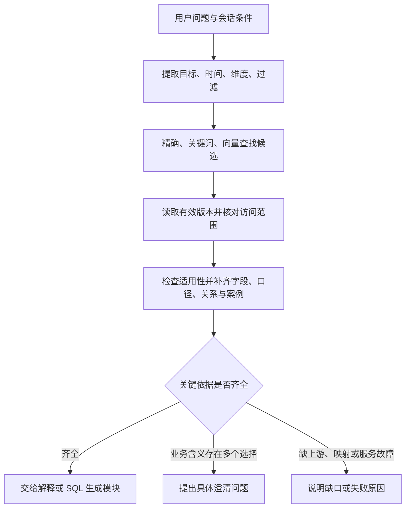

# 语义理解与检索：第一版设计

更新：2026-10-03。状态：用户已完成 18 项 MVP 选择，并确认新消息待处理期间暂缓同一会话 SQL 确认（第 19.5 节）。第 17–20 节收敛实施范围、数据责任和验收；第 19.5–19.8 节补齐运行契约，第 20.1 节统一起步场景编号。技术命名和字段为实施设计，尚未转换为业务程序或迁移。Pi 为唯一 Agent 循环、Rust 主业务、数据平台适配器先 mock、双向澄清与 SQL 展示确认等原则继续沿用。公开版本全部采用从零构造的零售订单样例；应用接入状态以当前记录为准。未将离线样例验证视为真实模型或生产平台验收。

本文件从语义理解与检索设计扩展为 MVP 的设计及实施基线。2026-10-03 公开化改写只替换业务材料和旧证据，保留已确认的 18 项决定与详细技术契约。[CURRENT.md](CURRENT.md) 继续作为唯一当前状态记录。后端使用 Rust；MySQL、Zilliz/Milvus、DeepSeek 沿用已有选择或偏好。新增技术约定的依据是用户已确认的行为，具体组件版本、协议和效果仍需试验。

## 1. 这块必须解决的问题

对一个问题，系统既要找到相关表，也要找到足以回答它的字段、口径、关联和依据。找到表不代表已经具备计算条件。

第一版推荐：**按业务对象组织知识，结合精确、关键词和向量检索，再检查候选能否满足问题，补齐依赖后交给回答或 SQL 模块。**

采用这一做法的原因：字段名适合精确匹配，不同业务叫法需要语义匹配，计算是否正确还取决于时间、粒度、过滤和关联。向量相似度只用于寻找候选，不能证明业务上适用。

| 做法 | 适用部分 | 主要缺口 |
| --- | --- | --- |
| 名称和关键词查找 | 明确表名、字段名、已维护的别名 | 问法换了可能漏掉相关内容 |
| 仅按向量相似度查找 | 业务问法与说明措辞不同 | 容易混淆相近指标、字段，无法验证关联和计算条件 |
| 本文推荐的组合方式 | 同时处理精确定位、自然语言问法和计算依据 | 需要维护对象关系、版本，并通过真实问题调整效果 |

## 2. 检索什么：原有六类知识与业务文档

这是后台的数据组织方式。维护页在原有五个分区上增加“业务文档”，支持字段、表、指标引用完整文档或具体章节。

| 对象 | 保存的核心内容 | 检索后的用途 |
| --- | --- | --- |
| 表 | 用途、覆盖范围、每行代表什么、时间、候选键、适用问题 | 判断这张表能否解决当前问题 |
| 字段与取值 | 类型、业务含义、有效值与默认值、计算方式、使用提醒；map 子项保留所属字段 | 把用户说的条件对应到实际字段和值 |
| 指标 | 统计对象、算法、分子分母、时间、维度、过滤、可用表和 SQL | 保持同一指标的计算口径一致 |
| 查询关联 | 两端对象、关联条件、时间条件、匹配数量与证据、去重要求、适用目的 | 补齐查询所需关系，检查是否可能重复计数 |
| 业务用语与规则 | 常用叫法、简称、含义、适用业务域、默认规则及例外 | 解释业务表达；一个叫法可对应多个候选，不能全局强绑 |
| 已验证问句与 SQL | 问句、SQL、用途、参数范围、适用语义版本、验证记录 | 复用正确做法；新问题仍需检查时间、粒度与过滤是否适用 |
| 业务文档与章节 | 完整正文、章节标识、范围、来源、维护者、版本及对象引用 | 解释业务背景、跨表流程、边界与例外；命中章节后补齐必要上下文 |
| 业务主题 | 业务目标、范围、术语以及相关表、指标和文档的引用 | 组织多张表共同服务的业务；主题归属本身不构成查询关联规则 |

共同要求：

- 每项有稳定标识、所属空间和对象、版本、来源、适用范围、待解决问题。名称变更不应随意生成一个无历史的新对象；平台标识能力需核实。
- 原始资料、SQL 中的加工事实、模型建议、人工修改分别保留。人工修改标识、业务确认和查询验证是不同状态。
- 加工事实与业务定义冲突时同时保留并指出差异，不能只按“谁最后修改”自动认定正确。
- 业务别名带适用范围。例如“UV”不能直接在整个空间内等同于支付客户数；必须结合上下文确定统计对象。
- 指标可以被多个表引用，使用明确的适用条件选择实现；不在每个表页面复制出独立口径。
- 生产血缘、当前 ETL 的关联事实和可用查询关联分别记录。能追到上游，不代表可以直接 JOIN。
- 当前公开样例提供净收入、月支付客户数和订单退款率的定义；独立参考 SQL 与结果放在 `docs/sources/evaluation/`，不向待验收模型泄露答案。样例通过只证明固定数据上的行为，不自动成为生产已验证案例。缺少案例不会阻止依据充分的全新查询生成。

### 怎样制作供检索的内容

- 表有一份简短摘要；字段、指标、规则和 SQL 案例分别形成检索条目，并携带所属表与业务域。
- 一个字段条目保留完整的“含义、取值、计算与提醒”。map 子项可以独立命中，但必须带回父字段和对应 key。
- 一个指标条目同时携带算法、范围和限制，避免只找到名称而漏掉分母或排除条件。
- 长 SQL 原文完整保存。检索主要使用问句、用途和关键逻辑；需要时通过依据定位原文片段。
- 关联规则以 MySQL 中的结构化关系为准。可以为发现关系制作检索文本，使用时仍核对两端和完整条件。
- 取值映射优先整理有限的业务枚举及其解释。实际取值资料能否用于共享检索，需沿用平台权限；不批量索引个人标识、原始对话或凭据字段。

## 3. 先把已有资料解释清楚

2026-10-02 用户选择 4A：先导入整个空间可获取的元数据、血缘和节点 SQL，完成基础预填；常用表优先由模型深入分析，其他表按需补齐。所有已导入表都进入可检索目录，不等待全空间深入分析完成。基础预填只填已有资料和能确定的加工事实，未知业务含义保留缺口。

常用表的首批范围可由维护者指定；平台若能提供使用情况，再辅助排序，不假设已有热度接口。模型分析记录范围、进度和缺口，按处理预算推进。

1. 保存本次元数据、血缘和节点 SQL 的原始版本，记录同步是否完整。
2. 解析能确定的表达式、过滤、窗口、字段来源等事实，保持可定位的原文依据。离线样例使用 SQLite；Rust SQL 解析器对目标平台方言、窗口和调度变量的支持，仍需分别验证；未成功解析的部分保留原文和缺口。
3. DeepSeek 结合上述事实补充业务解释、发现描述冲突。不能把模型推测写成接口直接返回的事实。
4. 透传字段按需要追到对应上游。记录已经查过的对象与版本，遇到循环、缺 SQL 或达到处理预算时留下具体缺口。
5. 有可用数据权限时，检查取值、空值、重复或匹配数量。抽样未发现重复不能证明全量唯一；说明检查的范围与时间。
6. 把说明、依据、差异和未解决问题送到已有维护页。

元数据同步失败或只完成一部分时，不能把本次未收到的表当成已删除。真正删除、改名或结构变化需要可靠的变更依据。

## 4. 用户提问后的处理过程

以下流程表达常见知识处理关系。按第 13 节的最新决定，实际运行由 Pi 中的模型动态选择工具、补查和调整；不要求每个问题依次走完所有模块。一次计算所需条件可随调查逐步明确。



### 4.1 理解需求

- 保存用户原话，再提取任务类型、统计对象、时间、维度、过滤及明确指定的表。模型给出的对象首先是候选。
- 业务域可辅助排序；没有充分依据时，不能先锁死一个域，把可能相关的数据全部排除。
- 显式表名、字段名优先精确定位，同时继续检索它依赖的规则。找对字段不意味着其他必要条件已经齐全。
- 相对时间依据会话记录的时间点和业务时区解析。业务时区尚未明确，不能从字符串时间或开发者电脑时区直接推断。
- 追问默认保留未被用户改变的条件；切换业务问题时重新判断适用范围，不把旧过滤条件带到无关问题。

### 4.2 找候选并判断是否适用

- 在平台允许访问的范围内，结合精确名称/别名、关键词、向量检索。不同对象类型分别保留候选，防止大量字段结果挤掉指标或案例。
- 从 MySQL 读取对应有效版本，检查停用、来源变更和访问范围后，才将内容交给模型进行解释或排序。
- 按“是否包含所需字段、能否满足时间和粒度、指标含义是否一致、关联是否适用”检查候选。
- 对相似候选，要能记录选用或排除的具体理由。排序分数不等同于正确概率；不设一个通用分数作为取数放行条件。
- 初始可用 Zilliz 的关键词与向量结果融合，再做上述明确检查。是否引入单独的重排模型，等样本比较后决定。
- 向量模型、文本处理和索引版本配套记录。中文业务词、英文标识和下划线字段名要用样本检查，不能只测中文自然句。

### 4.3 补齐依据，控制检索范围

- 读取当前问题需要的字段说明、指标定义、取值解释，以及关系另一端和适用案例；优先完整保留关键口径。
- 查询需要跨表时，根据可用查询关系补充缺少的表，不要求另一端也必须是向量检索的高分结果。
- 发现明确缺口时可以做一轮有针对性的补查。次数、条目数、模型调用和上下文长度设上限，初值通过样本确定。
- 达到上限仍缺关键条件时明确列出缺口；非关键说明缺失不妨碍回答已经有依据的部分。
- 当前业务定义优先于过期案例。案例的依赖变更后需复核，不能通过相似问句沿用旧口径。

### 4.4 给下一个模块的输出

输出包括：整理后的需求、选中的表和字段、指标与规则、可用关系、适用案例、来源与对象版本、未解决问题，以及当前可执行的下一步。

| 状态 | 典型原因 | 后续行为 |
| --- | --- | --- |
| 依据齐全 | 当前任务需要的定义和条件已找到 | 可回答含义或进入 SQL 生成与校验 |
| 需要澄清 | 多个口径都合理，或用户未给出必要范围 | 只问影响当前结果的选择；答案只作用于本次需求，正式定义另行维护 |
| 缺资料 | 没有上游 SQL、枚举映射或可用关联证据 | 给出已有事实和具体缺口，不把猜测当成定义 |
| 服务不可用 | 模型、检索或资料接口失败 | 标记失败或明确的降级；不能解释成业务上没有相关数据 |

“依据齐全”只表示可以进入下一步，不等于 SQL 已执行或结果已验证。生成草稿与实际执行分别有自己的检查。

允许有依据的自动预填进入使用流程。这里检查的是本次问题的必要条件，不要求所有字段都先由人工确认。

## 5. 用完全虚构的零售订单问题走一遍

问题示例：计算 2026 年 1 月的退款率。样例采用 UTC，并按原支付月份归属累计退款；这个问题仍未说明分母。

系统需要同时找到：

1. `demo_order_detail` 是订单行粒度，候选键是 `(order_id, line_id)`；订单数需要按 `order_id` 去重。
2. `paid_amount_cents`、`refunded_amount_cents` 以整数分表示，来自成功支付/退款事件的行级聚合。
3. `paid_at` 是首次成功支付时间；`order_date` 是下单日期，不能互换。
4. 默认排除 `is_test=1`，支付客户数还要求已支付及非空客户标识。
5. 退款率可以按订单数，也可以按金额计算；关联 `customer_tags` 还可能放大行数。

样例业务指南分别定义了订单退款率和金额退款率。用户只说“退款率”时，Agent 应说明两种口径并澄清，不能替用户决定分母。选择订单口径后，应统计退款订单数除以已付订单数；选择金额口径则是退款金额除以支付金额。参考结果仅用于验收，不能预先塞入模型上下文。

这个例子说明：找到正确表、返回很多说明、SQL 可以运行，均不能单独证明回答正确。公开材料见 [样例说明](sources/README.md) 和 [业务指南](sources/business-guide.md)。

## 6. MySQL 与 Zilliz 的数据责任

| 位置 | 保存什么 | 关键约束 |
| --- | --- | --- |
| MySQL 正式知识 | 六类对象、原始资料与依据、有效版本、人工修改、验证和待解决问题 | 表字段、共享指标及关系能通过稳定标识关联；变更可追溯 |
| MySQL 任务与查询记录 | 索引更新任务、处理状态；本次需求、引用的对象版本、检索缺口和后续 SQL | 后续可以复现当时采用的定义，区分故障和知识缺失 |
| Zilliz 检索索引 | 对象标识、类型、所属范围、语义版本、索引/向量模型版本、检索文本与向量 | 可从正式知识重建；使用前回 MySQL 核对当前内容与访问范围 |
| 原有数仓与查询服务 | 业务明细、实际查询与平台权限 | 语义存储不承接业务明细复制；执行仍按平台能力进行 |

### 修改与版本规则

2026-10-02 用户选择 1A：有维护权限的人保存公共语义修改后立即生效，保留历史版本，不增加单独发布或他人审核流程。模型预填和修订草稿继续保留来源与确认状态；“已保存生效”不自动成为“业务结果已验证”。

1. 保存语义修改时，在同一个 MySQL 事务内保存新版本并登记索引更新任务，避免内容已改但更新任务丢失。
2. Worker 按对象、版本和索引版本处理任务；重复执行应得到同一结果，较旧任务完成后不能把索引状态覆盖回旧版本。
3. 旧索引命中时回源读取当前内容并重新检查相关性，不能把旧文本直接交给模型。对象停用或删除后直接过滤该命中。
4. 新描述尚未进入向量索引时，先用精确标识、别名和可用关键词补查更新项；无法覆盖时明确标记检索尚未更新完成。页面区分“内容已保存”和“检索已更新”。
5. 一次处理固定所引用的对象版本。生成或执行前发现关键依赖已变化时，需要按新版本重新核对；连续追问遇到口径变化，应告诉用户，不能悄悄换口径。
6. 2026-10-02 用户选择 5A：元数据、血缘或节点 SQL 变化后，自动分析受影响内容并更新未人工修改的预填建议。按具体字段、规则或文档条目保留人工值及修改记录；新建议和变化依据供维护者复核，不覆盖人工值，也不把模型建议标成人工确认。受影响的解释、规则、指标和案例保留待复核状态，直到完成相应核对；旧依据不能继续显示为已核实有效，其对当前问题的影响需具体判断。异步分析完成时还要核对来源版本及期间的人工修改，避免旧任务覆盖新内容。

### 权限和故障

- 检索范围、回源取内容和实际查询均沿用平台授权。目录可见不等于数据可查，行列限制与字段样例权限需要接口核实。
- 关系两端和案例引用的对象都要在可用范围内；被拒绝的内容不进入模型、回复或可见检索记录。
- Zilliz 故障时，明确字段/指标可以由 MySQL 和已有映射继续定位；语义匹配不足的任务应说明降级或暂不可用，不伪装成完整检索成功。
- 长任务有状态、有限重试和恢复记录。重复超时不能无限补查或无限调用模型。
- SQL、注释和检索文本是资料，不是系统指令；生产 SQL 只用于分析，不能在查询流程中自动执行其中的写入或删除语句。

## 7. 首批 20 个验证场景

以下场景全部围绕从零构造的零售样例编写，不使用任何真实公司表、字段、SQL 或数据行。E01–E14 由公开样例或计算原则给出预期；E15–E20 另需构造目录、对话、版本与故障。场景说明不是模型已通过的证据。

证据简称：

- S1：[公开表结构](sources/schema.sql)。
- S2：[公开加工 SQL](sources/etl.sql)。
- B：[虚构业务指南](sources/business-guide.md)。
- P：本设计的预期行为。独立标准答案位于 `docs/sources/evaluation/`，不进入知识检索索引或模型提示。

| ID | 问题或条件 | 必须找到或识别的内容 | 应避免的错误 | 依据 |
| --- | --- | --- | --- | --- |
| E01 | `paid_amount_cents=0` 都是零元成交吗？ | 成功支付聚合缺失时填 0，需结合 `paid_at` 与订单状态 | 将未支付或没有成功支付记录解释成零元成交 | S1、S2、B |
| E02 | 月支付客户数能累加每日去重客户数吗？ | 非空客户标识、已支付、测试过滤与整月去重 | 累加每日去重结果 | B；P |
| E03 | 统计 2026 年 1 月支付客户数 | UTC 半开时间范围、`paid_at`、`is_test=0`、正支付金额及非空客户标识 | 用下单日期代替支付时间，漏过滤或给 NULL 编造客户 ID | S1、S2、B |
| E04 | 计算 2026 年 1 月退款率 | 订单退款率与金额退款率的分子分母不同 | 未澄清就选分母，或把订单行平均值当订单退款率 | B |
| E05 | 统计 1 月下单与 1 月支付有什么差异？ | `order_date` 与 `paid_at` 的语义及边界样本 | 将两个时间字段互换 | S1、B |
| E06 | 地区是订单发生时的地区吗？ | `region` 来自当前客户维表，缺失保持 NULL | 承诺历史时点地区属性 | S2、B |
| E07 | 1 月净收入是否等于 1 月现金流？ | 累计退款归属原支付月，不是退款发生月现金流 | 将不同时间归属规则混算 | S2、B |
| E08 | 多次支付和退款记录怎样汇总？ | 先按订单行聚合成功支付/退款，再关联订单行 | 直接关联支付明细而重复累计订单行 | S2 |
| E09 | 为什么本月查询出的上月净收入可能变化？ | 退款累计快照与数据版本 | 把当前累计数冒充历史快照或推断未来退款 | B；P |
| E10 | 一行代表一个订单吗？ | 订单行粒度和复合键，订单数需去重 | 把行数当订单数 | S1、S2 |
| E11 | 能解释某个订单为什么退款吗？ | 现有材料只有金额与状态，没有退款原因字段 | 编造客户动机或原因 | S1、B |
| E12 | 只看 app 渠道，该怎样过滤？ | 实际 `channel` 枚举与含义 | 依名称猜测一个不存在的编码 | S1、B |
| E13 | 缺客户或地区的信息如何处理？ | NULL 的来源和各指标自己的过滤规则 | 给未知客户统一填值后计为一个真实客户 | S2、B |
| E14 | 只看某类客户标签的净收入，能直接 JOIN 吗？ | `customer_tags` 一对多，先筛客户集合或用 EXISTS | 标签关联放大金额；把血缘当成查询关联 | S1、B；P |
| E15 | 目录有订单、订单行与多种“客户数”；用户只说“客户” | 保留候选，结合上下文或澄清 | 高分候选直接胜出或排除正确业务域 | 构造目录；P |
| E16 | “再按渠道拆开看”；另加口径更新变体 | 保留时间与过滤，定义变化后指出并复核 | 丢条件或悄悄切换口径 | 构造会话；P |
| E17 | 人工修正已保存，索引仍旧；旧任务晚于新任务完成 | 回源、新别名补查、版本不回退 | 旧文本当新说明或假称检索完整 | 构造索引任务；P |
| E18 | 源 SQL 变更、字段删除、部分同步失败 | 依赖失效、复核、完整性判断 | 使用旧字段或把未同步对象误删 | 构造来源变化；P |
| E19 | 相似候选或案例引用了无权访问对象 | 内容及引用范围检查 | 将无权内容送入模型或回复 | 构造授权；P |
| E20 | 检索失败、模型超时、确实无资料三个变体 | 故障、降级、资料缺失分开 | 故障解释成无数据或无限重试 | 构造故障；P |

### 怎么验证

1. 先固定每题条件、关键依据和预期行为；不明确的口径可以正确澄清，不能用猜测补齐。
2. 在 SQLite 固定样例上运行生成 SQL，与 `docs/sources/evaluation/` 中独立参考 SQL 和结果核对；该目录不作为模型知识源。
3. 比较精确/关键词基线与加入向量后的结果，必要时再比较重排；每次只改变一个主要因素。
4. 分别记录依据是否找全、适用性、缺口判断、口径/数值、耗时与模型成本。
5. 版本、权限、故障控制场景逐项验收；一个综合正确率不能掩盖这些失败。
6. 小样例不能证明上千张表目标目录的效果，需增加合成相似表和跨业务题。实际平台方言与权限另行验证。

2026-10-03，公开样例经 `python3 docs/sources/verify.py --report docs/sources/evaluation/verification.json` 离线验证，24 项检查通过；记录见 [样例验证结果](sources/evaluation/verification.json)。这些检查覆盖数据、参考查询与反例，Agent 和检索效果仍需实际运行。

## 8. 基础、后续优化与剩余决定

基础包括：对象和依据可追溯、别名与取值匹配、组合检索、适用性与依赖检查、版本与权限核对、会话条件保留、缺口及故障处理、上述验证记录。

后续根据失败样例再决定：专用重排模型、更复杂的业务域路由、向量模型更换、额外查询缓存。图数据库、多 Agent 和微调暂未成为必要依赖。

实施顺序已收敛到第 17 节；第 18、19 节给出数据与接口基线，第 20 节明确首批验收。接下来用公开合成问题补齐参考答案，在首条流程中验证模型、索引和平台适配，随后根据证据调整检索参数。

## 9. 参考

- [Databricks Genie knowledge store](https://docs.databricks.com/aws/en/genie/knowledge-store)：业务同义词、值匹配、关联、指标表达式与示例 SQL。
- [Snowflake Semantic View Autopilot](https://docs.snowflake.com/en/user-guide/views-semantic/autopilot)：结合元数据、SQL 与样例辅助构建语义。
- [Snowflake Verified Query Repository](https://docs.snowflake.com/en/user-guide/snowflake-cortex/cortex-analyst/verified-query-repository)：复用已验证问句及 SQL。
- [WrenAI memory system](https://docs.getwren.ai/oss/concepts/memory_system)：知识与检索索引分离，分别查找语义与正确案例。
- [Zilliz Hybrid Search](https://docs.zilliz.com/docs/hybrid-search)：组合检索与结果融合。

以上资料已于 2026-09-28 查阅，支持方案构成；不能据此推断本项目的实际准确率。

## 10. 长篇文档怎样进入语义层（2026-10-02 补充）

用户明确需要字段级长说明、单表业务文档及跨表业务文档，并授权更新原型。下面的实现细节为本轮推荐。

- 文档保存一份完整正文和版本；章节拥有稳定标识。字段、表、指标和业务主题以对象标识关联文档，可指定章节。文档改名不改变标识；章节删除或重组需要检查已有引用，不能静默跳到另一段内容。
- 结构化定义保存算法、时间、过滤、维度和关联条件；文档解释背景、原因、边界和例外。引用同一文档不代表多个指标拥有相同算法。文字与计算规则冲突时保留差异并检查是否影响本次问题。
- MySQL 保存文档、版本、来源及关联。Zilliz 索引文档摘要、章节内容和所属对象；检索命中后回 MySQL 核对权限、当前状态和版本。取回章节标题、适用范围、必要相邻段落及被引用的规则，避免只截取一句结论。
- 文档链接和文档正文分别处理。只得到链接时保留“正文未取得”，不把标题当成已检索到的内容；内部文档平台自动同步放到后续接入阶段。
- DDL、节点 SQL、血缘可以生成有依据的草稿；缺少产品背景、上游算法、枚举或业务约定时继续记录缺口。原始资料、自动分析、人工修订及来源变化分别保留。
- 文档权限可能与所关联表不同。读取和引用时分别检查；关联关系不授予权限。本次使用记录固定文档及章节版本。改版后将受影响的规则和案例标为需复核，保留人工文字。
- 2026-10-02 用户选择 6A：MVP 通过粘贴、编辑正文并保留来源链接接入已有业务文档，支持章节、关联和版本。来源链接用于追溯，不代表正文会自动同步。内部文档平台自动同步、协同富文本、复杂附件解析、自动编写完整业务知识库留待后续。

## 11. 用户记录、长期记忆与纠错（2026-10-02 补充）

用户明确要求分用户记录与记忆，提出优先考虑开源记忆系统，并强调用户纠错必须可复用。原有设计只提到会话、任务和连续追问，未充分定义这一部分。以下为推荐方案，尚未接入服务。

### 11.1 哪些内容分开保存

| 内容 | 主要保存什么 | 使用方式 |
| --- | --- | --- |
| 会话与查询记录 | 用户、空间、会话、消息、回答、计算条件、SQL、任务状态、引用版本、结果引用、纠错来源 | 按用户回看和追问；过去的结果不自动成为当前业务事实 |
| 当前会话状态 | 当前目标、已明确的时间和过滤、待澄清项、关联任务 | 同一个任务连续追问时沿用；换话题重新判断适用性 |
| 个人长期记忆 | 稳定展示偏好、用户明确的业务上下文、带范围的纠错经验 | 跨会话检索相关内容；能够查看、更正、停用和删除 |
| 共享语义与已验证案例 | 公共表字段说明、指标规则、文档及经过验证的问句 SQL | 由现有维护权限修订，供有权用户共享使用 |

个人说法和正式指标发生冲突时，检查来源、版本、适用范围与验证依据。展示偏好服从本次明确要求；若用户明确要求改变标准指标的过滤，说明采用的是自定义口径。个人偏好与记忆均不能改变权限规则。

2026-10-02 用户选择 2A、3A：

- 历史查询保存 SQL、条件、来源版本、执行记录和数据平台适配器结果引用；回看按有效权限读取平台结果。引用过期时提示重新确认查询，首版不额外建设查询结果快照保存能力。平台实际结果保留期限和读取方式后续接入核实，mock 需要覆盖过期情形。
- 对话、SQL 草稿、查询任务记录默认保留到用户主动删除，不启用默认 90 天清理。此选择不改变长期记忆与 Skill 的独立管理，也不保证业务数据结果永久存在。

### 11.2 一条可复用的纠错最少包含什么

1. 原问题和错误做法：例如“把每日去重支付客户数相加作为月支付客户数”，关联原会话与 SQL 记录。
2. 用户原话和整理后的修正：例如“在整月范围重新按非空 customer_id 去重”。保留原话，模型整理不能丢掉限制条件。
3. 适用范围：所属用户、数据空间、业务域、相关指标或字段、适用问题及例外。明确个人可见还是已进入共享语义。
4. 依据与验证：引用的语义、文档、SQL 版本及检查结果。用户指出问题并不自动证明所提修正的所有细节都正确；SQL 能执行也不等于口径正确。
5. 版本与状态：待核对、可用线索、已纳入有效规则、已被替代、停用；谁在什么时候修改，替代哪条旧记录。

这些是记录字段和处理规则，不要求第一版建立复杂审批平台。一次性条件无需升级为长期规则；同义纠错可以合并候选，但保留各自来源。共享口径由已有语义维护权限保存即可。

### 11.3 MVP 的纠错闭环

1. 用户纠错后，先修正本次任务的理解。需要重新生成或执行 SQL 时沿用现有授权和检查，保留前后差异。
2. 2026-10-02 用户选择 10A：将明确且具有复用价值的纠错自动整理为带范围和依据的个人记忆，保存后告知用户记住了什么及适用范围，提供查看、修订、停用和删除入口，不逐条再询问是否保存。明确“仅这次”的要求只保留在本次条件；适用范围不清时保留原话与缺口，不推断为通用规则。MVP 优先处理明确纠错与用户要求记住的内容，不从全部对话自动学习所有陈述。自动保存不改变验证状态，未核实内容仍作为检查线索使用。
3. 同一事务保存正式纠错记录及索引更新任务。先保证纠错记录可读，再异步更新记忆索引；相关对象的最新修正可以直接从 MySQL 补查，避免索引尚未更新时继续沿用旧错误。
4. 新问题检索时同时找相关语义和纠错。相似度只是候选；核对用户、空间、对象、适用条件、状态、版本后再使用。未核实的纠错可以提醒检查，不能冒充已验证的计算规则。
5. 影响通用业务口径的纠错进入现有语义维护；语义修正后，纠错记录引用修订版本。可将验证后的正确查询加入案例库，并保留错误反例用于回归。个人聊天不会直接覆盖公共口径。
6. 后续资料改变或用户再次纠正时，显式替代或停用旧记录。即使旧索引仍返回旧记忆，回源校验也应排除它。删除需立即停止后续使用，并清理派生索引；历史审计保留哪些字段及多久需按内部要求确定，不向用户承诺未经实现的彻底删除。

不要求全空间所有语义先人工确认。只检查本次问题依赖的关键规则和冲突。

### 11.4 开源记忆系统承担什么

历史决定（2026-10-02，接入部分已由下述决定替代）：先利用 MySQL 与现有检索做通个人记忆的保存、查找和修订，同时用小样本验证 Mem0，合适再接入；Mem0 不作为首版基础记忆的硬前置，也不自研完整记忆框架。候选接入方式为 Mem0 自托管或开源库封装的内部 HTTP 服务，由 Rust 调用；具体方式和新增依赖根据试验结果确定。当时未接入专业记忆系统。

**2026-10-06 接入决定：采用 Mem0 OSS 2.2.1。** 固定对比的完整场景均为16/18，Mem0的记忆管理17/18高于16/18，SQL24/24高于22/24。按用户“比较后选用”的要求，以分项作为持平时的选择依据；样本不足以证明稳定的整体优势。历史结果见[对比报告](research/mem0-extraction-comparison-results.md)，正式试用结果以CURRENT引用的证据为准。

正式接法：Pi提出带原文引用的个人记忆操作 → Rust检查原话、归属、依赖和起点版本 → Mem0直接分析完整原始消息，准备候选正文及向量 → Rust再次检查并将正文、版本、工具回执、索引待办同事务保存 → Worker提交候选为可检索状态。未保存候选不可采用。MySQL保存最终正文；Mem0的Milvus集合只做派生索引，SQLite仅保存SDK历史、幂等和技术回执。

- Mem0通过本机Python进程`apps/memory`接入，不引入另一套Agent循环。Pi SDK继续管理长期对话、调查、工具循环及原生压缩。
- 提取使用DeepSeek Flash、关闭思考；个人记忆向量使用百炼`qwen3.7-text-embedding`、1024维。共享知识仍使用锁定的本地E5/384维；两种索引分开。
- 自动记忆的正文与适用范围采用同一份最终提取文字，完整保留适用对象、限定和待核实含义；名称取其前40个Unicode字符作显示标签。主Agent提交的名称/范围不再作为第二份语义持久化，保存告知和后续采用以正式回执为准。显式builtin沿用同一保存规则；人工页面保存的名称/范围不自动改写。这个约束消除字段分开生成造成的不一致，不保证模型正文永远理解正确。
- 页面人工正文使用`infer=False`直接建索引，不再次让模型改写。启停/删除立即影响Rust采用检查，后台清理派生数据；不承诺清除历史备份。
- 初始上下文先搜索全部有效个人资产，再回源核对，最多放入20条；目录工具仍可分页。工具检索也回源，服务不可用时明确`directory_fallback`，正式目录仍可读。
- 每次LLM和embedding均使用M08原账本预留/结算。聊天提取归原请求；人工编辑、存量回填与新集合重建用明确维护profile。未知保留预留且禁止SDK隐式重试；重启不补额。
- 首次启用会为当前集合缺失的正式版本排队。数据库隔离集合与持久回执目录；重建切换新集合，从MySQL正式正文重新向量化，保留旧任务和账本。具体运行步骤见[开发文档](development.md#7-mem0个人记忆)。

- 我们的 MySQL 保存会话、正式纠错记录、作用范围、状态、版本、替代关系及引用。共享语义仍按已有方案保存。
- 开源系统负责候选记忆的提取、组织和检索。由 Rust 提供经过权限过滤的必要内容，内部调用不能让浏览器自行传任意用户标识来读取记忆。
- 接入边界保持简单：写入候选及来源标识、按用户和空间检索、停用或删除、读取同步状态。候选需要能映射回正式记录及版本；取回后由业务系统决定是否采用。不同引擎通过相同边界替换。
- 先确定每种内容的正式来源，避免 MySQL 和记忆引擎各自修改出互相矛盾的“最终版本”。引擎生成的新归纳先作为候选记录；正式记录改版由应用登记索引任务。
- 记忆故障时仍可读会话和明确关联的纠错，按可用依据继续；不能声明已经使用个性化记忆。若缺失内容影响统计口径，需要明确缺口。
- 存下的记忆与文档是待核对资料；其中的工具指令不获得执行权限。历史结果及引用材料按当前权限检查后才进入模型。原始结果留数仓或平台，必要结果引用及保留期限另定。

这样保留开源系统的价值，也不把纠错是否有效交给向量相似度。第一版无需为此引入图数据库、多 Agent 或自研完整记忆算法。

### 11.5 历史开源资料核对及取舍（2026-10-02）

2026-10-02 阅读下列官方仓库当前主线；未安装、未调用模型，未测试 Rust 联调或准确率。实现时应固定版本，主线文档可能继续变化。

| 方案 | 官方资料可确认的情况 | 当前建议 |
| --- | --- | --- |
| [Mem0](https://github.com/mem0ai/mem0) | 提供开源库及自托管服务；当前 README 描述用户/会话记忆和追加式提取；[DeepSeek 适配](https://github.com/mem0ai/mem0/blob/main/mem0/llms/deepseek.py)与 [Milvus/Zilliz 适配](https://github.com/mem0ai/mem0/blob/main/mem0/vector_stores/milvus.py)存在，仓库为 Apache 2.0 | 优先小规模验证；不能据此宣称兼容已验证。旧纠错的替代、停用、回源检查仍由应用明确处理 |
| [Letta](https://github.com/letta-ai/letta) / [当前 Letta Code](https://github.com/letta-ai/letta-code) | 官方入口说明 V1 API server 已转归档，当前代码包含有状态 Agent 运行框架、记忆、应用服务等能力 | 涉及更完整的 Agent 运行方式；目前与我们已定的 Rust 流程重叠较多，不优先引入整套 |
| [Graphiti](https://github.com/getzep/graphiti) | 时序知识图谱、事实变化与矛盾处理；支持 REST 服务，依赖 Neo4j/FalkorDB 等图存储；用户与会话管理需自己建设 | 若后续确有复杂实体关系和历史事实推理需求，再评估；当前不为记忆增加图数据库 |

[Mem0 自托管服务](https://github.com/mem0ai/mem0/tree/main/server)使用 FastAPI，默认套件含 PostgreSQL/pgvector 等依赖。已有 Milvus 适配不等于该套件所有存储都能直接切为 MySQL/Zilliz。需比较整套部署与较小内部封装的维护成本，尚未决定新增数据库。向量化模型仍需单独选定。托管平台公布的效果不能作为开源版或本项目的效果证据。

### 11.6 最小验证与扩展边界

正式接入前先测 6 类情形：换个问法仍能找到月客户数纠错；同名但不同业务指标不被套用；A 用户记忆不返回给 B；新版本纠错生效且旧版本不再采用；停用或删除立即停止使用；语义或文档改版后能定位需复核的经验。另观察检索延迟、模型调用成本和故障回退。

10A 的待验证行为：有复用价值的明确纠错自动保存并反馈范围；“仅本次”不生成长期规则；存储失败不显示已记住；未核实纠错不升级为已验证公共定义。上述基础行为先在 MySQL 与现有检索上验证，Mem0 试验使用相同案例作对照。

MVP 必须有：用户与空间边界、会话状态、可复用纠错的结构、来源和版本、编辑/停用/删除、语义维护衔接，以及有限的真实回归案例。

后续可扩展：经过权限核对的团队经验、自动建议合并重复纠错、案例晋升、按结果反馈优化排序、复杂实体和时间关系。现在保留稳定标识、关联、状态与引擎接入边界即可；暂不建立复杂审批或自动自我修改系统。

## 12. 个人 Skill 与 Pi 运行底座（2026-10-02）

用户已明确确定依赖 Pi，替代此前“Pi 作为候选”的状态。SDK 接入、会话持久化与 Skill 加载的具体实现仍需验证；尚未安装或试跑 Pi。Rust 主业务后端已定。前面八个模块表示系统职责，动态运行与工具分工见第 13 节。

### 12.1 Skill 保存什么

| 内容 | 回答的问题 | 示例 |
| --- | --- | --- |
| 共享语义与业务文档 | 数据是什么意思、指标怎么算 | 月支付客户数在月范围按有效客户标识去重 |
| 个人记忆与纠错 | 这个用户有什么偏好、哪些错误需要避免 | 喜欢按渠道展示；曾纠正把每日客户数相加的问题 |
| 个人 Skill | 这类分析如何反复完成 | 收集月份和维度，读取指标与文档，检查条件，生成及校验 SQL，按请求取数并解释 |

MVP 流程：用户完成一次有价值的分析 → 选择“保存为我的 Skill” → 模型整理参数、步骤和输出要求草稿 → 用户修改、命名并启用 → 下次选中 Skill 并填入新的月份或维度。保存成功只表示方法已存储，执行成功也不自动证明业务口径正确。

2026-10-02 用户选择 12A：用户可以直接指定个人 Skill；Agent 发现适合当前问题的已启用 Skill 时，也可以推荐并简述用途，由用户选中后采用。推荐不等于已使用；用户未选择时仍可按正常流程继续处理问题。采用时核对归属、有效版本和适用范围，沿用本次已明确条件，新 SQL 继续展示确认。首版不自动采用匹配到的 Skill。

最少保存 `skill_id`、用户/空间、名称与说明、适用范围、参数、步骤正文、输出要求、来源会话、依赖对象、版本与启用状态。正文可兼容 `SKILL.md`，产品字段由应用保存；不要求用户手写文件或代码。保留编辑、停用、删除及版本追踪，团队分享和自动采用可后续增加。

Skill 通过稳定标识引用指标与文档。一次运行记录 Skill 版本和本次采用的语义/文档版本；依赖变化时检查适用性，不把编写时的口径复制成永不过期的另一份定义。纠错可以提出 Skill 修订草稿，是否修订、是否进入共享口径分别处理。第一版以指令和受控数据工具为主，任意用户脚本、技能市场、从全部聊天自动生成与发布技能后续再评估。

### 12.2 Pi 已有能力与项目仍需负责的内容

| 能力 | 官方资料核对 | 本项目分工 |
| --- | --- | --- |
| Agent 运行 | 工具循环、事件流、取消、重试、排队与上下文压缩；可替换系统提示和工具集合 | 复用通用运行能力；关键计算条件和执行门槛仍由数据工具校验 |
| 模型与工具 | 当前资料列 DeepSeek，支持自定义工具；CLI 与 SDK 有不同 MCP 加载方式 | 用实际端点验证工具调用；数据工具接 Rust/数据平台适配器，MCP 按接口需要选用 |
| Skills | `SKILL.md` 格式，先给名称/说明，按需读取正文；支持显式调用 | 复用格式与加载思路，补个人归属、版本、管理页及业务依赖 |
| 会话 | 默认 JSONL 会话树，也支持内存会话与外部条目恢复 | MySQL 保存正式记录和所需恢复状态，定义断线及进程退出的处理 |
| 权限与数据正确性 | 官方声明不内置文件、进程、网络与凭据权限隔离 | Rust/数据平台适配器校验用户权限、语义版本、SQL 和查询状态；Skill 不授予新权限 |

### 12.3 Rust 如何接 Pi

| 方式 | 优点 | 需要承担的工作 |
| --- | --- | --- |
| Rust 启动 Pi RPC 子进程 | 官方语言无关协议，可直接发送 JSONL 命令并读取事件 | 子进程管理、资源隔离、工具扩展、请求关联、流消费和恢复；它不是 HTTP 服务 |
| Rust 调用嵌入 Pi SDK 的小型 Node.js 组件 | 直接创建各会话的模型、工具、资源和状态，适合我们自己的用户/Skill/存储管理 | 封装内部通信和生命周期，多维护一个 Node.js 运行环境 |

**Pi 已定，2026-10-02 用户选择 7A：Rust 主应用、Pi 的 Node.js 运行组件和后台 Worker 统一配置、部署和升级，内部按职责分进程。** Node.js 嵌入 SDK 是具体接入方向，接口兼容仍需验证。Rust 负责用户、语义、记忆/Skill 的正式记录、权限和数据工具；Pi 承载模型理解、规划、工具选择与调整的运行循环；DeepSeek 作为模型；数据平台初期由 mock 适配。第一版不按功能全面拆成微服务，无需为了使用 Pi 立即 fork 全仓库或重写其运行内核。

源码核对带来的具体约束：

- `tools` 是显式白名单，`customTools` 注册业务工具；自定义 `ResourceLoader` 可替换宿主机默认资源发现。只关闭默认工具却继续加载任意扩展仍不足以界定工具范围。身份和空间由可信调用上下文绑定，不能由模型或浏览器随意指定。
- 原生显式 `/skill:name` 会直接读取 `skill.filePath`；自动 Skill 提示依赖 `read` 或 `bash`。因此不能把一个虚拟路径放进加载器，就声称支持从 MySQL 读取正文。MVP 由应用验证选中 Skill 后加载正文，作为本次方法交给 SDK；自动选择阶段再加入受控 `load_skill`。文档列出的 `allowed-tools` 为实验字段；已读解析和调用代码未据此强制权限。
- `SessionManager.inMemory(cwd, options, entries)` 可接外部存储的会话条目，`getHeader()`/`getEntries()` 可读出状态；还需记录活动分支和格式版本。正式模型上下文由 SessionManager 重建，直接覆盖 `session.agent.state.messages` 不能替代它。保存时机、失败处理和重启恢复要通过小试验决定，不假设存在即插即用的 MySQL 适配器。
- MySQL 中的业务任务/SQL 回执与 Pi 会话恢复条目有不同职责，须关联同一个用户、会话和运行，避免双方各自改写出两套最终上下文。一个会话的运行修改应串行管理。模型压缩摘要不替代结构化计算条件或长期记忆。
- RPC 的 prompt 成功只表示接收/排队；`agent_end` 后可能还有恢复或后续工作，应按 `agent_settled` 判断 Pi 不再自动继续。数据平台适配器查询任务是否完成另查任务回执；用户取消模型也需按平台能力取消在途查询。
- `pi-durable` 自称 Experimental、API 可随版本变化，目前列出 Memory/SQLite/JSONL，且一个 storage 只允许一个进程持有。暂不把它作为 MVP 的核心持久化方案，也不据此承诺查询只执行一次。

### 12.4 最小验证及通过条件

下一步建议用一个“月支付客户数分析”Skill 和少量模拟数据工具验证接入，再在授权范围内验证实际模型与平台：

1. **个人复用**：用户保存、编辑、指定版本调用；Agent 推荐后只有用户选用才采用，未选用不阻塞普通提问。换月份能保留分析步骤，停用后新任务不再加载。
2. **两人隔离**：A、B 可以使用相同 Skill 名称，各自只能看到自己的记录、正文和记忆；伪造另一人的标识被业务接口拒绝。
3. **调用约束**：只注册选定数据工具；即使 Skill 要求跳过 SQL 校验或访问越权对象，工具仍拒绝。任意扩展和宿主机资源不被自动加载。
4. **依赖与纠错**：旧 Skill 引用的指标改版后能提示并读取合适版本；月客户数不采用每日客户数相加；未验证修正不直接成为共享指标。
5. **会话与执行恢复**：压缩后保留明确计算条件，重启能恢复所需会话条目；取消、模型失败和查询回执未知被正确区分，不因重新运行模型而盲目重复提交查询。
6. **页面断开与交错返回**：页面关闭后后台继续，遇澄清或新 SQL 确认则等待；重连能读取真实状态。查询期间可处理新问题，晚到或重复的结果仍只关联原任务及其条件，不覆盖新问题，不重复提交或恢复。

Pi 的采用已由用户确定；试验用于明确接入方式和修复兼容问题。遇到需要修改 Pi 内部的情况，先检查 SDK 扩展点与应用适配是否足够，不自动展开另一套选型。此处是待执行条件，不是已通过检查。

### 12.5 调研依据与边界

2026-10-02 阅读官方公开资料及源码，主线固定为 `0495646a8322ff99ce40ac2f9e15f1f49f56bb11`；SDK/Skills/RPC 文档及 SDK、skills、system-prompt、agent-session、session-manager 五份源码另与 `v1.0.0` 核对，内容一致。本次没有运行代码或调用模型。

- [Pi 仓库、组成与权限说明](https://github.com/earendil-works/pi/tree/0495646a8322ff99ce40ac2f9e15f1f49f56bb11)：旧 `badlogic/pi-mono` 地址已重定向；仓库为 MIT。
- [SDK](https://github.com/earendil-works/pi/blob/v1.0.0/packages/coding-agent/docs/sdk.md)、[Skills](https://github.com/earendil-works/pi/blob/v1.0.0/packages/coding-agent/docs/skills.md)、[RPC](https://github.com/earendil-works/pi/blob/v1.0.0/packages/coding-agent/docs/rpc.md)：接入能力、文件发现、工具和会话边界。
- [SessionManager 源码](https://github.com/earendil-works/pi/blob/v1.0.0/packages/coding-agent/src/core/session-manager.ts)、[Skill 调用源码](https://github.com/earendil-works/pi/blob/v1.0.0/packages/coding-agent/src/core/agent-session.ts)、[系统提示组装源码](https://github.com/earendil-works/pi/blob/v1.0.0/packages/coding-agent/src/core/system-prompt.ts)：外部条目恢复、正文读取及默认自动发现条件。
- [模型层](https://github.com/earendil-works/pi/blob/0495646a8322ff99ce40ac2f9e15f1f49f56bb11/packages/ai/README.md)、[pi-durable](https://github.com/earendil-works/pi/blob/0495646a8322ff99ce40ac2f9e15f1f49f56bb11/packages/durable/README.md)：模型适配及实验性持久化的边界。实际 DeepSeek 端点、MySQL 恢复和数据平台适配器行为均未联调。

## 13. 以 Pi 为底座的 Agent 设计（2026-10-02 用户决定后的收敛）

### 13.1 已定原则与推荐接入

已定：Agent 依赖 Pi；模型可以根据问题和工具反馈自主判断、检索、规划、补查与修正；数据平台适配器先用 mock；主业务后端使用 Rust。模型需要的资料与工具围绕真实分析任务设计，八模块不构成强制执行流水线。

推荐接入：在一个小型 Node.js 进程中嵌入 Pi coding-agent SDK，替换为数据分析场景的系统提示、资源加载和受控业务工具。复用其会话、压缩、事件与工具循环，不在 Rust 另写一套模型推理循环。本轮回读的官方包元数据为 `@earendil-works/pi-coding-agent`、`1.0.0`；它是已核对的试验版本依据，尚未安装或锁定生产依赖。

Rust 接收用户请求、校验身份、准备允许的初始上下文并启动/恢复 Pi；Pi 向模型提供资料与工具，模型决定下一步；工具调用进入 Rust 的业务接口，结果回到同一个 Pi 会话，供模型继续调查或回答。Rust 的运行管理负责保存、连接、取消和恢复，不替模型预先编排每一道分析题。

### 13.2 职责分工

| 部分 | 负责内容 |
| --- | --- |
| Pi + 模型 | 理解问题、按需查资料、决定分析步骤、生成和修订 SQL、分析结果、提出澄清、组织解释；复用 Pi 的通用运行能力 |
| Rust 业务与工具 | 知识和用户资产读写、身份与访问检查、SQL 执行前的可程序化检查、资源限制、查询回执、结果读取、正式运行记录 |
| 语义层 | 提供指标、字段、关联、业务文档和依据版本；支持 Agent 对照已有知识、继续调查缺口并提出修订建议 |
| Worker | 资料同步、语义预填、索引更新与长查询跟踪；后台调度不另建一套自主分析 Agent |
| 数据平台适配器 mock / 后续真实适配 | 提供统一的资料、权限和查询行为；模拟返回明确标识，真实接口差异集中在适配层 |

### 13.3 首批工具按任务需要组织

以下是工具职责建议，名称、参数与数量在下一步细化，不要求每个数据库表对应一个工具。

| 工具职责 | Agent 用它解决什么问题 | 输出至少应说明什么 |
| --- | --- | --- |
| 搜索知识、读取对象与文档 | 找到候选表/指标；展开字段、章节和已知规则 | 对象标识、适用范围、版本与来源；缺资料和无权限分别由接口处理 |
| 读取平台资料 | 查 DDL、节点 SQL、上下游，调查现有说明的缺口 | 原文/可定位片段、来源版本、已获取范围 |
| 检查数据与执行只读 SQL | 看取值、粒度和重复；计算实际指标；检查 SQL 并修正错误 | 检查结果或真实错误；短查询结果或长查询标识、状态与完整性 |
| 读取查询状态和结果、取消查询 | 在长查询期间保持可恢复的运行与展示 | 平台任务状态、分页/截断、取消是否真正完成；后台跟踪避免模型高频轮询 |
| 读取个人经验、加载 Skill | 使用当前用户的相关纠错和分析方法 | 用户/空间范围、来源与有效版本；正文按需加载 |
| 保存个人资产、提交语义修订草稿 | 响应用户的纠错、记住或保存方法要求；保留调查所得 | 保存对象、范围和状态；共享规则生效继续遵守维护权限和既有约定 |

工具错误应带足够信息，让模型判断能否换条件、补查或修订 SQL。身份、权限、只读与资源限制在工具端强制执行；SQL 能运行不代表口径正确。模型发现业务约定确实缺失或冲突时，可以澄清。文档和工具结果中的文字作为资料处理。

### 13.4 计算条件、记忆与 Skill 怎样进入运行

- 计算条件由模型在调查中逐步整理；执行某次计算前保留已经明确的对象、时间、过滤、指标及依据。按该题需要检查关键项，不把一张全字段表单设为所有问题的前置门槛。纯解释问题可以直接依据资料回答。
- 会话历史与压缩由 Pi 的会话机制承载；用户/空间归属、正式计算条件、平台任务及必要恢复条目由应用保存并关联。程序保留的是业务状态和可恢复事件，不另存一套相互竞争的模型上下文，也不要求保存模型私有推理。
- 长期记忆与共享知识按相关性读取。新一轮或恢复时检查来源的权限、版本和停用状态；需要时重建含失效依据的上下文。Pi 会话压缩不自动完成长期记忆管理。
- Skill 提供可复用的方法、参数与输出要求，模型可根据实际资料选择工具和调整调查步骤。按用户选择 12A，首版由用户直接指定，或由 Agent 推荐后用户选用；从 MySQL 加载正文由应用适配，避免假设 Pi 默认文件读取已支持数据库。候选推荐与正式采用分别记录。
- 应用明确控制 Pi 工具和资源加载，不直接使用多人后台宿主机的默认 shell、文件工具或任意扩展。数据查询与分析通过受控工具完成；需要代码计算时另行定义隔离的工具能力。

### 13.5 下一步的具体产物与验证边界

首批工具、MySQL 对象和 Rust/Node 接口现见第 14、18、19 节。接下来用月支付客户数、字段解释和缺口径澄清等代表任务实现并验证：模型能按任务选择不同路径，能根据工具反馈补查或修正；不用固定工具顺序作为验收答案。

同时验证 Pi SDK 的工具加载、会话恢复、用户隔离、取消及数据平台适配器 mock 状态变化。该试验验证已选 Pi 的接入；真实模型效果、SQL 方言与业务数值需各自的证据。当前仅完成设计收敛，没有安装、试跑或调用模型。

### 13.6 后台运行与同会话继续提问（2026-10-02 用户选择 8A、9A）

- 关闭页面或连接断开不终止已启动的 Agent 任务；后台在时间、调用及资源预算内继续处理，遇到澄清或 SQL 确认时保存等待状态。已确认提交的查询继续跟踪，回到页面后读取已保存的进度和结果。需要新增 SQL 时仍等待确认，不因用户离线扩大授权。
- 已提交查询独立于当前对话轮次运行，用户可以在同一对话继续提问。用户消息和查询完成事件按同一会话串行处理，不让多个 Pi 运行同时改写会话。每个查询保留其原问题、条件、SQL 和依据版本，结果标明归属；处理晚到结果时不把新问题的条件套到旧查询上，也不覆盖当前问题。
- 页面断开与服务重启分别处理；统一部署不等于已验证重启恢复。停止、取消、回执未知查证和恢复仍按既有约定执行。具体事件与持久化接口在接入试验中落实。

## 14. 首批 Pi 数据工具：接口草案（2026-10-02）

用户认可继续细化工具。本节给出推荐的职责、输入/输出及行为，工具名称和字段还不是已发布 API。沿用第 13 节的自主运行原则，不增加第二套 Agent 循环；没有新增程序实现。

### 14.1 工具怎样给模型使用

Pi 注册带说明和参数结构的自定义工具。模型提供查询内容或对象标识；Rust 从可信运行上下文绑定用户、空间、会话、运行和调用标识。模型不能通过参数切换成另一个用户。权限检查在每个工具内部完成，不要求模型先调用一个“查权限”工具才能使用其他工具。

初始上下文提供本次请求、允许的工具、会话中已明确的条件、可用的日期/业务时区以及用户显式选中的 Skill。其余知识按需检索。未知业务时区或条件不被伪装成平台已经确认的默认值。

模型原生完成理解、SQL 编写和解释；这些不另封装为调用同一个大模型的 `plan`、`generate_sql`、`explain` 工具。需要澄清时直接向用户提问，应用保存等待回复状态，回答回到同一个 Pi 会话。

### 14.2 首批工具

| 工具 | 模型提供的主要输入 | 返回给模型的主要内容 |
| --- | --- | --- |
| `search_knowledge` | `query`；可选 `kinds`、业务范围提示、结果数量 | 有权访问的表、字段、指标、关联、术语、文档、案例及当前用户记忆/Skill 候选；每项包含标识、摘要、状态、版本和来源。目录里的未维护对象也能命中 |
| `read_knowledge` | 对象标识；可选版本、章节/片段、续读位置 | 语义定义、完整规则或文档/Skill 正文、依据、依赖对象、未解决问题；长内容附续读位置与完整性标记 |
| `read_source` | 表/字段/节点标识，资料类型；可选 SQL 行范围、血缘方向、续读位置 | DDL、字段原注释、加工 SQL、血缘、节点资料或可得的数据到齐信息；返回原文位置、来源版本、关联对象及缺失情况 |
| `validate_sql` | SQL；当前问题中已明确的条件和可用依据引用 | 按项列出语法/对象/权限/执行限制及可验证口径约束的检查结果；给出错误位置和说明。用于用户只要 SQL 或模型希望先检查的情况 |
| `request_query`（原暂名 `execute_sql`） | SQL、查询用途；已明确的条件和依据引用 | 检查并保存待确认的 SQL 草稿，返回草稿标识、版本及展示卡片；用户确认后由宿主执行该版本并返回查询状态/结果。模型调用本身不授权提交，详见第 15 节 |
| `update_analysis_task` | 创建/关联/修订任务、提出/解决澄清；业务参数见第 19.6 节 | 保存任务条件、消息归属、澄清 ID 和等待状态；不产生用户确认，不提交查询 |
| `get_query` | 应用查询标识；可选结果游标、页大小 | 当前执行/取消状态、错误、字段类型、结果页、是否取全/截断、可得的数据到齐信息、下一页位置及结果来源 |
| `cancel_query` | 应用查询标识 | 已收到取消请求或平台实际终态；已完成时如实返回已完成，不伪装成已取消 |
| `manage_personal_asset` | 记忆/Skill 类型；保存、修订、停用或删除操作；相应正文、适用范围、依据；修改时附对象和起点版本 | 当前用户的资产标识、版本与状态；修订/替代关系、冲突或错误。保留来源会话，保存内容和索引更新分别报告 |
| `propose_semantic_change` | 目标对象和起点版本、修改建议、依据及原因 | 本人可见的公共语义修订建议标识、状态及待核对问题；建议本身不进入公共知识，正式生效沿用维护页的权限和保存约定 |

这些工具按“找知识、读原始资料、检查/查询、管理任务、积累个人经验、提出公共修订”组织。数据库结构不决定工具数量；一个业务服务可以支持多个工具。

### 14.3 必须明确的返回含义

**知识读取：**返回内容区分原始事实、模型草稿、人工修订和验证记录，修改标识不等同业务验证。搜索可以覆盖原始目录；业务范围提示用于缩小候选，资料不足时允许放宽。权限限制始终生效。长 SQL 必须能定位并继续读取关联上下文，文档命中章节后也能读完整规则和例外。

**查询条件：**模型可以先查资料，并在用户确认相关 SQL 后检查数据，再补充本次条件。未建立正式指标、没有已验证 SQL 案例，不阻止有依据的临时分析。执行输入只要求本题必要的条件；探索取值或重复情况不强求具备最终指标定义，但同样遵守展示与确认。不能自行追加“排除测试订单”等用户未要求且无正式定义支持的过滤。

**SQL 检查：**每项检查区分通过、失败、未检查和平台不支持；给出可供模型修复的真实错误。`validate_sql` 仅做不提交查询的检查；需要实际运行或扫描数据的检查遵守第 15 节确认，未运行的项目如实标记。用户确认后、实际提交前仍检查最新权限、SQL 与关键依据；模型无需固定先调用一次 `validate_sql`。检查通过不宣称任意 SQL 的业务口径已获证明。

**查询身份与恢复：**应用查询标识在提交平台前生成，即使回执丢失也能由 `get_query` 查证。宿主提供同一工具调用的稳定标识，保存 SQL 和已知平台标识；恢复同一调用不能直接再次提交。回执未知时明确返回待查证状态，后续先读取已有任务；不能靠更换调用标识绕过同一提交的查证。不同时间用户要求重新执行同一 SQL 可以产生新任务，不按 SQL 文本永久去重。

**结果：**至少说明来自 mock 还是实际平台、查询状态、字段类型、当前页与总体完整性、是否截断。数据到齐未知如实返回未知。精确小数和大整数按类型安全传输；模型不能从预览行推断全量统计。需要整体计算时可再执行聚合 SQL。

**等待和取消：**后台跟踪长查询，保存进度并向已连接页面推送；断开页面后继续处理，重连读取状态。完成事件关联原任务，经会话串行处理后向 Pi 交付，使用原任务条件；此时用户可能已经提出新问题，不能覆盖其条件。同一结果重复到达不得重复恢复。具体事件持久化和唤醒接口在运行方案中细化。无需让模型高频轮询 `get_query`。用户点取消时，宿主直接调用同一取消服务并停止相应运行，无须等模型选择调用工具；平台取消终态另行确认。

**个人和公共修改：**响应明确的记住、纠错、保存方法或删除意图。按用户选择 10A，对有复用价值的明确纠错自动保存为个人记忆并反馈，保存失败不能声称已记住；一次性条件不转为长期规则。长期记录保留适用对象、来源和替代关系；修订不能只追加一条互相冲突的文字。修改基于起点版本，停用/删除后停止后续自动复用，恢复上下文也遵守第 13.4 节。对公共定义的发现通过草稿衔接维护页；“草稿已保存”不能显示成“公共规则已生效”。自动保存纠错不扩展为自动创建、启用或采用 Skill。

**错误：**区分资料缺失、资料/版本变化、权限限制、SQL 拒绝、平台或检索服务失败、提交回执未知。只返回当前用户可知的错误细节；不可枚举的对象不因错误信息泄露存在性。可重试与否由错误性质和宿主预算决定，模型可根据反馈修正或换方法。没有能力的接口明确说明，不返回伪造的成功。

### 14.4 用三个问题检查工具是否足够

以下按行为验收，不规定模型的调用顺序和次数。

| 场景 | Agent 可以怎样工作 | 应得到的结果 |
| --- | --- | --- |
| E01：`paid_amount_cents=0` 都是零元成交吗？ | 查字段说明，按需读取聚合及 COALESCE 赋值来源 | 说明缺成功支付记录也可能填 0，结合支付时间/状态区分；无需查业务明细也能解释 |
| E03：计算 2026 年 1 月支付客户数 | 找表与时间/客户/测试标记，生成整月去重 SQL 和说明，展示确认后查询 | 使用 UTC 支付时间、已支付且非测试、非空客户规则；数值用离线 SQLite 样例验证，结果标识为合成来源 |
| E04：只说“1 月退款率” | 读两个退款指标及业务文档，指出分母不同并澄清 | 用户选择后保存本次口径，再生成与确认 SQL；不能将订单行平均值冒充订单退款率 |

用户纠正“日去重相加”的问题后，`manage_personal_asset` 保存带范围和来源的个人修正并告知；需要修改公共定义时通过 `propose_semantic_change` 提出草稿。用户显式选中个人 Skill 后，按归属和版本加载正文；不依赖默认文件工具读取数据库正文。

### 14.5 mock 与验收怎么组织

mock 位于数据平台适配边界，Agent 工具名称和业务接口保持一致。`docs/sources/` 只含从零构造的零售资料；身份、任务状态和目录干扰也全部为模拟数据。场景由测试配置选择，不向模型提供“让本题成功”的参数。

SQLite 离线执行覆盖生成 SQL 的计算逻辑；固定返回 fixture 覆盖等待、分页、错误、回执未知和取消等协议行为。两类测试分别标识，不对任意输入 SQL 都返回成功。未知 SQL 或未模拟能力明确返回限制。

首先验证零支付解释、整月客户去重、退款率澄清、标签关联放大和用户隔离。标准答案与参考查询保存在 `docs/sources/evaluation/`，不能被检索器读取。测试进度以实际运行记录为准，不把样例存在等同于 Agent 已验收。

## 15. SQL 先展示，用户确认后查询（2026-10-02 用户决定）

### 用户看到的流程

用户明确建议：生成 SQL 后展示，再询问是否查询以输出结果；其主要目的包括让用户在执行前提供纠正或补充信息，由 Agent 据此修改 SQL。此决定替代先前可能按最初取数意图直接提交 SQL 的行为。预览是持续对话的一部分，应同时让懂 SQL 和只熟悉业务的用户看懂本次将如何取数。

统一原则已对齐：执行前，本次任务的业务目标、统计对象、口径、时间、过滤、维度、表/字段选择及 Agent 的理解都可继续补充或纠正，Agent 同步修改相关 SQL 和说明。下文的局部交互只是实现参考，不把可修订内容限制为几个预设字段；后续按当前记录推进 MVP 整体设计。

用户同时明确 Agent 可以主动询问。模型先利用会话与工具查到的资料，仍有影响答案的缺失、冲突或多种合理解释时，提出具体澄清，必要时给出有依据的选择。用户回答回到同一任务，更新受影响条件并继续；主动澄清可出现在理解、调查、SQL 修订或结果解释阶段。应用应区分等待用户回答与等待查询结果，但不为此规定固定问卷或要求所有问题先经过澄清。用户尚未回答不视为已经同意某个假设。

1. Agent 自主读取资料、理解和编写 SQL，完成可用的不执行查询的检查。
2. 页面展示完整 SQL，以及简短取数说明：查什么、时间、主要过滤/统计方式，必要时列出假设。参数化 SQL 同时显示本次绑定值；相对时间解析成具体范围后展示。
3. 提供“执行查询”“补充或纠正”“复制 SQL”等操作；对话输入继续可用。用户可自然语言修改条件、补业务解释或指出错误，Agent 重新读取必要依据并更新 SQL，简要说明本次修改，再回到预览。用户也可以只保留或复制 SQL；待确认阶段不提交数据平台适配器/mock。
4. 用户确认后，应用执行刚才展示的版本，显示运行状态；完成后交给 Pi 分析，展示结果和说明。

这道确认只控制实际取数。模型仍自主决定如何找资料、选择口径、写 SQL 和分析已有结果。通过新 SQL 检查取值、唯一性、样本或补充聚合，同样先展示并确认；读取已有元数据/SQL/语义、查询已提交任务状态、取完同一结果的后续页和解释已取得结果无需再次确认。

### 预览中的补充与纠错

- 用户无需直接编辑 SQL。例如在“上个月的支付客户数”的预览下补充“时间改成最近 7 天，再按渠道拆一下”，Agent 修改时间和分组，保留未被改变的统计对象、有效 ID 等已明确条件。起止日期及边界在新版说明中展示，必要歧义才澄清。
- 新版简要列出“改了什么”，例如时间范围与新增分组；完整 SQL 可查看。若用户纠正了字段或口径理解，重新核对受影响的表达式、关联和说明，不能只改自然语言总结。
- 本次补充先进入当前查询条件。用户要求复用或有明确复用价值的纠错，沿用既有个人记忆、Skill 或公共修订流程；不能因改了一次查询，就静默覆盖共享指标。采用自定义口径时在取数说明中说清楚。
- 同一对话可以多轮修改。用户补充信息被服务端接收后，旧预览标记为已被替代或修改中，暂停旧卡片执行；新版本准备好后恢复执行入口。修订失败时保留错误与原稿供查看，不自动恢复执行旧稿。并发点击与修改按服务端版本检查处理，执行已经提交时如实显示状态，不能把事后纠正当成旧查询未发生。

### 工具与宿主的最小约定

- 保留原工具表的 `execute_sql` 暂用名；从模型角度，其调用先提出查询请求并保存待确认草稿。返回 `awaiting_confirmation` 与草稿标识/版本，不能直接提交。后续程序命名可用 `request_query` 更明确表达此用途，无须为了确认增加一套审批服务。
- SQL 卡片由同一份已保存草稿生成，关联当前用户、会话、SQL 原文、参数、执行目标和相关条件。用户确认的是这一份具体内容；模型不能传入 `confirmed=true` 或自行构造授权。
- 用户点击“执行查询”后，由 Rust 根据可信用户动作和草稿版本调用内部执行服务。确认后无需让模型再生成一次 SQL。结果和查询状态回到关联 Pi 会话。文字确认如要支持，必须能够唯一关联到当前展示版本；MVP 优先采用明确按钮。
- 用户或模型修改 SQL、绑定参数或执行目标后形成新版本并重新展示；旧确认不适用于新版本。正式指标关键依赖变化时先重新核对，需要修改查询则重新展示确认。用户确认仍不替代执行前的最新权限和只读等检查。
- 同一确认的重复点击、网络重试和会话恢复只关联同一个应用查询任务；状态未知先查证，不能再次提交。用户主动重新运行同一 SQL 是新的执行动作，需要一次新的确认。
- 执行失败后，模型可以调查并修复 SQL，展示修订版本再询问。确认过的同一任务可以按平台幂等契约继续跟踪或恢复；不把用户一次确认扩展成任意新查询的授权。
- 待确认时取消只关闭该待执行请求；运行后取消沿用现有查询取消语义。用户继续修改需求时，旧草稿标记已被替代，不能误执行。

### 待验证的行为

mock 场景补充：未确认时提交次数为零；用户连续修改时间/分组后 SQL 和说明同步更新、未变条件保留；用户不懂 SQL 也能通过自然语言修改；修订期间、旧卡片或旧确认不能误执行；修订失败不自动执行旧稿；确认一次仅提交展示版本；重复点击返回同一任务；失败修订后再次展示确认；分页与解释无需重复确认；停用/取消待确认请求后不执行。以上为验收设计，尚未实现或运行。

## 16. 主工作台、结果与基本分析（2026-10-02 用户选择 13A、14A、15A）

### 16.1 一个聊天工作台贯穿日常使用

用户在同一工作台连续查表和字段含义、补充需求、生成复杂 SQL、确认查询、查看结果及追问分析。SQL、取数说明、执行状态、结果和引用依据都能在工作台查看，并与对应任务关联。纯解释或只要 SQL 的问题无需执行查询。

语义维护继续作为独立页面，由有维护权限的人编辑；个人记录、记忆和 Skill 保留管理入口。工作台可定位到相关定义、文档、纠错或方法，历史对话也可继续提问。历史结果回看仍按当前权限和平台引用有效性处理，不因工作台展示而新增永久结果快照。

### 16.2 表格、基础图表和 CSV

- 结果支持表格，并按问题需要展示折线图、柱状图等基础图表；图表引用具体查询结果及字段，保留时间、分组、过滤等相关说明，不要求每次回答都画图。
- 页面明确已获取范围、分页或截断情况及 mock/真实来源。图表和总结遵守相同范围，不能把预览行当作全量结果或漏掉的分组当作零。需要全量聚合时，由 Agent 生成相应 SQL 并等待确认。
- 支持导出已取回的数据为 CSV，在导出前说明对应查询和导出范围；只取得部分结果时明确提示。首版不包含大批量数据导出、定时报表或完整 BI 看板。导出不扩大读取权限，也不改变平台结果保留策略。

### 16.3 基本分析的计算范围

首版支持 SQL 可完成的趋势、分组对比、占比和排名等常见分析，Pi 根据问题与结果解释发现。分析可包含多次查询和追问；需要新增计算时继续生成、展示并确认 SQL，无需先创建正式指标。已有结果足以回答时直接解释。

数值计算依赖可核对的查询结果，文字解释引用相应口径和数据范围。资料或结果不足时明确缺口并按需澄清，不将统计相关或分组差异直接宣称为已证实原因。Python 分析环境留待后续，不作为上述首版能力的依赖。

### 16.4 待验收行为

围绕同一个问题验证：字段解释 → 生成 SQL → 补充条件并修订 → 确认执行 → 表格与适用图表 → CSV 导出 → 追问分析。另覆盖只要 SQL、历史结果过期、部分结果、空结果，以及长查询期间继续提问的场景。核对图表/表格/CSV 与对应查询的字段、数值及范围一致；mock 流程只证明交互与状态，真实 SQL 及业务数值仍需单独验证。

本节为已确认的产品范围和待验收设计，尚未实现主工作台、图表、CSV 导出或分析工具。

## 17. 实施基线与交付顺序（2026-10-02）

实现前的代码模块、公开操作、状态/存储归属、跨模块事务和框架/流程图见 [实现设计](architecture/implementation-design.md)。以下业务范围和 I0–I3 顺序继续有效；进程分工与工程原则不能代替模块设计。维护预算等新增实现细化在该设计中单独标明，真实接入仍需试验。

### 17.1 本版范围

用户已确认第 1–18 题全部选 A。下面将选择归入交付边界；对象名、接口路径和字段是实现建议，尚未成为已发布契约。

| 部分 | 本版交付 | 对应选择 |
| --- | --- | --- |
| 共享语义 | 全空间基础预填，常用表优先深入分析；来源变化自动重分析并保留人工值；正文/章节录入；有权限的维护者保存即生效并留版本 | 1、4、5、6 |
| 历史记录 | 对话、SQL 草稿和任务记录保留到用户删除；结果保存数据平台适配器引用，按当前权限回看，过期后重新确认查询 | 2、3 |
| Agent 运行 | Rust 主应用、Pi/Node.js、Worker 统一交付；后台继续；同一对话可以在查询等待期间处理新问题 | 7、8、9 |
| 个人资产 | 明确且有复用价值的纠错自动记住并告知；基础记忆已闭环，Mem0按11.4节比较后接入；Skill 指定或推荐后选用 | 10、11、12 |
| 工作台 | 聊天贯穿查含义、复杂 SQL、取数和分析；表格、基础图表与 CSV；SQL 支持的常见分析 | 13、14、15 |
| 推进方式 | 先贯通代表问题；完全虚构零售订单及易错题起步再扩大业务；数据开发和分析同学先试用，再尽早纳入产品和算法同学 | 16、17、18 |

首版基础还包括已定的身份与数据权限、双向澄清、SQL 版本确认、任务恢复/取消、来源与版本检查、日志定位和验收。它们随流程实现。Python 分析环境、完整 BI 看板、大批量导出、文档平台自动同步、全面微服务和 Skill 自动采用留待后续；Mem0按第11.4节的比较结果与用户决定接入。

部署职责沿用 [C4 容器图](architecture/data-agent-c4-container.png)。React 是工作台和维护入口；Rust API 与 Worker 共用业务规则和 MySQL；Node.js 嵌入 Pi，负责唯一的模型/工具循环。首版用 MySQL 保存后台任务和待处理事件；是否需要专用队列由实际吞吐与恢复复杂度决定，不预先增加服务。

### 17.2 连贯的实现增量

| 增量 | 主要产物 | 完成时应能看到什么 |
| --- | --- | --- |
| I0：样例和接入试验 | 首批问题的条件与参考答案；小型合成数据；最薄 Rust/Pi 工具及恢复试验；数据平台适配器 mock 契约；用合成内容验证获准的 DeepSeek 测试端点 | E01 能回源解释，E03 有可核对的计算样例，E04 会澄清；分别留存宿主协议/恢复及真实模型工具调用的运行证据 |
| I1：第一条完整流程 | 最小知识保存/检索、聊天、条件修订、SQL 草稿与确认、查询任务、结果解释、个人纠错 | 用代表问题从提问走到结果，纠错能在下次相关问题被找到；两个用户隔离；页面断开和查询等待不丢任务 |
| I2：补齐首版范围 | 增量预填与人工保护、长文档引用、基础图表/CSV、Skill 保存和选用、历史继续及其异常状态 | 已确认功能形成连贯体验；来源改版、个人资产停用、结果过期和查询交错返回均按约定处理 |
| I3：扩大验证与真实接入 | 全空间目录及多业务检索样本、真实数据平台适配器接入、实际环境和业务资料下的模型验证、小范围业务试用 | 样本中的语义与数值有真实证据，实际权限及平台任务行为经过核对；记录剩余不支持范围和失败案例 |

各增量内部先实现当前流程用到的最小内容；I1 不等待语义维护所有细节完成，I2 的归类也不允许 I1 绕过必要的版本和权限检查。Mem0 用相同纠错样例并行试验，基础记忆不等待其结果。

数据平台适配器先 mock 不等于大模型始终模拟。I0 可先用模拟 provider 验证宿主协议，随后尽早用合成内容验证实际 DeepSeek 工具调用。没有可用端点时可继续样例和本地工程工作，但真实模型兼容项保持未完成，不能据此宣布 I0 全部通过，也不把首次模型验证推迟到 I3。

Mock 阶段可请首批用户评估交互与说明，结果明确标为模拟；真实业务数值的验收放到可执行数据与平台验证中。以上确定实施与试用顺序，本轮未启动安装、模型调用、邀请或发布。

## 18. 最小数据关系与保存责任

### 18.1 先固定几个关系

| 关系 | 含义 |
| --- | --- |
| 一个空间 → 多个知识对象 → 多个版本 | 表、字段、指标、查询关系、文档/章节、主题等有稳定标识；页面和检索引用同一对象 |
| 一个知识版本 → 多个来源/依赖引用 | 能定位具体 DDL、SQL 片段、文档章节或相关定义的版本；生产血缘与查询关系保留各自类型 |
| 一个用户在一个空间 → 多个个人资产 → 多个版本 | 记忆和 Skill 分类型保存，个人归属不可由模型修改；可引用公共知识及来源任务 |
| 一个会话 → 多个分析任务 → 多个条件版本 | 新问题可以另开分析任务，补充或纠正沿用原任务；会话不只保存一份不断覆盖的“当前条件” |
| 一个分析任务 → 多个 SQL 草稿版本 → 多次查询 | 草稿固定条件与依据；一次有效确认对应一次提交，主动重跑另建一次执行请求 |
| 一个查询 → 状态、结果引用与交付事件 | 查询保留原任务和条件；返回结果可晚于新问题，不随当前聊天条件变化 |
| 一个会话 → 多次 Pi 运行与恢复记录 | 每次交付事件关联目标分析任务；同一 Pi 会话的修改串行处理 |

用户消息、查询结果和澄清回答关联分析任务。关联由应用结合当前明确操作和 Agent 判断保存；目标含糊且会改变结果时先澄清，不能仅因“最后一条消息”就将内容归到最近查询。

### 18.2 MySQL 的建议记录

下面是最小逻辑分组，物理表名可随实现调整；明确需要独立版本/事务的记录分开保存。通用字段包括稳定标识、空间、创建/更新时间和修订号；个人记录另含用户归属。

| 建议记录 | 必须保存的核心内容 | 写入责任 |
| --- | --- | --- |
| `source_snapshots`、同步批次 | 平台对象标识、来源类型、原文/原始返回、版本或内容指纹、采集时间、批次完整性 | 资料 Worker；失败/部分同步不推断对象已删除 |
| `knowledge_objects`、`knowledge_versions` | 对象类型、父对象、名称/别名、当前版本、有效状态；按类型校验的正文、结构化规则、来源与待复核项 | Rust 知识服务；Worker 和维护页均通过该服务写入 |
| `knowledge_references` | 起点对象及版本、引用类型、目标对象/来源及版本、字段路径或章节/SQL 位置 | 知识服务；支持查出来源变化影响哪些条目 |
| `semantic_change_proposals` | 提出者、目标/基版本、建议补丁、来源、原因、状态与应用回执 | 知识模块；本人可见，不参与公共检索；正式保存另验维护权限与公共资料范围 |
| `personal_assets`、`personal_asset_versions` | memory/skill 类型、用户与空间、当前版本、启用/停用状态；正文、范围、来源任务、依据、验证状态及替代关系 | 个人资产服务；模型经受控工具提出写入 |
| `conversations`、`conversation_events` | 用户与空间、事件顺序、类型、消息/卡片引用、关联任务、展示内容、处理进度 | Rust 会话服务；前端事件流从已保存记录投递 |
| `analysis_tasks`、`condition_revisions` | 目标、状态、当前条件版本；对象、时间/时区、过滤、维度、缺口、依据、条件来源 | 任务服务；条件由 Pi 整理，经应用校验后保存新版本 |
| `sql_drafts`、草稿版本 | SQL、绑定参数、执行目标、条件版本、依据版本、检查结果、是否已替代 | 查询服务；保存新版本时使旧待确认请求失效 |
| `query_requests` | 请求/查询 ID、草稿版本、真实用户确认记录、提交幂等标识、平台 ID、执行与取消状态、结果引用、错误 | 查询服务；确认、提交、跟踪和取消共用此记录 |
| `agent_runs`、`pi_checkpoints` | 会话/任务/输入事件、运行状态和版本、Pi 头/条目/活动分支/格式版本、已持久化位置 | Rust 运行服务保存；Node 提供 SDK 可恢复内容 |
| `tool_calls` | 会话与稳定 operation_id、原运行/SDK 调用映射、工具名、参数指纹、处理中/成功/失败/未知、回执引用 | Rust 工具入口；恢复新运行仍接回原操作，不以新运行 ID 重置副作用身份 |
| `assistant_outputs`、输出尝试 | 逻辑回答 ID、输入事件、尝试 ID、片段序号、生成/提交/中断/替代状态、最终正文 | Rust 输出入口；展示片段与正式会话提交分开，见第 19.7 节 |
| `budget_scopes`、`model_call_attempts` | 触发用户消息、限额版本、累计用量、调用许可、预留/已发出/结算/未知状态、试验总额度引用 | Rust 原子检查与结算；内部重试、任务拆分和恢复不新增额度，见第 19.8 节 |
| `background_jobs` | 类型、对象/目标版本、重试数、下次运行时间、领取者、租约到期、领取代次、状态和错误 | Worker 领取；过期可重领，旧领取者不得覆盖新结果 |

身份来自可信登录上下文；mock 阶段用明确的模拟身份。平台权限、用户与空间归属由 Rust 校验，不接受模型自行指定另一个用户；本表不意味着另造完整组织与数仓权限体系。

知识版本正文可用按对象类型校验的 JSON 保存不同结构。查询关联中的键、时间条件、粒度和适用范围必须为可检查字段；长文档不能替代计算规则。每个可编辑条目记录原始值、模型建议、人工覆盖及其来源路径，避免只给整张表打一个“人工修改”标记。版本写入后保持不可变，通过对象的当前版本指针生效。

`enabled`、人工修改、待复核和业务验证状态分别保存。例如一条自动纠错可以启用为检查线索，同时保持未验证；不能用一个“已确认”字段混合这些含义。

### 18.3 四个需要原子处理的地方

1. **保存知识或个人资产**：校验起点版本，在同一事务写入新版本、更新当前指针并登记索引任务。版本冲突返回当前版本，不静默覆盖他人修改。
2. **接收补充并保存修订**：对明确针对某任务的补充/纠正，在保存用户消息的同一事务中把受影响的待确认请求设为修改中，立即拒绝旧确认；不等待 Pi 生成新版。普通消息尚未完成归属时，按第 19.5 节暂缓整个会话的新确认；归属后恢复不受影响的请求。随后保存新的条件/草稿版本并替代受影响的旧请求。目标不明先澄清；已确认进入提交流程或已经运行的查询保留原条件，修订不改写其历史。
3. **确认执行**：待确认请求在预览时已经创建。核对用户、会话、任务、当前草稿版本与执行目标，原子地将该请求从待确认转为待提交并保存确认记录，再由后台提交。对同一请求重复确认始终返回同一查询，不依赖客户端是否换了确认 ID；主动重跑创建新的待确认请求，即使 SQL 和草稿版本未变也要重新确认。
4. **接收与消费完成事件**：更新查询状态并登记一条稳定 ID 的交付事件；会话运行结束时，将可恢复检查点、已消费事件进度及最终输出的确认状态放在同一事务提交。中途崩溃从最近已提交点恢复；事件可以重试交付，通过事件 ID、工具调用记录和输出序号避免重复业务副作用与最终输出，不承诺跨故障绝对只调用模型一次。

外部查询提交无法被 MySQL 事务包住。数据库中的请求唯一，不证明平台只执行一次；网络中断后须按平台幂等标识或回执查证，无法查证则维持未知状态，不盲目重提。

会话运行也需要租约和领取代次：同一时刻只允许当前持有者推进 Pi，会话保存及工具写入校验代次。查询等待要释放会话，后台完成时再投递事件。平台查询的存续不依赖模型一直运行或页面一直连接。

工具调用在执行前保存请求及对应的 Pi 恢复条目；应用内写入与工具回执尽量在同一事务保存。恢复先接回已记录的调用与结果，不从原始用户消息盲目重跑整轮。具体 SDK 条目格式和可用保存时机是 I0 必须验证的内容。

### 18.4 索引、历史和删除

- Zilliz 保存对象/个人资产 ID、空间/归属、正文版本、对象类型、章节或片段位置、检索文本、向量模型及索引版本。它是派生数据；命中后回 MySQL 核对有效性和权限。索引更新失败明确记录，必要时通过精确对象/别名读取补查，不宣称检索已全部更新。
- Pi 恢复记录与业务记录各有职责：前者恢复 SDK 会话，后者固定条件、授权和真实任务状态。不能只用聊天文本恢复 Pi，也不能用 Pi 压缩摘要代替正式条件或长期记忆。
- 用户删除会话后停止后续加载和自动续跑；相关任务的取消/收尾按真实平台状态处理。已单独保存的记忆和 Skill 继续独立管理，来源显示已删除，不能借来源链接读回已删除正文。
- 停用、删除或撤销权限后，旧索引、历史工具返回和压缩摘要不能继续把失效资料送入新一轮运行；需要重建受影响的模型上下文。清理方式要在恢复试验中验证，不将界面隐藏称为彻底清除。
- 长期保留业务记录不等于永久保存所有运行日志、临时导出文件和原始结果。结果按平台保留能力回看；日志与临时文件设置有界保留，在实际部署前确定数值，不在此虚构内部合规期限。

## 19. 第一条流程的接口约定

本节命名的是我们应用自己的接口，既不是已实现 API，也不是已核实的数据平台适配器 URL。前端到 Rust 建议 HTTP 加可重连的 SSE；Rust 到 Node 使用内部 HTTP/事件接口，具体由 Pi 接入试验确认。所有接口返回可关联的请求/运行标识，错误区分业务缺资料、权限限制、版本冲突、服务失败和状态未知。

### 19.1 前端与 Rust

| 操作示例 | 输入与返回的最小约定 |
| --- | --- |
| `POST /conversations/{id}/messages` | 输入消息、客户端消息 ID、可选明确目标任务或澄清 ID；返回已保存消息、归属状态与运行/任务关联。保存消息和相应确认暂停同事务完成；普通消息待判定期间暂停会话新确认，见第 19.5 节；同一客户端 ID 重传同内容返回原消息，不同内容返回冲突 |
| `GET /conversations/{id}/events?after_seq=…` | 读取或订阅带递增序号的已保存事件；断线从序号补读。事件包含任务 ID，结果事件还带查询 ID |
| `POST /conversations/{id}/skill-selections` | 保存用户选中的个人 Skill ID/版本及关联任务；校验归属、启用状态和适用范围。推荐事件本身不形成选择 |
| `POST /query-requests/{id}/confirm` | 提交已展示请求的草稿版本及客户端确认 ID；身份取自登录态；同一请求即使确认 ID 不同也返回原查询。会话有待归属消息时返回 `message_pending`；修改中或已替代时返回版本冲突，均不登记新的执行 |
| `GET /queries/{id}`、`GET /queries/{id}/results?cursor=…` | 读取执行状态及当前有权访问的结果页，返回字段类型、完整性、范围、结果来源与游标 |
| `POST /tasks/{id}/cancel` | 停止该分析任务的后续推进并处理关联查询取消，返回每个查询的已知状态；单查询取消另按查询 ID 定位 |
| `GET /queries/{id}/export.csv` | 导出已取回且当前有权读取的范围；页面在下载前显示范围，文件内容与对应结果一致；不隐式执行新 SQL |
| 知识与个人资产的读取/修改接口 | 读取正文、版本和来源；修改带 `base_version`，返回新版本和索引状态。复用现有语义维护与个人资产规则 |

前端确认示例，仅代表用户已看到的一个请求：

```json
{
  "draft_version": 3,
  "client_confirmation_id": "confirm-demo-1"
}
```

Rust 从该请求读取已保存 SQL、参数、目标和条件，不接受确认操作附带一份替换 SQL。用户与空间来自可信会话，不以 JSON 中自报的身份授权。

### 19.2 Rust 与 Pi/Node

| 方向 | 应用协议建议 | 必须保持的行为 |
| --- | --- | --- |
| Rust → Node | `resume_and_deliver`：会话/运行/目标任务、事件、条件版本、受控工具、允许的上下文及恢复记录 | 一个会话一次只处理一个运行；来自哪个任务的结果就使用哪个任务的条件 |
| Node → Rust | `invoke_tool`：运行 ID、领取代次、稳定调用 ID、工具名和参数 | Rust 解析真实用户/空间并校验；重复调用返回已记录结果或未知状态，不重做副作用 |
| Node → Rust | `append_output`、`finish_run`：输出/尝试/片段编号、SDK 恢复条目及消费事件进度 | 流式输出按第 19.7 节去重或替换；运行结束时检查点、消费进度和最终输出确认同事务提交，旧运行不能覆盖新状态 |
| Rust → Node | `cancel_run`：具体运行及领取代次 | 停止模型运行；平台查询是否取消单独记录，不能用 Pi 停止事件替代平台终态 |

工具沿用第 14 节，实施名称固定为 `request_query`（替代早期暂名 `execute_sql`）：检查并保存 SQL 草稿及待确认请求，返回 `awaiting_confirmation`，不提交平台。新增第 19.6 节的 `update_analysis_task` 保存任务、条件及澄清。资料、检索和个人资产工具按需调用，不添加固定的模型规划流水线。

**等待的实际处理：**长查询未完成时返回查询标识和 `running`，让当前 Pi 运行结束并释放会话。Worker 跟踪状态，完成后写入原任务的结果事件，再由同一会话的串行调度器交付 Pi 解释。澄清、SQL 确认也通过持久等待状态恢复；模型不靠反复调用状态工具维持等待。

**条件示例：**以下来自 E03 的虚构测试条件，适用范围仅为公开零售样例。

```json
{
  "task_id": "task-customer-demo",
  "condition_revision": 2,
  "goal": "统计2026年1月支付客户数",
  "time_range": {
    "start_inclusive": "2026-01-01T00:00:00Z",
    "end_exclusive": "2026-02-01T00:00:00Z",
    "timezone": "UTC",
    "origin": "synthetic_fixture"
  },
  "distinct_entity": "customer_id",
  "group_by": [],
  "filters": ["is_test = 0", "paid_amount_cents > 0", "customer_id IS NOT NULL"],
  "open_questions": [],
  "knowledge_refs": [
    {"object_id": "field-customer-demo", "version": 1},
    {"object_id": "field-paid-at-demo", "version": 1}
  ]
}
```

条件修订保留未改变的字段与各自来源。本例采用样例业务指南的非测试过滤；用户改变范围时，须更新相应条件和 SQL 草稿版本。

### 19.3 数据平台适配器与 mock

| 应用接口 | 代表输入/输出 |
| --- | --- |
| `read_catalog`、`read_source` | 可信身份与空间、对象/资料类型、游标或片段范围；返回元数据/DDL/血缘/节点 SQL、来源版本、已获取范围、完整性与缺口 |
| `check_access`、`get_capabilities` | 操作、对象或执行目标；返回可访问范围、结果/取消/幂等查证等能力是否支持；未知能力不当作支持 |
| `submit_query` | 已保存 SQL/参数/执行目标、可信用户、应用查询 ID及幂等标识；返回平台 ID/状态，或明确拒绝/失败/回执未知 |
| `lookup_submission`、`get_status` | 提交标识或平台 ID；返回已知任务与真实状态；不支持查证时维持未知状态 |
| `read_results` | 平台任务/结果引用和游标；返回字段类型、结果页、范围与完整性；过期和无权限各自返回明确状态 |
| `cancel_query` | 可信身份和平台任务；返回取消请求是否收到及当前已知状态，后续继续核实终态 |

结果示例，以下数值和标识全部为构造数据：

```json
{
  "query_id": "query-customer-demo",
  "source": "mock",
  "execution_state": "succeeded",
  "columns": [
    {"name": "paying_customers", "type": "int64", "encoding": "decimal_string"}
  ],
  "rows": [["5"]],
  "next_cursor": null,
  "result_complete": true,
  "truncated": false,
  "data_freshness": "unknown",
  "result_ref": "mock-result-customer-demo"
}
```

`result_complete` 只表示查询结果已取全，不代表上游业务数据已经到齐；后者由 `data_freshness` 单独表达。大整数与精确小数用明确类型编码，不能在 JSON/前端转换中丢精度。

mock 覆盖允许/无权限、等待/成功/失败、分页/截断、结果过期、取消与回执未知；未知 SQL 或未模拟能力返回明确限制。稳定返回的 fixture 仅验证接口和显示，数值正确性由可执行合成数据另测。真实平台不支持某项能力时，应调整相应用户体验及恢复策略，不能只替换 URL 后假定全部可用。

### 19.4 执行目标与模型接入的最小边界（2026-10-03 补充）

本节补实已有只读执行、身份和模型数据范围原则；不是新增业务模块，也不要求重做选型。

**执行目标配置：**每个目标保存 `target_id`、SQL 方言与已知引擎版本、允许语句/函数范围，以及只读、参数绑定、提交查证、结果和取消能力。公开离线加工与查询样例使用 SQLite；它仅用于业务 fixture，不改变应用正式存储使用 MySQL 的选择，也不代表后续数据平台使用相同方言。I0 应记录 SQLite 版本，真实执行目标后续核实。

- MVP 执行入口接受可完整解析、符合目标能力的单条只读查询；包括以 SELECT 为主体的 CTE、子查询、聚合和窗口等受支持形式。检查整个语句结构，不能只凭开头是 SELECT 或 WITH 放行。
- 写入、DDL、多语句、目标禁止的外部访问或函数不得进入查询执行；无法完整解析或无法判断允许范围时返回“不支持/未通过”，保留 SQL 草稿供核对，不标为已通过执行检查。
- 实际提交同时依赖平台的只读能力和用户数据权限；静态语法检查不能代替平台约束。资料读取用已有读取工具；未核实是否执行或扫描数据的预检，不假装成已完成的无执行检查。
- 追加验收：普通/CTE 查询、写入与多语句、未支持语法、被禁止函数，以及用户确认后权限或目标能力变化。资料中的加工 SQL 只用于理解，不自动作为查询执行。

**模型接入配置：**记录端点和实际模型标识、认证配置的引用、时间/调用/费用上限，以及允许交给该端点的资料类别和结果字段范围。密钥留在运行配置或凭据设施，不进入仓库、提示词或日志；本轮不读取凭据。

- 用户可查看资料，不自动意味着资料可以发送给任意模型端点。Rust 在交给 Pi 的上下文和工具返回中，同时核对用户访问范围与该模型端点允许接收的范围；仅传当前问题所需内容。
- 初次真实模型兼容试验优先使用合成材料。公开仓库与默认演示只加载虚构材料。后续外部接入的 DDL/加工 SQL、业务文档、个人资产和结果各自核对授权范围；不得将演示授权扩展到其他材料。
- 确实需要用户或平台提供的输入是可用端点、实际模型及调用配置、接入材料使用范围和试验预算约束；本地 mock、协议和合成样例准备可以先推进。普通字段名、错误枚举和开发超时初值由实现方设计，数值初值标为待测。
- 模拟身份仅用于明确标识的开发环境；真实环境必须从已验证的登录/平台身份获得用户，不能将浏览器切换模拟用户的做法带入实际服务。

### 19.5 新消息与确认执行的竞争（用户已选择 A）

用户在 2026-10-03 确认：新消息尚未完成判断时，暂缓该对话的 SQL 确认；归属后恢复未受影响的请求，已经运行的查询继续。该规则适用于同一会话的所有页面和客户端。

1. 接收新消息时，Rust 在锁定会话记录的事务中分配 `message_id`、递增 `event_seq`，保存 `routing_state=pending`。明确修订还同时标记目标请求修改中。数据库提交后才向客户端表示已接收。客户端仅切换视图或编辑未发送草稿不触发暂停。
2. 确认操作采用相同的会话锁顺序，再锁请求；有未处理的普通消息则返回 `409 message_pending`，不排队自动执行。页面显示“正在处理补充信息”，解除后仍由用户点击确认。已成功确认的同一请求重传直接返回原查询，不因后续消息而伪装成从未确认。
3. 两个事务以实际提交顺序决定结果：消息先提交则旧确认被阻止；确认先提交则查询按已确认版本继续。页面展示这次查询采用的条件，后续修订生成新的草稿，不能追溯修改已经确认的执行。
4. Pi 通过第 19.6 节工具将消息归为 `new_task`、`task_update`、`task_question` 或 `needs_target`；Rust 校验并原子保存关联。前两种分别创建任务或使受影响草稿失效；只问含义可保留原条件。尚有其他待归属消息时，不因完成其中一条就解除暂停。
5. 若必须澄清目标，保存候选任务和澄清 ID；能可靠确定候选范围时，仅保留这些任务的暂停，其他请求恢复；不能确定范围时继续暂缓整个会话。新问题的业务口径澄清在归属已明确后只影响其任务。
6. 模型超时、进程退出或预算不足不自动认定“消息与旧 SQL 无关”。保存失败/待恢复状态，并展示原因；恢复后继续处理该消息。用户可以明确撤回尚未应用的消息，宿主记录撤回并重新核对其他阻塞项；已经应用的条件通过新修订改回，不删除历史。

必须验证的竞争用例：消息先提交/确认先提交；两个页面同时确认；连续两条待处理消息只完成一条；目标澄清；消息处理失败后恢复；重复消息 ID 携带不同正文；运行中的旧查询结果晚于新修订到达。成功标准看事务记录与提交次数，不能只检查按钮是否禁用。

### 19.6 任务、条件与澄清的结构化交付

采用一个受控业务工具 `update_analysis_task`。普通回复继续使用自然语言；创建/修改任务、判定消息归属和提出可恢复澄清必须通过该工具保存。Rust 不从回复里的问号或措辞推断正式状态。

| 操作 | 模型提供的业务参数 | Rust 的原子写入与返回 |
| --- | --- | --- |
| `create` | 消息引用、目标、已知条件、依据和待补项 | 创建任务和首个条件版本，关联消息；返回任务 ID 和版本 |
| `revise` | 消息引用、任务 ID、`base_condition_revision`、条件补丁和依据 | 校验起点版本，保存新条件并替代受影响的待确认请求；返回新版本 |
| `attach` | 消息引用、已有任务 ID、`task_question` 等归属理由 | 保存消息关联，不更改条件；可解除该消息的归属暂停 |
| `clarify` | 消息引用、已知目标任务或候选任务、待补字段、问题、可选答案；若修订条件须附起点版本 | 分配澄清 ID，保存问题、候选范围与等待状态；附带的条件修订同事务提交 |
| `resolve_clarification` | 已保存的澄清 ID、回答消息引用、确定的任务、条件补丁及起点版本 | 校验回答属于同一会话及未解决问题，保存条件并关闭该澄清；新 SQL 仍须另行生成和确认 |

条件补丁区分 `set` 与 `unset`；未提及的条件保留，空值不隐式表示删除。可修改路径由宿主允许列表限定，不能修改用户归属、查询执行状态、确认记录或预算。澄清时尚无明确任务可以暂挂会话，但不能因此丢失已有条件和候选。

可信的用户、空间、会话、运行、领取代次和触发事件由宿主绑定。模型提供的任务/消息引用仍需校验归属；所有有副作用的工具调用先登记稳定 `operation_id` 和规范化参数指纹，再在业务事务中保存结果。相同 ID/参数重传返回原回执，不同参数返回冲突。旧代次或旧条件版本拒绝写入。

Node 在 SDK 正常结束后调用 `finish_run`，交付恢复条目及输出；Rust 根据已保存事实记录等待澄清/确认/查询或已回答。取消、预算耗尽、工具失败另有明确状态。模型不能报告“已确认”或“执行成功”来推进平台状态。只输出澄清文字却未保存问题的轮次不能算通过；可以在剩余预算内纠正交付，失败则显示未完成。

Pi 重新生成新调用 ID 不能作为恢复已提交操作的办法。恢复必须先接回已登记的 SDK 调用及结果；这一保存时机须在 I0 用固定 SDK 实测，未验证前不宣称具备恢复保证。

### 19.7 流式回答、提交与替换

- `output_id` 标识一个输入/查询完成事件对应的逻辑回答；`attempt_id` 标识一次生成尝试；`chunk_seq` 是尝试内连续片段序号。宿主分配 ID。SSE 另用持续递增的会话 `event_seq`，不随重新生成归零。
- `append_output` 携带上述编号、运行代次和片段；同编号同内容去重，不同内容拒绝。乱序片段等待补齐或返回缺口，不把缺失的文本当作完整回答。
- 输出尝试状态为 `streaming`、`committed`、`interrupted`、`superseded`。正常结束并等待用户澄清或确认的说明可以提交；业务等待不等于生成中断。
- `finish_run` 在同一事务提交最终正文/片段摘要、可恢复检查点和已消费事件进度。最终提交重传返回原提交。部分工具已成功而本轮未提交时，工具回执仍由独立的业务记录接回，不能因回答重做而重新执行副作用。
- 进程退出后将未提交尝试标为中断。若 SDK 无法接续原生成，创建新的尝试并记录 `replaces_attempt_id`，追加替换事件；界面将旧半段标为中断，新尝试单独展示，最终只保留一个有效回答。不得将两次半段拼接为正式回答。
- 恢复上下文仅采用已提交回答，以及已查证的工具调用/结果；未提交展示片段不作为完整历史。旧代次迟到的片段、结束和检查点均拒绝。事件保留范围不足时返回“需要读取当前快照”及新游标，不静默漏掉事件。

故障验收至少覆盖：半段输出后退出；最终事务成功但 Node 未收到回执；接管后旧 Node 继续输出；SSE 重连重复片段与缺片；暂停等待的说明已提交但任务尚未结束。输出身份是应用协议，SDK 检查点内部格式在固定版本的小试验中核实。

### 19.8 跨运行预算与调用许可

预算属于持久化的用户请求范围，独立于某次 Pi 进程和分析任务。初次理解尚未创建任务也需要记账；一个请求拆成多个任务仍共享原额度。

1. 每条成功接收的主动用户消息可创建一个 `budget_scope_id`，由该消息触发的调查、修订、工具回合、查询完成后的解释继承它。每个运行、待确认请求及其交付事件保存不可变的范围引用，不读取任务或会话的“最新预算”。重复消息 ID 不新增额度。确认按钮、Worker 接管、定时重试和查询结果事件不创建额度，始终沿用对应操作的原范围。
2. 用户在同一会话继续提问或回答澄清，是新的明确交互，可按配置获得新的请求额度；之前仍在后台进行的工作继续使用自己的范围，不能挪用新消息的额度。所有范围叠加本次试验的总上限；真实试用时再增加用户/空间的周期上限。Agent 不能创建、补满或修改限额。
3. Rust 保存限额版本、累计调用/token/运行时间、金额预留和结算状态。Node 每次实际发往模型前，必须原子申请 `call_attempt_id` 许可，同时检查请求范围和试验总上限。重复申请同一 ID 幂等，真正重试使用新 ID 并继续扣原额度。
4. SDK 内部网络重试也算实际调用。固定版本若无法在每次重试前检查，先关闭其隐式重试并由受控调用层处理；若两者都不可行，真实调用子项保持阻塞，不能只在 Pi 整轮外计数。
5. 许可包含调用参数指纹、限额版本、最大输入/输出和到期时间。`reserved → issued` 通过原子状态变更校验运行代次及有效期，只有首次成功变更的执行者获得发送许可；重传发现已发出、未知或已结算时仅返回状态，不再次授权发送。标记与实际网络之间无法原子提交，崩溃时按可能已发出处理。未知调用保留预留，不能当作未收费释放；已确认未发出才释放，可靠用量到达后幂等结算。确需再次请求模型须申请新尝试，旧代次许可不得复用。
6. 等待用户和平台查询不消耗模型调用数；实际模型运行时长累计，调用超时与预算有效期分别配置，重启不清零。预算耗尽照常保存查询结果，停止新增解释，显示原因。用户明确要求“继续解释 Q1”可以新建仅针对该结果的解释操作，使用新消息范围；不替换旧操作的预算、不自动唤醒其他耗尽的工作、不重跑 Q1。
7. 严格金额上限要求有有效价格、可计算的输入/输出上界及保守预留；缺少这些只能承诺调用/token 限制。模型价格和真实试验金额上限在调用前确认，未配置不启用真实模型。

并发验收：最后一份额度只批准一次；预留请求重传不重复扣减；拆任务、接管和查询结果唤醒不增加余额；超时未知不退款；新的用户消息不能让旧后台任务续满额度。此账本放在现有 MySQL 和 Rust 内，不增加计费服务。

## 20. 首批验收与证据要求

### 20.1 五个起步业务场景

沿用第 7 节的 E01–E20。起步流程使用 S01–S05；行为题保留 B01–B08，数值题为 Q01–Q13，预填参考为 P01–P05，不再复用 B 编号。先完成以下五项，再扩展其他场景。标准答案与模型上下文隔离；样例数值不代表实际业务。

| 场景 | 预期与参考依据 | 需要的验证证据 |
| --- | --- | --- |
| S01 / E01：解释零支付金额 | 区分没有成功支付记录与零元成交，引用聚合与缺失填 0 的加工；P01 作为字段事实参考 | 回答引用到字段与 SQL 位置，可不查数据；预填与问答分别记录 |
| S02 / E02、E03：计算整月支付客户数 | UTC、支付时间、非测试且支付金额大于零、非空客户整月去重；数值参考 Q02、Q03 | 生成 SQL 与独立参考 SQL 比较；B03 的确认原则适用，但其净收入原题不充当客户数验收 |
| S03 / E16：追问与纠错 | 保留时间与过滤；旧结果归原任务；对应 B02、B05、B08 | 条件/草稿版本、确认、记忆及查询记录；Q08、Q09 仅用于条件匹配的渠道/月数值比较 |
| S04 / E04：退款率澄清 | 订单数与金额分母分别解释，选择后沿原任务继续；对应 B01、Q04、Q05、Q10 | 澄清/选择记录、分子分母引用、数值比较及零分母行为 |
| S05 / E14、E15：相似表与标签关联 | 粒度选择正确，标签一对多不能重复累计；Q06 覆盖标签筛选 | 选表理由、EXISTS 或去重集合、错误 JOIN 反例；相似目录 E15 仍需独立构造，不能用 Q06 冒充覆盖 |

行为题 B04 对应 E05 的时间归属解释，B07 对应 E06 的历史地区限制，B06 检查缺退货件数不能推导净件数。行为文件中的前提和成功/失败变体是正式判定的一部分。自动预填参考见 [P01–P05](sources/evaluation/prefill-cases.json)：每项有事实、原文出处、应保留的未知、禁止编造项及人工覆盖反例。现阶段仅检查资料一致性，Agent 行为、预填效果与 E15 目录检索仍待实现后执行。

公开固定样例中，2026 年 1 月非测试已付订单 8 个、退款订单 4 个；订单退款率为 50%。支付金额 16000 分，累计退款 3600 分，金额退款率为 22.5%，净收入 12400 分。支付客户整月去重为 5，逐日去重相加为 7。2 月数据用于验证时间边界。上述数字只作为验收预期，实际以独立脚本验证，不能由模型背诵答案视为通过。

`customer_tags` 是额外查询关系，不参与宽表 ETL。一个客户有多个标签，直接关联后汇总金额会重复；用 EXISTS 或先去重符合条件的客户集合验证正确结果。对外部平台的最终唯一性仍需该平台的证据。

### 20.2 必须随流程覆盖的控制场景

| 场景 | 检查什么 | 最小证据 |
| --- | --- | --- |
| 确认与版本 | 未确认不提交；修订后旧确认无效；重复点击只关联同一请求；失败改 SQL 后重新确认 | 提交计数、请求标识、草稿/条件版本与确认记录 |
| 身份与个人隔离 | 两个用户的知识权限、结果、记忆、Skill 和历史回源都正确限制 | 允许/拒绝用例与实际传给模型的可见资料；不能只检查页面隐藏 |
| 后台与恢复 | 关闭页面继续；等待查询释放会话；重连、进程重启、重复/晚到事件不重复副作用、不串任务 | 事件序号、运行领取代次、工具调用记录与平台提交回执 |
| 失败与取消 | 资料缺失、服务失败、回执未知、取消中/已取消/已完成分别正确显示；解释失败不重跑查询 | 故障注入后的状态和调用记录；未知提交先查证 |
| 语义与索引更新 | 人工值保留、新建议可见；旧任务不回退版本；停用/删除后旧索引和上下文不可继续采用 | 版本、人工修改路径、依赖和索引状态；一次恢复后的真实模型输入 |
| 记忆与 Skill | 纠错自动保存并告知范围；仅本次不长期化；替代/停用生效；Skill 推荐未被选用时不采用 | 资产版本、采用记录、后续相近问句；未选 Skill 仍能正常回答 |
| 结果与导出 | 空结果、部分结果、分页、过期、精确数值、图表和 CSV 的范围一致 | 对应查询的字段/值/范围比较，mock 标记与数据到齐状态 |

### 20.3 什么证据能说明什么

1. **文档/原型检查**：说明设计表达和界面演示符合约定。这类证据本身不能证明 Agent 行为正确。
2. **mock 集成**：说明身份传递、状态、事件、确认和异常流程成立；固定 fixture 不证明生成的 SQL 正确。
3. **可执行合成数据**：用实际生成 SQL 与独立参考计算比较数值，说明在该方言和样本上的逻辑成立；若测试引擎与生产引擎不同，仍需验证方言差异。
4. **真实模型/平台及扩大目录**：I0 用合成内容单独验证 DeepSeek 端点及工具调用，真实数据平台适配器和业务资料接入后再验证实际方言、权限/任务/结果及跨业务检索；小型零售样例成功不等于整个目标目录都已验证。四类证据描述验证范围，不要求等到最后才调用真实模型。

每次记录问题、条件、材料/代码/模型与索引版本、所用依据、SQL 与结果引用、行为/数值判断、失败原因、耗时及调用成本。正确澄清与错误拒答分别计数；不以一个综合正确率掩盖未确认执行、权限串用、计算错误或恢复重复提交。

首批明确预期的业务题及控制场景逐项核对。按2026-10-05最新交付决定，本地MVP冻结Flash和既有样本测量准确率，保留语义失败与局限，不以100%正确为收尾条件；权限、用户确认、隔离和恢复等基础控制仍须通过。资料不足或数值错误均如实计入判分，不能用“SQL执行成功”替代。正常题的效果、耗时和成本先测基线，再据实际使用设目标，当前不虚构准确率或响应时间承诺。

测量后若修复工程错误，原产物与判分不能改写。保留原测量作为基线时，独立审查须逐文件绑定测量时与修复后的哈希、说明影响，并核对相应回归；报告明确没有对修复后版本重测。未审查或审查过期的差异不能复用旧测量。提示、模型、工具行为、业务口径或资料的变化不能仅凭“工程修复”名称视为效果不变。

### 20.4 第一条流程仍需取得的证据

- Pi SDK 工具注册、事件交付、恢复/取消与 DeepSeek 端点实际兼容；当前只有公开文档和源码核对。
- SQLite 样例和后续目标平台方言分别验证解析；未解析的窗口或调度变量如何回源及暴露缺口。
- Embedding 候选、中文业务词/英文标识的检索效果，目录扩展后的召回、延迟和索引更新表现。
- 接入业务的正式时区、ID 规则、比率分母及跨表关系；虚构样例的 UTC、过滤和退款定义不自动成为外部业务口径。
- 数据平台适配器的身份传递、只读执行、查询幂等/查证、分页/保留/取消能力；先由 mock 表达，真实接入逐项核实。
- 后台预算、在线/批量并发分配和日志留存等运行参数；从小样本和首轮使用确定，不影响先准备本地契约和样例。

以上 Pi/真实模型、目标平台、检索与运行恢复均仍需取得对应证据；公开 SQLite fixture 的检查独立记录，不以文档状态否认其实际结果。实施基线已经可以指导首条流程的开发与验证，问卷完成不等于组件兼容或业务效果已经通过验收。

## 21. 需求与增量验收对应

本节是静态覆盖表。D01–D18 对应 [CURRENT 已确认的 18 项决定](CURRENT.md#已确认的-18-项决定)，C01–C08 汇总既有基础约束，A01–A10 对应[模块设计自审](mvp-readiness-audit-20261002.md#92-已确认的问题与修正)。模块 ID 沿用[实现设计](architecture/implementation-design.md)。当前状态、实际命令、证据及未完成项只记录在 CURRENT，不在此另建进度账。

“完成阶段”按第 17.2 节安排该行完整行为的验收；早期局部实现不等于整行完成，也不能以阶段靠后为由跳过当前流程已经涉及的权限、版本、恢复等约束。I0 完成不等于 MVP 完成，后续阶段的需求持续保留。具体测试与证据在对应增量落实，按第 20.3 节区分材料、mock、合成执行和真实接入范围；I3 映射不授权邀请、外部发布、资料接入或付费调用。

### 21.1 已确认决定

| ID | 依据 | 完成阶段 | 模块 | 可观察的完成行为 | 既有验收编号或需要补的验收 |
| --- | --- | --- | --- | --- | --- |
| D01 | 决定 1；第 6、18.3 节 | I1 | M01、M02、M10、M12 | 有权维护者保存后新语义立即生效并留版本；保存不自动成为业务验证通过 | E17；补保存即生效、版本冲突及验证状态分离 |
| D02 | 决定 2；第 18.4、19.3 节 | I2 | M01、M07、M12 | 保存平台结果引用；回看重查权限和有效期，过期后新查询须确认，不默认存完整快照 | 第 20.2 节结果场景；补过期、撤权和重新确认 |
| D03 | 决定 3；第 11.1、18.4 节 | I2 | M05、M06、M07、M08、M12 | 对话、SQL 草稿、任务保留到用户删除；删除后停止加载和续跑，独立资产按自身状态管理 | 补历史继续、会话删除、查询收尾及资产来源已删除 |
| D04 | 决定 4；第 3、17.2 节 | I3 | M02、M03、M04、M08、M10 | 全目录完成基础导入/预填；常用表先深入、其他按需补齐，无依据字段保留缺口 | P01–P05、E15、A07；补扩大目录覆盖与按需分析 |
| D05 | 决定 5；第 6、18.3 节 | I2 | M02、M03、M04、M08、M10 | 来源变化触发重分析；未人工修改项更新，人工值保留并提示复核，新建议及依据可查 | E17、E18、P01–P05、A05 |
| D06 | 决定 6；第 10、17.1 节 | I2 | M01、M02、M04、M12 | 正文、链接、章节、对象关联和版本可维护；仅有链接时明确正文不可用 | 补长文命中、章节改版/断链、关联双方权限；自动同步和复杂附件解析后置 |
| D07 | 决定 7；第 13.2、17.1 节 | I0 | M01–M12 | Rust API、Node/Pi、Worker 按职责分进程，同一配置和版本清单统一启动/升级；API 与 Worker 复用业务规则 | 补三进程启动/升级、契约兼容与入口复用检查 |
| D08 | 决定 8；第 13.6、19.8 节 | I1 | M05、M06、M08、M10、M11 | 页面关闭后在原预算内继续；澄清/确认进入持久等待，不默认向外通知 | 第 20.2 节后台与恢复；补断页、等待和预算耗尽 |
| D09 | 决定 9；第 13.6、19.2 节 | I1 | M05、M06、M07、M08、M10、M11 | 长查询等待时仍可提问；Pi 会话串行，晚到结果归原任务和条件，不覆盖新条件 | B08、E16；补交错结果、会话租约与新问题处理 |
| D10 | 决定 10；第 11.3、20.2 节 | I2 | M01、M04、M08、M09、M11、M12 | I1 已能自动保存明确可复用纠错、告知并下次找到；I2 补编辑/停用/删除；仅本次不长期化，未验证只作线索 | B05及成功/失败变体；补停用后恢复上下文不得复活 |
| D11 | 决定 11及2026-10-06接入决定；第11.4、17.2节 | I1、I2 | M04、M08、M09、M10、M11 | MySQL保留正式资产；Mem0负责原始消息提取和检索，回源核对；Pi仍为唯一Agent循环。显式builtin供无网络检查，服务故障不假称保存成功 | B05；补真实提取、原操作回放、索引恢复/重建、逐调用预算及目录降级 |
| D12 | 决定 12；第 12、13.4 节 | I2 | M01、M05、M06、M09、M11、M12 | Skill 经用户指定或推荐后选用，核对当前启用版本/适用范围；仍受条件和 SQL 确认约束 | 第 20.2 节记忆与 Skill；补未选、停用、改版和不适用 |
| D13 | 决定 13；第 16.1 节 | I2 | M02、M05、M06、M07、M09、M12 | I1 工作台贯通含义、SQL、取数和解释；I2 语义维护与个人资产入口形成完整体验 | S01–S05；补三个主入口与来源跳转/返回 |
| D14 | 决定 14；第 16.2 节 | I2 | M01、M07、M12 | 表格、基础图表和 CSV 引用同一查询，明确范围、分页、截断与完整性，不扩大权限 | 第 20.2 节结果与导出；补空/部分结果、精确数值及导出一致性 |
| D15 | 决定 15；第 16.3 节 | I2 | M06、M07、M08、M11、M12 | SQL 支持趋势、分组、占比和排名等常见分析；新增查询逐次确认，计算依据可核对，Python 分析后置 | Q01–Q13、B03；补趋势/分组/占比/排名及多查询确认 |
| D16 | 决定 16；第 17.2 节 | I3 | M01–M12 | 先用代表问题贯通提问到纠错，再补全其余决定与扩大验证；各增量保留整张需求覆盖表 | S01–S05、E01–E20；补每个增量的覆盖对账 |
| D17 | 决定 17；第 7、20.1 节 | I3 | M02、M03、M04、M07、M08、M11 | I0 用从零构造的合成资料与独立答案起步；覆盖易错口径/跨表/相似目录后扩大验证，答案不进入模型知识 | S01–S05、B01–B08、Q01–Q13、P01–P05、E01–E20；补 E15 扩大目录 |
| D18 | 决定 18；第 17.2 节 | I3 | M01–M12 | 获准后由少量数据开发/分析用户试用，尽早纳入产品/算法反馈；记录使用范围、问题和效果 | 补获准试用记录与反馈验收；不以此表授权邀请或发布 |

### 21.2 基础约束

| ID | 依据 | 完成阶段 | 模块 | 可观察的完成行为 | 既有验收编号或需要补的验收 |
| --- | --- | --- | --- | --- | --- |
| C01 | 第 12.3、13.1、17.2 节 | I0 | M08、M10、M11 | Pi 承担唯一 Agent 循环；Rust 守业务约束，Worker 不另设规划器；取得获准真实 DeepSeek 工具调用证据 | E01、E03、E04；补固定 SDK 工具/取消/恢复与真实模型小样 |
| C02 | 第 6、19.4、20.2 节 | I1 | M01–M12 | 可信用户/维护主体由宿主绑定；双用户及空间隔离，模型资料范围另核对；撤权后新轮次和恢复不沿用旧内容 | E19；补身份伪造、跨用户/空间、端点范围和撤权恢复反例 |
| C03 | 第 4.1、19.6 节 | I1 | M05、M06、M08、M11、M12 | Agent 可主动澄清，问题和回答可恢复；修订只改指定条件，保留其他字段及来源，不把未回答当同意 | B01、B02、B04、B06、B07、S03、S04；补目标含糊与澄清恢复 |
| C04 | 第 15、19.4–19.6 节 | I1 | M01、M05、M06、M07、M10、M12 | 展示 SQL/参数/目标/条件版本后确认；完整解析单条只读查询，执行前重核权限；新消息与确认竞争不执行旧版 | B03；补跨页竞争、重复确认、未支持语法和目标能力变化 |
| C05 | 第 18.3、19.7–19.8 节 | I1 | M05、M06、M07、M08、M10、M11 | 重启/重传不重复副作用；失败、未知、取消分开；旧代次拒写，输出不拼接，跨运行预算不补额 | E20、A01–A04、A10；补流式故障、未知查证和末份额度竞争 |
| C06 | 第 4.2–4.3、20.4 节 | I3 | M01、M02、M03、M04、M09 | 千表级目录实测候选选择与检索范围；命中回源核对有效性/权限/依赖，保留出处，明确缺口与降级 | E01–E20、A06；补扩大目录的召回、延迟、成本和索引更新证据 |
| C07 | 第 17.1、20.3 节；[工程规则](../AGENTS.md#工程规则) | I0 | M01–M12 | 首条链路建立请求/任务/运行/工具/查询日志关联与边界检查；契约同源生成且运行时校验，不记录凭据；后续增量沿用 | A09、A10；补 HTTP/Pi/SSE 正反例、日志关联与敏感字段检查 |
| C08 | [CURRENT 原型及全合成决定](CURRENT.md#最新方向整体原型与品质标准)；[项目约定](../AGENTS.md) | I2 | M02、M03、M07、M09、M12 | 正式 UI 延续三个主入口、会话草稿和移动/键盘交互，截图核对层级与状态；公开资料、样例和测试从零合成 | 既有原型用例作参考；补正式 UI 行为/截图与公开输入检查，奖项非验收结论 |

### 21.3 模块设计自审反例

本表保留自审编号以便对应增量直接引用；失败场景与修正原因以[审计第 9.2 节](mvp-readiness-audit-20261002.md#92-已确认的问题与修正)为依据，具体接口以实现设计为准。

| ID | 依据 | 完成阶段 | 模块 | 可观察的完成行为 | 既有验收编号或需要补的验收 |
| --- | --- | --- | --- | --- | --- |
| A01 | 审计第 9.2 节 A01；第 18.4 节 | I1 | M05、M06、M07、M08、M10 | 取消任务 A 不取消同会话 B；混合运行中 B 可恢复且不重做已提交操作 | 补 A01：独立任务与混合运行取消反例 |
| A02 | 审计第 9.2 节 A02；第 19.6 节 | I0 | M08、M11 | 业务提交后丢回执并换 run，仍接回原 operation_id 和回执；只一份副作用，同 ID 异参拒绝 | 补 A02：三个故障点及跨 run 恢复；映射缺失不自动重做 |
| A03 | 审计第 9.2 节 A03；第 18.3 节 | I1 | M07、M10 | 本地证实未提交的取消阻止旧确认；已确认重传返回当前终态；可能发出时查平台 | 补 A03：本地取消后旧确认提交零次；可能已发出按平台证据处理 |
| A04 | 审计第 9.2 节 A04；第 19.5 节 | I1 | M05、M06、M08 | E1 撤回后 E2 可消费；撤回/取消/删除有合法跳过回执，被处置正文不再送模型 | 补 A04：连续游标、跳过原因及实际模型输入检查 |
| A05 | 审计第 9.2 节 A05；第 18.3 节 | I2 | M02、M03、M10 | 两个租约均有效的同步作业乱序返回时，迟到旧快照只留历史，不替换新来源头或激活旧预填 | E18；补 A05：采集起点 CAS 冲突与重新采集 |
| A06 | 审计第 9.2 节 A06；第 4.3 节 | I1 | M01、M02、M04、M09 | 首批候选失效/旧版占满时有界补取有效对象；达上限说明覆盖不足，不泄漏权限过滤数量 | E17、E19；补 A06：配额满足、候选耗尽、工作量上限 |
| A07 | 审计第 9.2 节 A07；第 18.2 节 | I1 | M02、M03、M10 | 空目录导入产生对象、引用、首版和索引待办；重复/并发导入按稳定来源键只建一个对象 | 补 A07：首次创建、重复导入与并发唯一性 |
| A08 | 审计第 9.2 节 A08；第 15 节 | I2 | M01、M02、M08、M11 | 生成语义提案不改正式版本；维护者明确应用才生效，过期冲突、私人来源不隐式公开，同操作不重复应用 | 补 A08：提案生成/读取/应用、版本冲突与公共资料范围 |
| A09 | 审计第 9.2 节 A09；[工程规则](../AGENTS.md#工程规则) | I0 | M01–M10 | 协调层裸 SQL、兄弟模块互导及越 owner 写表反例被工程检查/评审拒绝；不把编译通过当表级隔离 | 补 A09：违规代码样本验证导入/SQL 位置/owner 检查 |
| A10 | 审计第 9.2 节 A10；第 18.3 节 | I1 | M05、M06、M07、M08、M10 | 确认、提交、取消、结束通过模块锁接口按同一锁序运行；协调层无 FOR UPDATE，死锁重试不重复外部副作用 | 补 A10：并发锁序、事务回滚与重试调用计数 |
